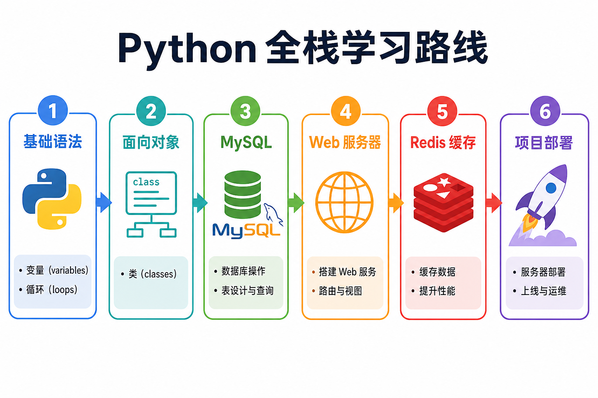

# Python 全栈入门教程

<div align="center">

# 🐍 Python 全栈入门教程

**8 大篇章 · 配图讲解 · 从零到实战**

[开始阅读](./C1/01-变量和数据类型.md) · [全书目录](./README.md)

</div>

---

## 写在前面

你好，欢迎翻开这本教程。

这是一套**全栈 Python 学习路线**，涵盖从语言基础到 Linux、Web 服务、多任务、前端、数据库的完整知识体系。每一章都配有**概念图、流程图、知识卡片和步骤截图位**，参考 [鱼皮 AI 编程教程](https://ai.codefather.cn/library/2010994846520700929) 的呈现方式，让你读起来像一本精心排版的书。

---

## 全书八大篇章（已确认）

| 章 | 主题 | 你将收获 |
|:--:|------|---------|
| **一** | Python 基础语法 | 变量、流程控制、数据结构、函数 |
| **二** | Python 面向对象 | 类、继承、多态、模块 |
| **三** | Linux 命令 | 终端操作、服务器管理基础 |
| **四** | Web 服务器 | Socket、HTTP、静态服务器 |
| **五** | 多任务编程 | 进程、线程、并发并行 |
| **六** | Web 前端基础 | HTML、CSS、JS、jQuery |
| **七** | MySQL 数据库 | SQL、事务、PyMySQL |
| **八** | Redis 数据库 | 缓存、数据结构、Python 交互 |



---

## 学习建议

```
第 1～2 周  → 第一、二章（Python 语言）
第 3 周     → 第三章（Linux）
第 4 周     → 第四、五章（Web + 多任务）
第 5 周     → 第六章（前端基础）
第 6 周     → 第七、八章（MySQL + Redis）
```

> 实战是最好的老师。每个示例都请**亲手敲一遍**。

---

## 你需要准备

1. Python 3.8+
2. Cursor 或 VS Code
3. Ubuntu 虚拟机或 WSL（第三章起）
4. MySQL、Redis（第七、八章）

---

**现在，从 [第一章 · 变量和数据类型](./C1/01-变量和数据类型.md) 出发吧！** 🚀
