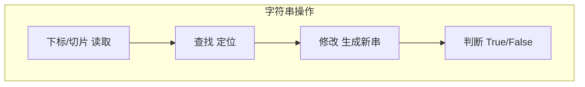

# 1.6 字符串

<div align="center">

**第一章 · Python 基础语法 · 第 6 节**

*预计学习时间：2 小时 · 难度：⭐⭐*

</div>


---

## 📖 本节导读

字符串是 Python 最常用的数据类型——用户名、密码、文件路径、网页内容都是字符串。本节学习**下标、切片、查找、修改、判断**五大类操作，让你像做手术一样精确操控文本。


---

## 1. 创建字符串

### 引号形式

| 形式 | 示例 |
|------|------|
| 单引号 | `'hello'` |
| 双引号 | `"hello"` |
| 三引号 | `'''多行'''` 或 `"""多行"""` |
| 转义 | `'I\'m Tom'` |

```python
a = "hello world"
b = 'TOM'
c = """多行
字符串"""
d = "I\'m TOM"

print(type(a))  # <class 'str'>
```

> 🟦 **知识卡片**
>
> 单引号和双引号完全等价，选一种风格保持统一即可。字符串内包含引号时，用另一种引号包裹或转义。

### 输入与输出

请你新建 `str_io.py`：

```python
name = input("请输入您的名字：")
print(f"您输入的名字是 {name}")
print(type(name))
```

**运行效果：**

```
请输入您的名字：TOM
您输入的名字是 TOM
<class 'str'>
```

---

## 2. 下标（索引）

### 概念

字符串中每个字符都有一个编号（下标），从 **0** 开始：

```
字符串：  a   b   c   d   e   f
正下标：  0   1   2   3   4   5
负下标： -6  -5  -4  -3  -2  -1
```

请你新建 `str_index.py`：

```python
str1 = "abcdef"
print(str1)       # abcdef
print(str1[0])    # a
print(str1[1])    # b
print(str1[-1])   # f（最后一个）
print(str1[-2])   # e
```

**运行效果：**

```
abcdef
a
b
f
e
```

> ⚠️ **避坑**：下标越界会报 `IndexError`。`str1[100]` 对长度为 6 的字符串无效。

> 📸 **截图位**：正负下标对照图或代码运行结果

---

## 3. 切片

### 语法

```python
序列[开始:结束:步长]
```

| 规则 | 说明 |
|------|------|
| 不包含结束位置 | `[2:5]` 取的是下标 2、3、4 |
| 省略开始 | 默认从 0 开始 |
| 省略结束 | 默认取到最后 |
| 省略步长 | 默认为 1 |
| 负步长 | 倒序选取 |

请你新建 `str_slice.py`：

```python
str1 = "012345678"

print(str1[2:5])      # 234
print(str1[2:5:2])    # 24（步长 2）
print(str1[:5])       # 01234
print(str1[2:])       # 2345678
print(str1[::-1])     # 876543210（反转）
print(str1[-4:-1])    # 567
```

**运行效果：**

```
234
24
01234
2345678
876543210
567
```

> 🟥 **危险警告**：如果切片方向与步长方向冲突，结果为空！`str1[-4:-1:-1]` 无法取出数据，因为从 -4 到 -1 方向向右，但步长 -1 向左。

```python
print(str1[-4:-1:-1])   # 空字符串
print(str1[-1:-4:-1])   # 876（方向一致，正常）
```

> 🟦 **知识卡片**
>
> 切片不仅适用于字符串，**列表和元组**也支持相同语法——学会一次，三处通用。

---

## 4. 查找方法

| 方法 | 作用 | 找不到时 |
|------|------|---------|
| `find()` | 返回子串起始下标 | 返回 `-1` |
| `index()` | 返回子串起始下标 | 抛出异常 |
| `rfind()` | 从右侧开始查找 | 返回 `-1` |
| `rindex()` | 从右侧开始查找 | 抛出异常 |
| `count()` | 统计子串出现次数 | 返回 `0` |

请你新建 `str_find.py`：

```python
mystr = "hello world and itcast and itheima and python"

print(mystr.find("and"))           # 12
print(mystr.find("and", 15, 30))   # 23（指定范围）
print(mystr.find("ands"))          # -1

print(mystr.index("and"))          # 12
# print(mystr.index("ands"))       # 报错！

print(mystr.count("and"))          # 3
print(mystr.rfind("and"))          # 35（最后一个 and）
```

**运行效果：**

```
12
23
-1
12
3
35
```

---

## 5. 修改方法

> 🟦 **知识卡片**
>
> 字符串是**不可变类型**——调用修改方法后，返回的是**新字符串**，原字符串不变。

| 方法 | 作用 |
|------|------|
| `replace(old, new, count)` | 替换子串 |
| `split(sep, maxsplit)` | 按分隔符切割，返回列表 |
| `join(iterable)` | 用指定字符连接序列 |
| `capitalize()` | 首字母大写，其余小写 |
| `title()` | 每个单词首字母大写 |
| `lower()` / `upper()` | 大小写转换 |
| `lstrip()` / `rstrip()` / `strip()` | 去除左右/两侧空白 |
| `ljust()` / `rjust()` / `center()` | 对齐填充 |

请你新建 `str_modify.py`：

```python
mystr = "hello world and itcast and itheima and python"

# replace
new_str = mystr.replace("and", "he", 1)
print(new_str)
print(mystr)   # 原字符串未变

# split
print(mystr.split("and"))
print(mystr.split("and", 2))

# join
list1 = ["chuan", "zhi", "bo", "ke"]
print("_".join(list1))

# 大小写
print("hello".capitalize())   # Hello
print("hello world".title())  # Hello World
print("Hello".lower())        # hello
print("Hello".upper())        # HELLO

# 去空白
print("  abc  ".strip())      # abc
```

**运行效果：**

```
hello world he itcast and itheima and python
hello world and itcast and itheima and python
['hello world ', ' itcast ', ' itheima ', ' python']
['hello world ', ' itcast ', ' itheima and python']
chuan_zhi_bo_ke
Hello
Hello World
hello
HELLO
abc
```

---

## 6. 判断方法

返回 `True` 或 `False`。

| 方法 | 作用 |
|------|------|
| `startswith()` | 是否以指定子串开头 |
| `endswith()` | 是否以指定子串结尾 |
| `isalpha()` | 是否全是字母 |
| `isdigit()` | 是否全是数字 |
| `isalnum()` | 是否全是字母或数字 |
| `isspace()` | 是否全是空白 |

请你新建 `str_check.py`：

```python
mystr = "hello world and python"

print(mystr.startswith("hello"))   # True
print(mystr.startswith("hels"))    # False
print(mystr.endswith("python"))    # True
print(mystr.endswith("pythons"))   # False

print("abc".isalpha())     # True
print("123".isdigit())     # True
print("abc123".isalnum())  # True
print("   ".isspace())     # True
```

**运行效果：**

```
True
False
True
False
True
True
True
True
```

---

## 7. 综合练习

请你依次完成：

1. 新建 `str_reverse.py`：输入一个字符串，用切片 `[::-1]` 反转并输出
2. 新建 `str_count_word.py`：统计字符串 `"hello hello world"` 中 `"hello"` 出现次数
3. 新建 `str_format_name.py`：输入 `"  tom  "`，用 `strip()` + `capitalize()` 格式化为 `"Tom"`

<details>
<summary>📎 练习 3 参考答案</summary>

```python
name = input("请输入名字：")
formatted = name.strip().capitalize()
print(f"格式化后：{formatted}")
```

</details>

---

## 8. 本节小结

| 类别 | 常用方法 |
|------|---------|
| 访问 | 下标 `[i]`、切片 `[start:end:step]` |
| 查找 | `find` `index` `count` `rfind` |
| 修改 | `replace` `split` `join` `strip` `upper/lower` |
| 判断 | `startswith` `endswith` `isdigit` `isalpha` |



> 🟩 **恭喜！** 字符串操作是日常开发的高频技能。下一节学习**列表和元组**——一次性存储多个数据的容器。

---

| ← 上一节 | [第一章目录](./README.md) | 下一节 → |
|---------|--------------------------|---------|
| [1.5 for 循环](./05-for循环.md) | | [1.7 列表和元组](./07-列表和元组.md) |

*源码：[`Python基础语法/6.字符串/`](https://github.com/Drgonmancer/Leo_code/tree/main/Python基础语法/6.字符串)*
