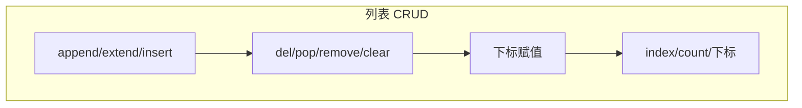

# 1.7 列表和元组

<div align="center">

**第一章 · Python 基础语法 · 第 7 节**

*预计学习时间：2 小时 · 难度：⭐⭐⭐*

</div>


---

## 📖 本节导读

一个变量只能存一个值，但现实中经常要存**一组数据**——学生名单、购物车商品、班级成绩。列表和元组就是 Python 的「收纳盒」，支持一次性存储多个数据。列表可变，元组不可变。


---

## 1. 列表基础

### 格式

```python
列表名 = [数据1, 数据2, 数据3]
```

| 特点 | 说明 |
|------|------|
| 有序 | 元素按插入顺序排列 |
| 可变 | 可以增删改元素 |
| 异构 | 同一列表可存不同类型 |

请你新建 `list_basic.py`：

```python
name_list = ["Tom", "Lily", "Rose"]
print(name_list)
print(name_list[0])    # Tom
print(name_list[1])    # Lily
print(type(name_list)) # <class 'list'>
```

**运行效果：**

```
['Tom', 'Lily', 'Rose']
Tom
Lily
<class 'list'>
```

> 🟦 **知识卡片**
>
> 列表是**可变类型**——直接修改原数据，不创建新对象。这与字符串的不可变形成对比。

---

## 2. 列表查找

| 操作 | 语法 | 说明 |
|------|------|------|
| 下标 | `list[i]` | 按下标访问，支持负索引 |
| index | `list.index(数据)` | 返回数据首次出现的下标，不存在则报错 |
| count | `list.count(数据)` | 统计数据出现次数 |
| len | `len(list)` | 返回列表长度 |

```python
name_list = ["Tom", "Lily", "Rose", "Tom"]

print(name_list.index("Tom"))    # 0
print(name_list.count("Tom"))    # 2
print(len(name_list))            # 4
```

**运行效果：**

```
0
2
4
```

---

## 3. 列表增加数据

| 方法 | 作用 | 示例 |
|------|------|------|
| `append(数据)` | 末尾追加单个元素 | `[1,2].append(3)` → `[1,2,3]` |
| `extend(序列)` | 末尾逐一追加序列中元素 | `[1,2].extend([3,4])` → `[1,2,3,4]` |
| `insert(下标, 数据)` | 指定位置插入 | `[1,3].insert(1,2)` → `[1,2,3]` |

请你新建 `list_add.py`：

```python
name_list = ["Tom", "Lily", "Rose"]

# append：追加单个
name_list.append("xiaoming")
print(name_list)

# extend：追加序列中的每个元素
name_list = ["Tom", "Lily", "Rose"]
name_list.extend("abc")          # 拆成 'a','b','c'
print(name_list)

name_list = ["Tom", "Lily", "Rose"]
name_list.extend(["xiaohong", "xiaolv"])
print(name_list)

# insert：指定位置
name_list = ["Tom", "Lily", "Rose"]
name_list.insert(1, "xiaoming")
print(name_list)
```

**运行效果：**

```
['Tom', 'Lily', 'Rose', 'xiaoming']
['Tom', 'Lily', 'Rose', 'a', 'b', 'c']
['Tom', 'Lily', 'Rose', 'xiaohong', 'xiaolv']
['Tom', 'xiaoming', 'Lily', 'Rose']
```

> ⚠️ **避坑**：`append("abc")` 追加的是整个字符串作为一个元素；`extend("abc")` 会拆成三个字符分别追加。

---

## 4. 列表删除数据

| 方法 | 作用 |
|------|------|
| `del 列表` / `del 列表[i]` | 删除整个列表或指定下标元素 |
| `pop(下标)` | 删除指定下标元素并返回（默认最后一个） |
| `remove(数据)` | 删除第一个匹配的数据 |
| `clear()` | 清空列表 |

请你新建 `list_del.py`：

```python
name_list = ["Tom", "Lily", "Rose"]

# del 删除指定
del name_list[0]
print(name_list)   # ['Lily', 'Rose']

# pop 删除并返回
name_list = ["Tom", "Lily", "Rose"]
del_name = name_list.pop(1)
print(del_name)    # Lily
print(name_list)   # ['Tom', 'Rose']

# remove 按值删除
name_list.remove("Rose")
print(name_list)   # ['Tom']

# clear 清空
name_list.clear()
print(name_list)   # []
```

**运行效果：**

```
['Lily', 'Rose']
Lily
['Tom', 'Rose']
['Tom']
[]
```

> 🟥 **危险警告**：`del name_list` 删除整个列表后，再访问 `name_list` 会报 `NameError`。

---

## 5. 列表修改与排序

### 修改指定下标

```python
name_list = ["Tom", "Lily", "Rose"]
name_list[0] = "aaa"
print(name_list)   # ['aaa', 'Lily', 'Rose']
```

### reverse 和 sort

```python
list1 = [1, 5, 2, 3, 6, 8]
list1.reverse()
print(list1)   # [8, 6, 3, 2, 5, 1]

list1.sort()              # 升序
print(list1)   # [1, 2, 3, 5, 6, 8]

list1.sort(reverse=True)    # 降序
print(list1)   # [8, 6, 5, 3, 2, 1]
```

---

## 6. 列表嵌套

一个列表里包含其他子列表：

```python
name_list = [
    ["Tom", "Lily", "Rose"],
    ["张三", "李四", "王五"],
    ["xiaoming", "xiaohong", "xiaolv"]
]

print(name_list[1])       # ['张三', '李四', '王五']
print(name_list[1][1])    # 李四
```

**运行效果：**

```
['张三', '李四', '王五']
李四
```

> 📸 **截图位**：嵌套列表多层访问的代码与输出

---

## 7. 综合案例：随机分配办公室

需求：3 个办公室，8 位老师，随机分配到各办公室。

请你新建 `office_assign.py`：

```python
import random

teachers = ["A", "B", "C", "D", "E", "F", "G", "H"]
offices = [[], [], []]

for name in teachers:
    num = random.randint(0, 2)
    offices[num].append(name)

i = 1
for office in offices:
    print(f"办公室 {i} 的人数是 {len(office)}，老师分别是：")
    for name in office:
        print(f"  {name}")
    i += 1
```

**运行效果（示例）：**

```
办公室 1 的人数是 2，老师分别是：
  B
  G
办公室 2 的人数是 4，老师分别是：
  A
  C
  E
  H
办公室 3 的人数是 2，老师分别是：
  D
  F
```

> 🟦 **知识卡片**
>
> 这个案例综合运用了：列表嵌套、`for` 循环、`random.randint()`、`append()`、`len()`——都是前面学过的知识。

---

## 8. 元组

### 定义

```python
t1 = (10, 20, 30)     # 多个数据
t2 = (10,)            # 单个数据，必须加逗号！
t3 = (10)             # 这不是元组，是 int
```

| 对比 | 列表 | 元组 |
|------|------|------|
| 符号 | `[]` | `()` |
| 可变性 | 可变 | **不可变** |
| 速度 | 较慢 | 较快 |
| 场景 | 频繁修改 | 固定不变的数据 |

> ⚠️ **避坑**：单元素元组必须写 `(10,)`，否则 `(10)` 只是带括号的整数。

### 元组操作（只读）

```python
tuple1 = ("aa", "bb", "cc", "dd")

print(tuple1[0])          # aa
print(tuple1.index("bb")) # 1
print(tuple1.count("bb")) # 1
print(len(tuple1))        # 4
```

### 元组内包含列表

元组本身不可变，但如果元素是列表，列表内容可以修改：

```python
tuple2 = (10, 20, ["aa", "bb", "cc"], 50, 30)
tuple2[2][0] = "aaaaa"
print(tuple2)   # (10, 20, ['aaaaa', 'bb', 'cc'], 50, 30)
```

> 🟥 **危险警告**：`tuple1[0] = "aaa"` 会直接报错！元组的元素不能重新赋值。

---

## 9. 综合练习

请你依次完成：

1. 新建 `list_crud.py`：创建列表，依次演示增删改查四种操作
2. 新建 `list_sort.py`：对 `[3, 1, 4, 1, 5, 9, 2, 6]` 分别升序和降序排序
3. 新建 `tuple_demo.py`：定义元组，尝试修改元素观察报错信息

---

## 10. 本节小结

| 类型 | 增 | 删 | 改 | 查 |
|------|:--:|:--:|:--:|:--:|
| 列表 | ✅ | ✅ | ✅ | ✅ |
| 元组 | ❌ | ❌ | ❌* | ✅ |

*元组内嵌套的列表内容可修改



> 🟩 **恭喜！** 列表和元组是 Python 最常用的容器。下一节学习**字典和集合**——更灵活的数据组织方式。

---

| ← 上一节 | [第一章目录](./README.md) | 下一节 → |
|---------|--------------------------|---------|
| [1.6 字符串](./06-字符串.md) | | [1.8 字典与集合](./08-字典与集合.md) |

*源码：[`Python基础语法/7.列表和元组/`](https://github.com/Drgonmancer/Leo_code/tree/main/Python基础语法/7.列表和元组)*
