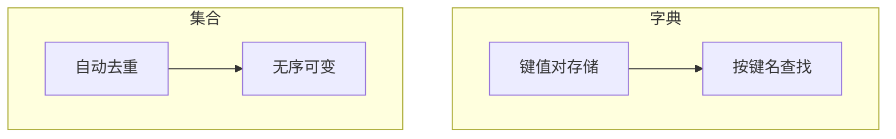

# 1.8 字典与集合

<div align="center">

**第一章 · Python 基础语法 · 第 8 节**

*预计学习时间：1.5 小时 · 难度：⭐⭐⭐*

</div>


---

## 📖 本节导读

列表用**下标**找数据，但「学号 → 姓名」这种映射关系用下标不方便。字典用**键值对**存储，按键名精确查找；集合则自动**去重**，适合处理不重复的数据集。


---

## 1. 字典基础

### 应用场景

存储用户信息、商品属性、配置项……数据以 **键值对（key: value）** 形式出现，通过键名快速查找，**与顺序无关**。

### 创建语法

```python
dict1 = {"name": "TOM", "age": 20, "gender": "男"}
dict2 = {}          # 空字典
dict3 = dict()      # 空字典
```

| 特点 | 说明 |
|------|------|
| 符号 | 大括号 `{}` |
| 结构 | 键值对，逗号分隔 |
| 键的要求 | 必须是不可变类型（数字、字符串、元组） |
| 可变性 | 可变类型，支持增删改 |

请你新建 `dict_basic.py`：

```python
dict1 = {"name": "TOM", "age": 20, "gender": "男"}
print(dict1)
print(type(dict1))
print(dict1["name"])
```

**运行效果：**

```
{'name': 'TOM', 'age': 20, 'gender': '男'}
<class 'dict'>
TOM
```

> 🟦 **知识卡片**
>
> 字典的键就像「名牌」——不管数据怎么变，只要知道键名就能找到对应的值。列表用下标 `list[0]`，字典用键名 `dict["name"]`。

> ⚠️ **避坑**：键不能是列表等可变类型。`{[1,2]: "a"}` 会报 `TypeError`。

---

## 2. 字典增删改

### 增加 / 修改

写法统一：`字典[key] = 值`

- key **存在** → 修改值
- key **不存在** → 新增键值对

请你新建 `dict_crud.py`：

```python
dict1 = {"name": "TOM", "age": 20, "gender": "男"}

# 修改
dict1["name"] = "Rose"
print(dict1)

# 新增
dict1["id"] = 110
print(dict1)
```

**运行效果：**

```
{'name': 'Rose', 'age': 20, 'gender': '男'}
{'name': 'Rose', 'age': 20, 'gender': '男', 'id': 110}
```

### 删除

| 方法 | 作用 |
|------|------|
| `del dict[key]` | 删除指定键值对 |
| `del dict` | 删除整个字典 |
| `clear()` | 清空字典 |

```python
dict1 = {"name": "TOM", "age": 20, "gender": "男"}

del dict1["gender"]
print(dict1)   # {'name': 'TOM', 'age': 20}

dict1.clear()
print(dict1)   # {}
```

---

## 3. 字典查找

### 方括号访问

```python
print(dict1["name"])   # TOM
# print(dict1["id"])   # KeyError！键不存在会报错
```

### get() 安全访问

```python
print(dict1.get("name"))       # TOM
print(dict1.get("id"))         # None
print(dict1.get("id", "未知"))  # 未知（自定义默认值）
```

| 方式 | 键不存在时 |
|------|-----------|
| `dict[key]` | 抛出 `KeyError` |
| `dict.get(key)` | 返回 `None` |
| `dict.get(key, 默认值)` | 返回默认值 |

> 🟦 **知识卡片**
>
> 不确定键是否存在时，优先用 `get()`。这是更安全的访问方式，避免程序崩溃。

### keys / values / items

```python
dict1 = {"name": "TOM", "age": 20, "gender": "男"}

print(dict1.keys())    # dict_keys(['name', 'age', 'gender'])
print(dict1.values())  # dict_values(['TOM', 20, '男'])
print(dict1.items())   # dict_items([('name', 'TOM'), ('age', 20), ...])
```

**运行效果：**

```
dict_keys(['name', 'age', 'gender'])
dict_values(['TOM', 20, '男'])
dict_items([('name', 'TOM'), ('age', 20), ('gender', '男')])
```

### 遍历字典

```python
for key in dict1:
    print(f"{key}: {dict1[key]}")

for key, value in dict1.items():
    print(f"{key} = {value}")
```

> 📸 **截图位**：遍历字典输出所有键值对的终端界面

---

## 4. 集合基础

### 创建

```python
s1 = {10, 20, 30, 40, 50}
s2 = set("abcdefg")
s3 = set()          # 空集合
# s4 = {}           # 这是空字典，不是集合！
```

| 特点 | 说明 |
|------|------|
| 无序 | 没有下标，不保证顺序 |
| 去重 | 相同元素只保留一个 |
| 可变 | 支持增删 |

请你新建 `set_basic.py`：

```python
s1 = {10, 30, 20, 10, 30, 40, 30, 50}
print(s1)   # 自动去重：{10, 20, 30, 40, 50}

s2 = set("abcdefg")
print(s2)   # {'a', 'b', 'c', 'd', 'e', 'f', 'g'}

s3 = set()
print(type(s3))   # <class 'set'>

s4 = {}
print(type(s4))   # <class 'dict'>
```

**运行效果：**

```
{10, 20, 30, 40, 50}
{'d', 'g', 'b', 'f', 'c', 'a', 'e'}
<class 'set'>
<class 'dict'>
```

> ⚠️ **避坑**：创建空集合只能用 `set()`，`{}` 创建的是空字典！

---

## 5. 集合增删查

### 增加

| 方法 | 作用 |
|------|------|
| `add(数据)` | 添加**单个**元素 |
| `update(序列)` | 添加**序列**中的每个元素 |

```python
s1 = {10, 20}
s1.add(100)
s1.add(10)          # 已存在，不重复添加
print(s1)           # {10, 20, 100}

s1.update([100, 200])
s1.update("abc")
print(s1)
```

### 删除

| 方法 | 作用 |
|------|------|
| `remove(数据)` | 删除指定元素，不存在则**报错** |
| `discard(数据)` | 删除指定元素，不存在**不报错** |
| `pop()` | 随机删除并返回一个元素 |

```python
s1 = {10, 20, 30}
s1.remove(10)
print(s1)   # {20, 30}

s1.discard(10)   # 不存在也不报错
print(s1)

del_num = s1.pop()
print(f"弹出：{del_num}")
```

### 判断

```python
s1 = {10, 20, 30, 40, 50}
print(10 in s1)       # True
print(10 not in s1)   # False
```

> 🟥 **危险警告**：`s1.add([1, 2, 3])` 会报错！`add()` 只能添加**不可变**的单一元素。要添加多个元素用 `update()`。

---

## 6. 字典 vs 集合 vs 列表

| 类型 | 符号 | 有序 | 去重 | 访问方式 |
|------|------|:----:|:----:|---------|
| 列表 | `[]` | ✅ | ❌ | 下标 |
| 元组 | `()` | ✅ | ❌ | 下标 |
| 字典 | `{}` | ❌* | 键唯一 | 键名 |
| 集合 | `{}` | ❌ | ✅ | 无法直接索引 |

*Python 3.7+ 字典保持插入顺序，但本质仍是键值映射。

---

## 7. 综合练习

请你依次完成：

1. 新建 `student_dict.py`：创建学生字典（姓名、年龄、成绩），遍历打印所有信息
2. 新建 `set_dedup.py`：列表 `[1, 2, 2, 3, 3, 3, 4]` 用集合去重后转回列表
3. 新建 `word_count.py`：统计字符串 `"hello world hello"` 中每个单词出现次数（用字典）

<details>
<summary>📎 练习 2 参考答案</summary>

```python
lst = [1, 2, 2, 3, 3, 3, 4]
unique = list(set(lst))
print(unique)   # [1, 2, 3, 4]
```

</details>

<details>
<summary>📎 练习 3 参考答案</summary>

```python
text = "hello world hello"
words = text.split()
count = {}
for word in words:
    count[word] = count.get(word, 0) + 1
print(count)   # {'hello': 2, 'world': 1}
```

</details>

---

## 8. 本节小结

| 类型 | 核心操作 |
|------|---------|
| 字典 | `dict[key]`、`get()`、`keys()`、`values()`、`items()` |
| 集合 | `add()`、`update()`、`remove()`、`discard()`、`in` |



> 🟩 **恭喜！** 四大容器类型（字符串、列表、元组、字典、集合）你已学了四个。下一节学习**公共方法**——跨容器通用的操作工具。

---

| ← 上一节 | [第一章目录](./README.md) | 下一节 → |
|---------|--------------------------|---------|
| [1.7 列表和元组](./07-列表和元组.md) | | [1.9 公共方法](./09-公共方法.md) |

*源码：[`Python基础语法/8.字典与集合/`](https://github.com/Drgonmancer/Leo_code/tree/main/Python基础语法/8.字典与集合)*
