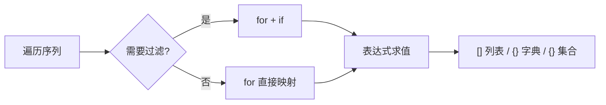

# 1.10 推导式

<div align="center">

**第一章 · Python 基础语法 · 第 10 节**

*预计学习时间：1.5 小时 · 难度：⭐⭐*

</div>


---

## 📖 本节导读

**推导式**（Comprehension）用一行代码完成「遍历 + 处理 + 收集」，是 Python 最标志性的语法糖。本节掌握列表、字典、集合三种推导式，以及 `if` 过滤与多 `for` 嵌套。



---

## 1. 为什么需要推导式？

传统写法：

```python
result = []
for i in range(10):
    result.append(i)
```

推导式写法：

```python
result = [i for i in range(10)]
```

| 对比项 | for 循环 | 推导式 |
|--------|---------|--------|
| 代码行数 | 3～5 行 | 1 行 |
| 性能 | 正常 | 通常更快 |
| 适用场景 | 复杂逻辑、有副作用 | 简单映射与过滤 |

> 🟦 **技巧**：简单的映射和过滤用推导式；需要 `print`、写文件、`break` 时用 for 循环。

---

## 2. 列表推导式 —— 基础语法

```
[表达式 for 变量 in 序列]
```

读作：「对序列中每个变量求表达式，结果放入列表。」

```python
# 0~9
list1 = [i for i in range(10)]
print(list1)  # [0, 1, 2, 3, 4, 5, 6, 7, 8, 9]

# 平方
squares = [i ** 2 for i in range(1, 6)]
print(squares)  # [1, 4, 9, 16, 25]

# 字符串转大写
names = ['tom', 'lily', 'rose']
upper_names = [name.upper() for name in names]
print(upper_names)  # ['TOM', 'LILY', 'ROSE']
```

**运行效果：**

```
['TOM', 'LILY', 'ROSE']
```

> 📸 **截图位**：列表推导式在 IDE 中运行，对比 for 循环版本

---

## 3. 带 if 过滤的列表推导式

```
[表达式 for 变量 in 序列 if 条件]
```

```python
# 提取偶数
evens = [i for i in range(10) if i % 2 == 0]
print(evens)  # [0, 2, 4, 6, 8]

# 提取及格分数
scores = [85, 92, 78, 55, 95, 48, 88]
passed = [s for s in scores if s >= 60]
print(passed)  # [85, 92, 78, 95, 88]
```

### if 的位置：过滤 vs 条件表达式

| 位置 | 写法 | 作用 | 结果长度 |
|------|------|------|---------|
| `if` 在 `for` 后 | `[i for i in seq if i % 2 == 0]` | 过滤，丢弃不满足条件的 | ≤ 原序列 |
| `if...else` 在 `for` 前 | `['偶' if i % 2 == 0 else '奇' for i in seq]` | 映射，每个元素都保留 | = 原序列 |

```python
# 过滤
evens = [i for i in range(10) if i % 2 == 0]

# 条件映射
labels = ['偶数' if i % 2 == 0 else '奇数' for i in range(5)]
print(labels)  # ['偶数', '奇数', '偶数', '奇数', '偶数']
```

> ⚠️ **避坑**：`if` 在 `for` 后面是**过滤**；`if...else` 在 `for` 前面是**三目映射**，两者含义完全不同。

---

## 4. 多个 for 的列表推导式

```
[表达式 for 变量1 in 序列1 for 变量2 in 序列2]
```

等价于嵌套 for 循环，**从左到右、外层到内层**：

```python
# 普通 for 循环
list1 = []
for i in range(1, 3):
    for j in range(3):
        list1.append((i, j))

# 推导式
list2 = [(i, j) for i in range(1, 3) for j in range(3)]
print(list2)
# [(1, 0), (1, 1), (1, 2), (2, 0), (2, 1), (2, 2)]
```

多 for + if 组合：

```python
pairs = [(i, j) for i in range(1, 4) for j in range(1, 4) if i != j]
print(pairs)
# [(1, 2), (1, 3), (2, 1), (2, 3), (3, 1), (3, 2)]
```

---

## 5. 字典推导式

```
{key表达式: value表达式 for 变量 in 序列}
```

```python
# 数字 → 平方
dict1 = {i: i ** 2 for i in range(1, 6)}
print(dict1)  # {1: 1, 2: 4, 3: 9, 4: 16, 5: 25}

# 字符串 → 长度
words = ['Python', 'is', 'awesome']
lengths = {w: len(w) for w in words}
print(lengths)  # {'Python': 6, 'is': 2, 'awesome': 7}
```

带 if 过滤：

```python
counts = {'MBP': 268, 'HP': 125, 'DELL': 201, 'Lenovo': 199, 'acer': 99}
high = {k: v for k, v in counts.items() if v >= 200}
print(high)  # {'MBP': 268, 'DELL': 201}
```

键值互换：

```python
original = {'a': 1, 'b': 2, 'c': 3}
swapped = {v: k for k, v in original.items()}
print(swapped)  # {1: 'a', 2: 'b', 3: 'c'}
```

> 🟦 **技巧**：两个列表合并为字典时，`dict(zip(keys, vals))` 往往比推导式更简洁。

---

## 6. 集合推导式

```
{表达式 for 变量 in 序列}
```

与列表推导式语法几乎相同，外层用 `{}` 无冒号，结果**自动去重**：

```python
list1 = [1, 1, 2, 2, 3, 3]
set1 = {i ** 2 for i in list1}
print(set1)  # {1, 4, 9}

# 提取大写字母
chars = {c for c in 'Hello World' if c.isupper()}
print(chars)  # {'H', 'W'}
```

---

## 7. 三种推导式对比

| 类型 | 语法 | 结果 | 特点 |
|------|------|------|------|
| 列表 | `[x for x in seq]` | `list` | 有序，可重复 |
| 字典 | `{k: v for ...}` | `dict` | 键值对 |
| 集合 | `{x for x in seq}` | `set` | 无序，自动去重 |

**区分技巧**：看最外层括号——`[ ]` 列表；`{k: v}` 有冒号是字典；`{x}` 无冒号是集合。

```python
data = [1, 2, 2, 3, 3, 3]
print([x for x in data])        # [1, 2, 2, 3, 3, 3]
print({x: x**2 for x in data})  # {1: 1, 2: 4, 3: 9}
print({x for x in data})        # {1, 2, 3}
```

---

## 8. 适用边界

| 适合 ✅ | 不适合 ❌ |
|--------|----------|
| 简单映射（每个元素变一下） | 循环体内有多行逻辑 |
| 简单过滤（按条件筛选） | 需要 print、写文件等副作用 |
| 生成新容器 | 需要 break / continue |
| 一行能写完 | 需要 try/except |

> ⚠️ **避坑**：盯着推导式超过 5 秒才看懂，就该改用 for 循环。

---

## 9. 综合案例：学生数据处理

请你新建 `comprehension_app.py`：

```python
students = [
    {'name': 'Tom', 'score': 85},
    {'name': 'Lily', 'score': 92},
    {'name': 'Rose', 'score': 78},
    {'name': 'Jack', 'score': 95},
    {'name': 'Lucy', 'score': 55},
]

# 1. 提取姓名
names = [s['name'] for s in students]

# 2. 及格学生
passed = [s['name'] for s in students if s['score'] >= 60]

# 3. 姓名 → 分数
score_dict = {s['name']: s['score'] for s in students}

# 4. 等级映射
grades = {
    s['name']: 'A' if s['score'] >= 90 else 'B' if s['score'] >= 80
    else 'C' if s['score'] >= 60 else 'D'
    for s in students
}

# 5. 不同分数（去重）
unique_scores = {s['score'] for s in students}

print(f'姓名：{names}')
print(f'及格：{passed}')
print(f'分数：{score_dict}')
print(f'等级：{grades}')
print(f'不同分数：{unique_scores}')
```

> 📸 **截图位**：运行 `comprehension_app.py` 的完整输出

---

## 10. 常见陷阱

**陷阱一：字典与集合的 `{}` 混淆**

```python
s = {x for x in range(5)}     # 集合 {0, 1, 2, 3, 4}
d = {x: x for x in range(5)}  # 字典 {0: 0, 1: 1, ...}
```

**陷阱二：字典推导式键重复**

```python
d = {x // 2: x for x in range(6)}
print(d)  # {0: 1, 1: 3, 2: 5} —— 后面的覆盖前面的
```

**陷阱三：变量作用域**

```python
x = 10
result = [x for x in range(5)]
print(x)       # 10 —— 外层 x 不受影响
print(result)  # [0, 1, 2, 3, 4]
```

---

## 11. 综合练习

请你依次完成：

1. 用列表推导式生成 1~20 中所有 3 的倍数
2. 给定 `scores = [85, 92, 78, 55, 95, 48, 88]`，提取及格分数（≥ 60）
3. 用推导式生成 `[(x, y) for x in 1~3, y in 1~3]` 共 9 对
4. 给定 `prices = {'苹果': 5.5, '香蕉': 3.2, '葡萄': 12.0}`，保留价格 > 5 的商品
5. 给定 `text = 'hello world'`，提取所有不重复的小写字母

<details>
<summary>📎 练习 1 参考答案</summary>

```python
result = [i for i in range(1, 21) if i % 3 == 0]
print(result)  # [3, 6, 9, 12, 15, 18]
```

</details>

<details>
<summary>📎 练习 2 参考答案</summary>

```python
scores = [85, 92, 78, 55, 95, 48, 88]
passed = [s for s in scores if s >= 60]
print(passed)  # [85, 92, 78, 95, 88]
```

</details>

---

## 12. 本节小结

| 类型 | 核心语法 | 要点 |
|------|---------|------|
| 列表 | `[expr for x in seq]` | 最常用，一行生成列表 |
| 列表 + if | `[expr for x in seq if cond]` | 过滤元素 |
| 多 for | `[expr for i in s1 for j in s2]` | 等价嵌套循环 |
| 字典 | `{k: v for ...}` | 遍历字典用 `.items()` |
| 集合 | `{expr for x in seq}` | 自动去重 |

---

| ← 上一节 | [第一章目录](./README.md) | 下一节 → |
|---------|--------------------------|---------|
| [1.9 公共方法](./09-公共方法.md) | | [1.11 函数基础](./11-函数基础.md) |

*源码：[`Python基础语法/10.推导式`](https://github.com/Drgonmancer/Leo_code/tree/main/Python基础语法/10.推导式)*
