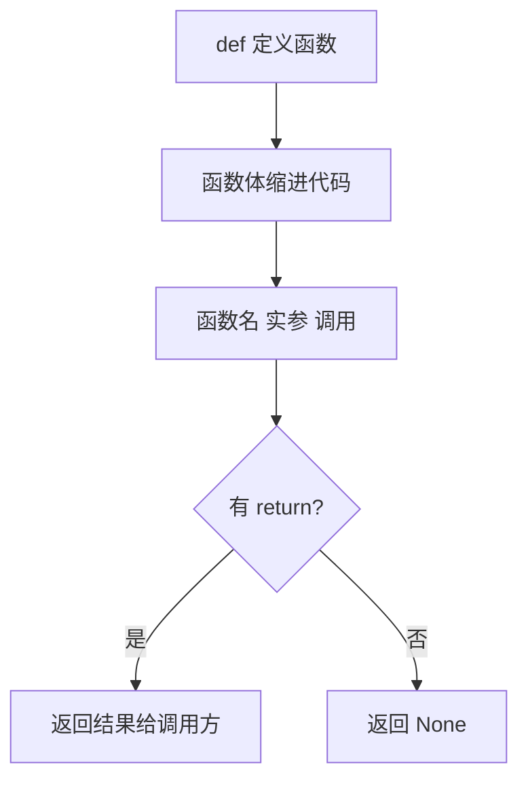

# 1.11 函数基础

<div align="center">

**第一章 · Python 基础语法 · 第 11 节**

*预计学习时间：1.5 小时 · 难度：⭐⭐*

</div>


---

## 📖 本节导读

**函数**把一段具有独立功能的代码封装起来，命名后在需要的位置调用——一次定义，多次复用。本节掌握函数定义与调用、参数、返回值、说明文档与嵌套调用。



---

## 1. 函数的作用

ATM 取钱流程：输入密码 → 显示功能界面 → 查询余额 → 显示功能界面 → 取钱 → 显示功能界面……

「显示功能界面」这段逻辑重复出现。函数就是把它**整合到一个整体并命名**，需要时调用即可。

> 🟦 **技巧**：函数在开发中实现代码重用，是结构化编程的基础。

---

## 2. 定义与调用

### 2.1 语法格式

```
def 函数名(参数):
    代码块1
    代码块2
    ...
```

| 部分 | 含义 | 示例 |
|------|------|------|
| `def` | 定义关键字 | `def greet():` |
| 函数名 | 标识符，见名知意 | `show_menu` |
| 参数 | 可选，接收外部数据 | `(name, age)` |
| 冒号 + 缩进 | 函数体 | 4 空格缩进 |

### 2.2 第一个函数

```python
def show_menu():
    print('请选择功能-------------')
    print('1、查询余额')
    print('2、取钱')
    print('3、退出')

show_menu()
show_menu()  # 可重复调用
```

**运行效果：**

```
请选择功能-------------
1、查询余额
2、取钱
3、退出
请选择功能-------------
...
```

> 📸 **截图位**：定义函数后多次调用的终端输出

---

## 3. 函数使用步骤与注意事项

| 步骤 | 说明 |
|------|------|
| 1. 定义 | `def 函数名():` + 缩进代码块 |
| 2. 调用 | `函数名()` 或 `函数名(参数)` |

三条铁律：

1. **先定义后调用**——先调用会 `NameError`
2. **不调用不执行**——定义时函数体不会运行
3. **调用时跳转到定义处**——执行完函数体后回到调用处继续

```python
# ❌ 先调用后定义 —— 报错
# say_hello()
# def say_hello():
#     print('Hi')

# ✅ 正确顺序
def say_hello():
    print('Hi')

say_hello()
```

> ⚠️ **避坑**：函数名不要与 Python 内置名冲突（如 `list`、`print`、`str`）。

---

## 4. 函数的参数

### 4.1 为什么需要参数？

固定计算 1+2 的函数不够灵活。参数让函数**接收调用者传入的数据**。

```python
# 无参数 —— 只能算 1+2
def add_fixed():
    result = 1 + 2
    print(result)

# 有参数 —— 算任意两数之和
def add_num(a, b):
    result = a + b
    print(result)

add_num(10, 20)  # 30
add_num(3, 7)    # 10
```

| 术语 | 说明 |
|------|------|
| 形参 | 定义函数时的参数名 `a, b` |
| 实参 | 调用时传入的真实数据 `10, 20` |

### 4.2 带参数的 ATM 菜单

```python
def show_menu(title):
    print(f'===== {title} =====')
    print('1、查询余额')
    print('2、取钱')
    print('3、退出')

show_menu('ATM 主菜单')
show_menu('操作完成，请继续')
```

---

## 5. 函数的返回值

### 5.1 return 的作用

1. **把结果返回**给调用者
2. **退出当前函数**——`return` 下方代码不再执行

```python
def buy():
    return '烟'

goods = buy()
print(goods)  # 烟
```

### 5.2 计算器示例

```python
def sum_num(a, b):
    return a + b

result = sum_num(1, 2)
print(result)  # 3
```

无 `return` 时，函数默认返回 `None`：

```python
def greet(name):
    print(f'Hello, {name}')

ret = greet('Tom')  # 打印 Hello, Tom
print(ret)          # None
```

### 5.3 return 退出函数

```python
def check_age(age):
    if age < 0:
        print('年龄无效')
        return
    print(f'年龄 {age} 有效')

check_age(-1)   # 只打印「年龄无效」
check_age(20)   # 打印「年龄 20 有效」
```

> ⚠️ **避坑**：需要把计算结果交给外部使用时，必须 `return`，不能只 `print`。

---

## 6. 函数的说明文档

用**文档字符串**（docstring）说明函数用途，方便自己和他人阅读。

```python
def sum_num(a, b):
    """计算两个数的和并返回结果"""
    return a + b

print(sum_num.__doc__)  # 计算两个数的和并返回结果
help(sum_num)
```

规范写法：函数体第一行用三引号字符串，简要描述功能、参数和返回值。

> 🟦 **技巧**：在 PyCharm / VS Code 中，输入 `"""` 后回车可自动生成 docstring 模板。

---

## 7. 函数嵌套调用

一个函数内部可以调用另一个函数：

```python
def menu_line():
    print('-' * 20)

def show_menu():
    print('请选择功能-------------')
    print('1、添加学员')
    print('2、删除学员')
    menu_line()

show_menu()
```

**运行效果：**

```
请选择功能-------------
1、添加学员
2、删除学员
--------------------
```

函数也可以作为表达式的一部分：

```python
def double(x):
    return x * 2

result = double(double(3))  # double(6) → 12
print(result)  # 12
```

> 📸 **截图位**：嵌套调用 `double(double(3))` 的单步调试过程

---

## 8. 综合案例：简易 ATM

请你新建 `atm_demo.py`：

```python
def show_menu():
    print('===== ATM 主菜单 =====')
    print('1、查询余额')
    print('2、取钱')
    print('3、退出')
    print('-' * 24)


def query_balance(balance):
    print(f'当前余额：{balance} 元')
    show_menu()


def withdraw(balance, amount):
    if amount > balance:
        print('余额不足！')
    else:
        balance -= amount
        print(f'取款 {amount} 元成功，余额 {balance} 元')
    show_menu()
    return balance


balance = 5000
show_menu()

choice = input('请选择功能序号：')
if choice == '1':
    query_balance(balance)
elif choice == '2':
    balance = withdraw(balance, 2000)
```

---

## 9. 常见陷阱

**陷阱一：忘记调用括号**

```python
def greet():
    print('Hi')

greet     # ❌ 只是函数对象，不会执行
greet()   # ✅ 正确调用
```

**陷阱二：参数个数不匹配**

```python
def add(a, b):
    return a + b

# add(1)       # ❌ TypeError: 缺少参数
# add(1, 2, 3) # ❌ TypeError: 参数过多
add(1, 2)      # ✅
```

**陷阱三：修改可变默认参数**

```python
# ❌ 危险写法（后续函数提高章节详讲）
def append_item(item, lst=[]):
    lst.append(item)
    return lst
```

---

## 10. 综合练习

请你依次完成：

1. 定义函数 `greet(name)`，打印 `Hello, {name}!` 并调用三次传入不同名字
2. 定义函数 `rect_area(w, h)`，返回矩形面积
3. 定义 `show_star(n)`，打印 n 行 `*`（每行数量递增），内部调用辅助函数
4. 给 `rect_area` 添加 docstring，用 `help()` 查看

<details>
<summary>📎 练习 2 参考答案</summary>

```python
def rect_area(w, h):
    """计算矩形面积"""
    return w * h

print(rect_area(5, 3))  # 15
```

</details>

<details>
<summary>📎 练习 3 参考答案</summary>

```python
def print_line(count):
    print('*' * count)

def show_star(n):
    for i in range(1, n + 1):
        print_line(i)

show_star(4)
```

</details>

---

## 11. 本节小结

| 知识点 | 要点 |
|--------|------|
| 定义 | `def 函数名(参数):` + 缩进 |
| 调用 | `函数名(实参)`，先定义后调用 |
| 参数 | 形参接收、实参传入，提高灵活性 |
| 返回值 | `return` 返回结果并退出函数 |
| 文档 | 三引号 docstring 说明用途 |
| 嵌套 | 函数内可调用其他函数 |

---

| ← 上一节 | [第一章目录](./README.md) | 下一节 → |
|---------|--------------------------|---------|
| [1.10 推导式](./10-推导式.md) | | [1.12 函数提高](./12-函数提高.md) |

*源码：[`Python基础语法/11.函数基础`](https://github.com/Drgonmancer/Leo_code/tree/main/Python基础语法/11.函数基础)*
