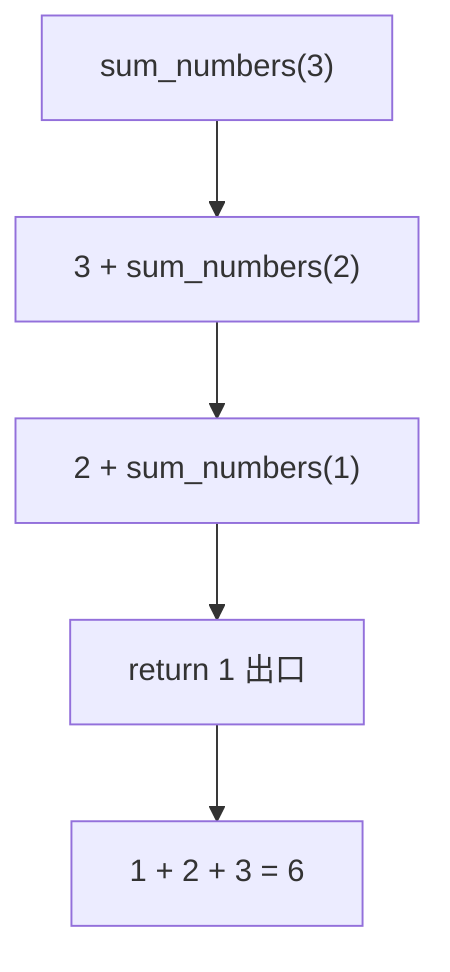

# 1.14 递归与匿名函数

<div align="center">

**第一章 · Python 基础语法 · 第 14 节**

*预计学习时间：1.5 小时 · 难度：⭐⭐⭐*

</div>


---

## 📖 本节导读

**递归**是函数调用自身的编程思想；**lambda** 是用一行表达式定义匿名函数。本节掌握递归三要素、累加求和案例，以及 lambda 语法与排序应用。



---

## 1. 递归

### 1.1 什么是递归？

递归是一种**编程思想**：函数内部调用自己，把大问题拆成相同结构的小问题。

| 应用场景 | 示例 |
|---------|------|
| 遍历文件夹 | 文件夹里还有文件夹 |
| 算法 | 快排、归并、斐波那契 |
| 数学 | 阶乘、累加 |

### 1.2 递归的两个条件

1. **函数内部调用自己**
2. **必须有出口**——否则无限递归，最终 `RecursionError`

> 🟥 **危险警告**：没有出口的递归会导致栈溢出。Python 默认最大递归深度约 1000 层。

---

## 2. 应用：1~n 累加求和

```python
def sum_numbers(num):
    if num == 1:          # 出口
        return 1
    return num + sum_numbers(num - 1)

result = sum_numbers(3)
print(result)  # 6
```

**执行过程：**

```
sum_numbers(3)
= 3 + sum_numbers(2)
= 3 + (2 + sum_numbers(1))
= 3 + (2 + 1)
= 6
```

> 📸 **截图位**：调试器中单步跟踪 `sum_numbers(3)` 的调用栈

---

## 3. 更多递归示例

### 3.1 阶乘

```python
def factorial(n):
    if n <= 1:
        return 1
    return n * factorial(n - 1)

print(factorial(5))  # 120
```

### 3.2 斐波那契（了解）

```python
def fib(n):
    if n <= 1:
        return n
    return fib(n - 1) + fib(n - 2)

print(fib(6))  # 8
```

> ⚠️ **避坑**：朴素斐波那契递归效率极低（大量重复计算），生产环境用循环或缓存。

---

## 4. lambda 匿名函数

### 4.1 为什么需要 lambda？

如果一个函数**只有一个返回值、只有一句代码**，可以用 lambda 简化：

```python
# 普通函数
def fn1():
    return 100

# lambda 等价写法
fn2 = lambda: 100

print(fn1())  # 100
print(fn2())  # 100
```

### 4.2 语法格式

```
lambda 参数列表: 表达式
```

| 规则 | 说明 |
|------|------|
| 参数可有可无 | 与普通函数参数规则相同 |
| 只能有一个表达式 | 表达式的值就是返回值 |
| 无函数名 | 通常赋值给变量或直接传入 |

```python
# 无参数
fn = lambda: 100
print(fn())  # 100

# 一个参数
fn = lambda a: a
print(fn('hello world'))  # hello world

# 两个参数
fn = lambda a, b: a + b
print(fn(1, 2))  # 3
```

---

## 5. lambda 参数形式

### 5.1 默认参数

```python
fn = lambda a, b, c=100: a + b + c
print(fn(10, 20))  # 130
```

### 5.2 可变参数 *args

```python
fn = lambda *args: args
print(fn(10, 20, 30))  # (10, 20, 30) —— 元组
```

### 5.3 可变参数 **kwargs

```python
fn = lambda **kwargs: kwargs
print(fn(name='python', age=20))
# {'name': 'python', 'age': 20}
```

### 5.4 带判断的 lambda

```python
fn = lambda a, b: a if a > b else b
print(fn(1000, 500))  # 1000
```

> 🟦 **技巧**：lambda 内可用三目运算符 `x if cond else y`，但不宜嵌套过深。

---

## 6. lambda 的应用 —— 排序

按字典列表中某个 key 的值排序：

```python
students = [
    {'name': 'TOM', 'age': 20},
    {'name': 'ROSE', 'age': 19},
    {'name': 'JACK', 'age': 22},
]

# 按 name 升序
students.sort(key=lambda x: x['name'])
print(students)

# 按 name 降序
students.sort(key=lambda x: x['name'], reverse=True)
print(students)

# 按 age 升序
students.sort(key=lambda x: x['age'])
print(students)
```

| 参数 | 作用 |
|------|------|
| `key=lambda x: x['name']` | 指定排序依据 |
| `reverse=True` | 降序排列 |

> 📸 **截图位**：三种排序结果的终端对比

---

## 7. 函数 vs lambda 对比

| 对比项 | 普通函数 | lambda |
|--------|---------|--------|
| 定义 | `def func():` | `lambda: ...` |
| 函数名 | 有 | 无（匿名） |
| 代码量 | 可多行 | 只能一行表达式 |
| 文档 | 可写 docstring | 不可 |
| 适用 | 复杂逻辑 | 简单、一次性、作参数传递 |

```python
# 作为参数传递 —— sorted / map / filter 等
nums = [3, 1, 4, 1, 5]
print(sorted(nums, key=lambda x: -x))  # [5, 4, 3, 1, 1]
```

---

## 8. 综合案例

请你新建 `recursion_lambda.py`：

```python
# --- 递归：计算目录层级（模拟） ---
def count_down(n):
    if n == 0:
        print('发射！')
        return
    print(n)
    count_down(n - 1)


# --- lambda：按分数排序学生 ---
students = [
    {'name': 'Tom', 'score': 85},
    {'name': 'Lily', 'score': 92},
    {'name': 'Rose', 'score': 78},
]

students.sort(key=lambda s: s['score'], reverse=True)
print('成绩排名：')
for rank, s in enumerate(students, 1):
    print(f'  第{rank}名：{s["name"]} —— {s["score"]}分')

print()
count_down(3)
```

**运行效果：**

```
成绩排名：
  第1名：Lily —— 92分
  第2名：Tom —— 85分
  第3名：Rose —— 78分

3
2
1
发射！
```

---

## 9. 常见陷阱

**陷阱一：递归无出口**

```python
# def bad():
#     return bad()
# bad()  # RecursionError
```

**陷阱二：lambda 多行逻辑**

```python
# ❌ lambda 不能写多行、不能写 print
# fn = lambda x: print(x); return x

# ✅ 复杂逻辑用 def
def process(x):
    print(x)
    return x * 2
```

**陷阱三：lambda 闭包变量延迟绑定**

```python
funcs = [lambda: i for i in range(3)]
# print(funcs[0]())  # 可能都输出 2
```

---

## 10. 综合练习

请你依次完成：

1. 用递归实现 `factorial(5)`，验证结果为 120
2. 用 lambda 定义 `square = lambda x: x ** 2`，计算 `square(7)`
3. 给定 `[{'n':'b','v':2},{'n':'a','v':1}]`，按 `v` 升序排序
4. 用递归实现 `count_down(5)` 倒计时

<details>
<summary>📎 练习 3 参考答案</summary>

```python
data = [{'n': 'b', 'v': 2}, {'n': 'a', 'v': 1}]
data.sort(key=lambda x: x['v'])
print(data)  # [{'n': 'a', 'v': 1}, {'n': 'b', 'v': 2}]
```

</details>

---

## 11. 本节小结

| 知识点 | 要点 |
|--------|------|
| 递归 | 函数调用自身，必须有出口 |
| 累加求和 | `return num + sum_numbers(num-1)` |
| lambda | `lambda 参数: 表达式`，单行匿名函数 |
| 排序应用 | `.sort(key=lambda x: x['key'])` |
| 选择 | 复杂逻辑用 def，简单传递用 lambda |

---

| ← 上一节 | [第一章目录](./README.md) | 下一节 → |
|---------|--------------------------|---------|
| [1.13 学员管理系统](./13-学员管理系统.md) | | [1.15 内置函数](./15-内置函数.md) |

*源码：[`Python基础语法/14.递归函数和匿名函数`](https://github.com/Drgonmancer/Leo_code/tree/main/Python基础语法/14.递归函数和匿名函数)*
