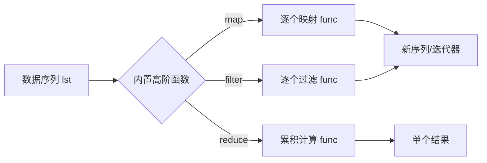

# 1.15 内置函数

<div align="center">

**第一章 · Python 基础语法 · 第 15 节**

*预计学习时间：1.5 小时 · 难度：⭐⭐⭐*

</div>


---

## 📖 本节导读

**高阶函数**把函数作为参数传入；**内置高阶函数** `map`、`reduce`、`filter` 让批量数据处理更简洁。本节还回顾 `abs`、`round` 等常用内置函数。



---

## 1. 高阶函数

### 1.1 什么是高阶函数？

**把函数作为参数传入**的函数，称为高阶函数——函数式编程的体现。

```python
# 普通写法
def add_num(a, b):
    return abs(a) + abs(b)

print(add_num(-1, 2))  # 3

# 高阶函数写法 —— 更灵活
def sum_num(a, b, f):
    return f(a) + f(b)

print(sum_num(-1, 2, abs))  # 3
print(sum_num(-1.4, 2.6, round))  # 3
```

| 对比 | 普通函数 | 高阶函数 |
|------|---------|---------|
| 灵活性 | 逻辑写死 | 行为由传入的函数决定 |
| 代码量 | 每种运算写一个函数 | 一个框架 + 不同 func |
| 代表 | `add_num` | `sum_num(a, b, f)` |

> 🟦 **技巧**：高阶函数减少重复代码，是 Python 数据分析、Web 框架中常见的模式。

---

## 2. 常用内置函数回顾

| 函数 | 作用 | 示例 |
|------|------|------|
| `abs(x)` | 绝对值 | `abs(-10)` → `10` |
| `round(x)` | 四舍五入 | `round(1.9)` → `2` |
| `len(x)` | 长度 | `len([1,2,3])` → `3` |
| `max(x)` | 最大值 | `max(1,5,3)` → `5` |
| `min(x)` | 最小值 | `min(1,5,3)` → `1` |
| `sum(x)` | 求和 | `sum([1,2,3])` → `6` |
| `sorted(x)` | 排序 | `sorted([3,1,2])` → `[1,2,3]` |

```python
print(abs(-10))       # 10
print(round(1.2))     # 1
print(round(1.9))     # 2
print(sum([1, 2, 3, 4, 5]))  # 15
```

---

## 3. map() —— 映射

### 3.1 语法

```
map(func, lst)
```

将 `func` 作用到 `lst` 的**每个元素**，返回迭代器（Python 3）。

```python
list1 = [1, 2, 3, 4, 5]

def func(x):
    return x ** 2

result = map(func, list1)
print(result)            # <map object at 0x...>
print(list(result))      # [1, 4, 9, 16, 25]
```

### 3.2 配合 lambda

```python
list1 = [1, 2, 3, 4, 5]
result = list(map(lambda x: x ** 2, list1))
print(result)  # [1, 4, 9, 16, 25]
```

### 3.3 多个序列

```python
a = [1, 2, 3]
b = [10, 20, 30]
result = list(map(lambda x, y: x + y, a, b))
print(result)  # [11, 22, 33]
```

> 📸 **截图位**：`map` 与 for 循环实现相同功能的代码对比

---

## 4. reduce() —— 累积

### 4.1 语法

```
reduce(func, lst)
```

`func` 必须接收**两个参数**，每次计算结果继续与下一个元素累积。

```python
import functools

list1 = [1, 2, 3, 4, 5]

def func(a, b):
    return a + b

result = functools.reduce(func, list1)
print(result)  # 15
```

**执行过程：**

```
((1 + 2) + 3) + 4) + 5 = 15
```

### 4.2 配合 lambda

```python
import functools

list1 = [1, 2, 3, 4, 5]
result = functools.reduce(lambda a, b: a * b, list1)
print(result)  # 120 —— 阶乘
```

> ⚠️ **避坑**：Python 3 中 `reduce` 移到了 `functools` 模块，需要 `import functools`。

---

## 5. filter() —— 过滤

### 5.1 语法

```
filter(func, lst)
```

过滤掉 `func` 返回 `False` 的元素，返回 filter 对象。

```python
list1 = [1, 2, 3, 4, 5, 6, 7, 8, 9, 10]

def is_even(x):
    return x % 2 == 0

result = filter(is_even, list1)
print(list(result))  # [2, 4, 6, 8, 10]
```

### 5.2 配合 lambda

```python
list1 = [1, 2, 3, 4, 5, 6, 7, 8, 9, 10]
result = list(filter(lambda x: x % 2 == 0, list1))
print(result)  # [2, 4, 6, 8, 10]
```

| 函数 | 输入 | 输出 | 典型用途 |
|------|------|------|---------|
| map | func + 序列 | 同长度新序列 | 批量转换 |
| filter | func + 序列 | 更短的新序列 | 按条件筛选 |
| reduce | func + 序列 | 单个值 | 累加、累乘 |

---

## 6. str.count() —— 统计子串

```python
text = 'hello world hello'

print(text.count('hello'))   # 2
print(text.count('l'))       # 5
print(text.count('Hello'))   # 0 —— 区分大小写
```

语法：`str.count(sub, start=0, end=len(string))`

| 参数 | 说明 |
|------|------|
| sub | 要搜索的子字符串 |
| start | 开始位置，默认 0 |
| end | 结束位置，默认字符串末尾 |

```python
text = 'hello world'
print(text.count('o', 0, 5))  # 1 —— 只在 'hello' 中搜索
```

---

## 7. 三大高阶函数对比

```python
data = [1, 2, 3, 4, 5, 6, 7, 8, 9, 10]

# map：每个元素平方
squares = list(map(lambda x: x ** 2, data))
print(squares)
# [1, 4, 9, 16, 25, 36, 49, 64, 81, 100]

# filter：保留偶数
evens = list(filter(lambda x: x % 2 == 0, data))
print(evens)
# [2, 4, 6, 8, 10]

# reduce：累加
import functools
total = functools.reduce(lambda a, b: a + b, data)
print(total)  # 55
```

> 🟦 **技巧**：Python 3 中，列表推导式往往可以替代 `map` 和 `filter`；但理解高阶函数有助于阅读第三方库源码。

---

## 8. 综合案例

请你新建 `builtin_demo.py`：

```python
import functools

scores = [85, 92, 78, 55, 95, 48, 88, 73, 60, 99]

# 1. 每个分数加 5（map）
adjusted = list(map(lambda s: s + 5, scores))
print(f'加分后：{adjusted}')

# 2. 筛选及格分数（filter）
passed = list(filter(lambda s: s >= 60, scores))
print(f'及格分：{passed}')

# 3. 计算总分（reduce）
total = functools.reduce(lambda a, b: a + b, scores)
print(f'总分：{total}，平均分：{total / len(scores):.1f}')

# 4. 高阶函数：按绝对值求和
def sum_with(a, b, f):
    return f(a) + f(b)

print(sum_with(-3, 5, abs))  # 8
```

**运行效果：**

```
加分后：[90, 97, 83, 60, 100, 53, 93, 78, 65, 104]
及格分：[85, 92, 78, 95, 88, 73, 60, 99]
总分：773，平均分：77.3
8
```

> 📸 **截图位**：运行 `builtin_demo.py` 的完整输出

---

## 9. map/filter vs 推导式

| 任务 | map/filter | 推导式 |
|------|-----------|--------|
| 平方 | `map(lambda x: x**2, lst)` | `[x**2 for x in lst]` |
| 偶数 | `filter(lambda x: x%2==0, lst)` | `[x for x in lst if x%2==0]` |

```python
lst = [1, 2, 3, 4, 5]

# 两种写法等价
print(list(map(lambda x: x ** 2, lst)))
print([x ** 2 for x in lst])
```

> ⚠️ **避坑**：`map`/`filter` 返回迭代器，只能遍历一次；需要多次使用时转成 `list()`。

---

## 10. 综合练习

请你依次完成：

1. 用 `map` 将 `['tom', 'lily']` 全部转大写
2. 用 `filter` 从 `[1,2,3,4,5,6]` 中保留大于 3 的数
3. 用 `reduce` 计算 `[1,2,3,4,5]` 的累乘
4. 统计 `'banana'` 中字母 `a` 出现次数

<details>
<summary>📎 练习 1 参考答案</summary>

```python
names = ['tom', 'lily']
result = list(map(str.upper, names))
print(result)  # ['TOM', 'LILY']
```

</details>

<details>
<summary>📎 练习 3 参考答案</summary>

```python
import functools
result = functools.reduce(lambda a, b: a * b, [1, 2, 3, 4, 5])
print(result)  # 120
```

</details>

---

## 11. 本节小结

| 函数 | 语法 | 作用 |
|------|------|------|
| 高阶函数 | `func(a, b, f)` | 函数作参数，提高灵活性 |
| map | `map(func, lst)` | 逐个映射 |
| reduce | `functools.reduce(func, lst)` | 累积计算 |
| filter | `filter(func, lst)` | 按条件过滤 |
| count | `str.count(sub)` | 统计子串出现次数 |

---

| ← 上一节 | [第一章目录](./README.md) | 下一节 → |
|---------|--------------------------|---------|
| [1.14 递归与匿名函数](./14-递归与匿名函数.md) | | [1.16 文件操作](./16-文件操作.md) |

*源码：[`Python基础语法/15.内置函数`](https://github.com/Drgonmancer/Leo_code/tree/main/Python基础语法/15.内置函数)*
