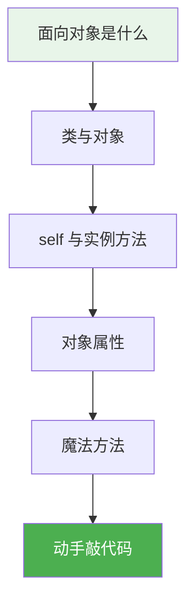
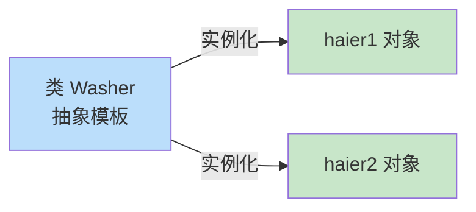

# 2.1 面向对象基础

<div align="center">

**第二章 · Python 面向对象编程 · 第 1 节**

*预计学习时间：1 小时 · 难度：⭐*

</div>


---

## 📖 本节导读

- ✅ 理解面向对象编程的核心思想
- ✅ 掌握类与对象的定义和创建
- ✅ 理解 `self` 的含义
- ✅ 学会添加、获取对象属性
- ✅ 掌握 `__init__`、`__str__`、`__del__` 魔法方法



---

## 1. 为什么学面向对象？

> 🟦 **知识卡片**
>
> 面向对象（OOP）是一种编程思想：把程序中的事物抽象成**类**，再用类创建**对象**来组织代码。
>
> 你之前写的「学员管理系统」用函数实现，代码一多就难维护。面向对象把**数据**和**操作数据的方法**打包在一起，更清晰、更易扩展。

| 对比项 | 面向过程 | 面向对象 |
|--------|---------|---------|
| 核心 | 函数 | 类 + 对象 |
| 关注点 | 怎么做（步骤） | 谁来做（事物） |
| 代码组织 | 功能分散 | 数据与方法封装 |
| 适用场景 | 简单脚本 | 中大型项目 |

> 📸 **截图位**：IDE 中同时打开「函数版」和「类版」学员管理代码的对比

---

## 2. 类与对象

### 2.1 概念

- **类（class）**：对一系列具有相同**特征**和**行为**的事物的统称，是抽象的概念
  - 特征 → **属性**
  - 行为 → **方法**
- **对象（object）**：类创建出来的真实存在的事物，也叫**实例（instance）**



> 🟩 **记忆口诀**
>
> **先有类，后有对象。** 类是图纸，对象是照着图纸造出来的实物。

### 2.2 定义类

```python
class Washer:
    def wash(self):
        print('能洗衣服')
```

> ⚠️ **避坑**：类名遵循**大驼峰**命名法（每个单词首字母大写），如 `SweetPotato`、`StudentManager`。

### 2.3 创建对象

```python
haier = Washer()   # 创建对象
print(haier)       # 打印内存地址
haier.wash()       # 调用实例方法
```

**运行效果：**

```
<__main__.Washer object at 0x000001A2B3C4D5E0>
能洗衣服
```

---

## 3. self 是什么？

> 🟦 **知识卡片**
>
> `self` 指的是**调用该方法的对象本身**。Python 会自动把当前对象传给 `self`，开发者不需要手动传递。

```python
class Washer:
    def wash(self):
        print('我会洗衣服')
        print(self)

haier1 = Washer()
haier2 = Washer()

haier1.wash()
haier2.wash()
```

**运行效果：**

```
我会洗衣服
<__main__.Washer object at 0x000001A2B3C4D5E0>
我会洗衣服
<__main__.Washer object at 0x000001A2B3C4D5F0>
```

要点：

1. 一个类可以创建**多个对象**
2. 不同对象调用同一方法时，`self` 指向**不同的对象**（内存地址不同）

> 📸 **截图位**：运行上述代码，观察两个不同的内存地址

---

## 4. 对象属性

属性就是对象的**特征**。可以在类外面或类里面添加和获取。

### 4.1 类外面添加属性

```python
haier1 = Washer()
haier1.width = 500          # 添加属性
print(haier1.width)         # 获取属性
```

**运行效果：**

```
500
```

### 4.2 类里面获取属性

```python
class Washer:
    def print_info(self):
        print(f'洗衣机宽度是 {self.width}')

haier1 = Washer()
haier1.width = 500
haier1.print_info()
```

**运行效果：**

```
洗衣机宽度是 500
```

> 🟥 **注意**：在类外面添加的属性，其他对象**不会自动拥有**。更推荐在 `__init__` 中统一初始化（下一节）。

---

## 5. 魔法方法

Python 中，以双下划线开头和结尾的方法叫做**魔法方法**，具有特殊功能。

### 5.1 `__init__()` — 初始化对象

创建对象时**自动调用**，用于设置初始属性。

```python
class Washer:
    def __init__(self, width, height):
        self.width = width
        self.height = height

    def print_info(self):
        print(f'宽度 {self.width}，高度 {self.height}')

haier1 = Washer(500, 800)
haier2 = Washer(600, 900)

haier1.print_info()
haier2.print_info()
```

**运行效果：**

```
宽度 500，高度 800
宽度 600，高度 900
```

要点：

1. `__init__` 在创建对象时**自动调用**，无需手动调用
2. `self` 由 Python 自动传递
3. 通过传参可以为不同对象设置**不同的初始值**

### 5.2 `__str__()` — 友好的字符串输出

默认 `print(对象)` 只显示内存地址。定义 `__str__` 后可返回自定义信息。

```python
class Washer:
    def __init__(self, width, height):
        self.width = width
        self.height = height

    def __str__(self):
        return f'海尔洗衣机（宽{self.width}，高{self.height}）'

haier = Washer(500, 800)
print(haier)
```

**运行效果：**

```
海尔洗衣机（宽500，高800）
```

### 5.3 `__del__()` — 对象销毁时调用

```python
class Washer:
    def __init__(self, width, height):
        self.width = width
        self.height = height

    def __del__(self):
        print(f'{self} 已被删除')

haier = Washer(500, 800)
del haier
```

**运行效果：**

```
<__main__.Washer object at 0x...> 已被删除
```

---

## 6. 拓展：`hasattr` 与 `setattr`

```python
class Washer:
    def __init__(self):
        self.width = 500

haier = Washer()

# 检查对象是否有某属性
print(hasattr(haier, 'width'))    # True
print(hasattr(haier, 'height'))   # False

# 动态设置属性
setattr(haier, 'height', 800)
print(haier.height)
```

**运行效果：**

```
True
False
800
```

| 函数 | 作用 |
|------|------|
| `hasattr(obj, name)` | 检查对象是否有指定属性 |
| `setattr(obj, name, value)` | 为对象设置属性（不存在则新建） |

---

## 7. 综合练习

请你依次完成：

1. 定义一个 `Phone` 类，包含 `brand` 和 `price` 两个属性（用 `__init__`）
2. 添加 `call()` 方法，打印「{品牌} 正在打电话...」
3. 添加 `__str__` 方法，返回「品牌：xxx，价格：xxx」
4. 创建两个不同品牌的手机对象并打印

> 📸 **截图位**：两个手机对象的 `print` 输出结果

<details>
<summary>💡 参考答案</summary>

```python
class Phone:
    def __init__(self, brand, price):
        self.brand = brand
        self.price = price

    def call(self):
        print(f'{self.brand} 正在打电话...')

    def __str__(self):
        return f'品牌：{self.brand}，价格：{self.price}'

p1 = Phone('华为', 5999)
p2 = Phone('苹果', 8999)
print(p1)
print(p2)
p1.call()
```

</details>

---

## 8. 本节小结

| 概念 | 要点 |
|------|------|
| 类 | 抽象模板，大驼峰命名 |
| 对象 | `对象名 = 类名()` 创建 |
| self | 代表调用方法的对象本身 |
| `__init__` | 初始化属性，自动调用 |
| `__str__` | 自定义 print 输出 |
| `__del__` | 对象销毁时自动调用 |

> 🟩 你已掌握面向对象最核心的「类与对象」。下一节通过「烤地瓜」案例，把所学知识用起来。

---

| ← 上一章 | [第二章目录](./README.md) | 下一节 → |
|---------|--------------------------|---------|
| [第一章 基础语法](C1/README.md) | | [2.2 烤地瓜案例](./02-应用烤地瓜.md) |

*源码：[`Python面向对象编程/1.面向对象基础/`](https://github.com/Drgonmancer/Leo_code/tree/main/Python面向对象编程/1.面向对象基础)*
