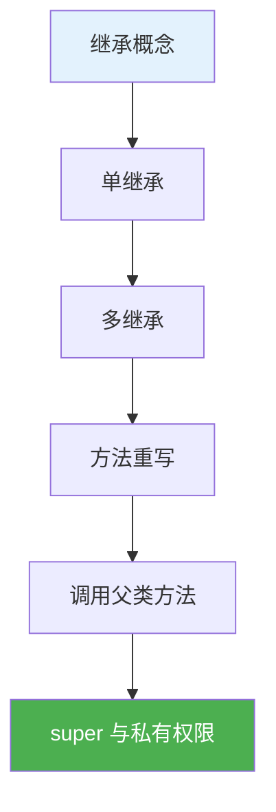
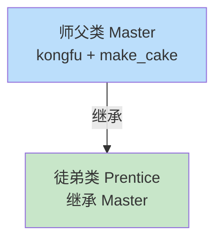

# 2.4 继承

<div align="center">

**第二章 · Python 面向对象编程 · 第 4 节**

*预计学习时间：1.5 小时 · 难度：⭐⭐⭐*

</div>


---

## 📖 本节导读

- ✅ 理解继承的概念和作用
- ✅ 掌握单继承与多继承
- ✅ 学会子类重写父类方法
- ✅ 掌握调用父类方法的两种方式
- ✅ 了解 `super()` 和私有权限



---

## 1. 什么是继承？

> 🟦 **知识卡片**
>
> **继承**：子类自动拥有父类的所有属性和方法，无需重复编写。
>
> 故事：师父有一手摊煎饼果子的绝技，徒弟**继承**师父的全部技术，可以直接使用。



在 Python 中，**所有类默认继承 `object` 类**（顶级基类），其他类称为派生类。

---

## 2. 单继承

### 2.1 基本语法

```python
class 父类名(object):
    pass

class 子类名(父类名):
    pass
```

### 2.2 煎饼果子故事

```python
class Master(object):
    def __init__(self):
        self.kongfu = '[古法煎饼果子配方]'

    def make_cake(self):
        print(f'运用{self.kongfu}制作煎饼果子')


class Prentice(Master):
    pass


daqiu = Prentice()
print(daqiu.kongfu)
daqiu.make_cake()
```

**运行效果：**

```
[古法煎饼果子配方]
运用[古法煎饼果子配方]制作煎饼果子
```

> 🟩 **要点**
>
> 子类 `Prentice` 没有写任何代码（`pass`），但自动拥有父类的属性和方法。

> 📸 **截图位**：子类对象调用父类方法的运行结果

---

## 3. 多继承

故事推进：徒弟不仅跟师父学，还报了黑马培训班。

```python
class Master(object):
    def __init__(self):
        self.kongfu = '[古法煎饼果子配方]'

    def make_cake(self):
        print(f'运用{self.kongfu}制作煎饼果子')


class School(object):
    def __init__(self):
        self.kongfu = '[黑马煎饼果子配方]'

    def make_cake(self):
        print(f'运用{self.kongfu}制作煎饼果子')


class Prentice(School, Master):
    pass


daqiu = Prentice()
print(daqiu.kongfu)
daqiu.make_cake()
```

**运行效果：**

```
[黑马煎饼果子配方]
运用[黑马煎饼果子配方]制作煎饼果子
```

> ⚠️ **避坑**：多继承时，**第一个父类优先**。上面 `School` 写在 `Master` 前面，所以用的是 School 的属性和方法。

### 3.1 MRO 方法解析顺序

```python
print(Prentice.__mro__)
```

**运行效果：**

```
(<class '__main__.Prentice'>, <class '__main__.School'>,
 <class '__main__.Master'>, <class 'object'>)
```

`__mro__` 是一个元组，表示 Python 查找方法的顺序。

---

## 4. 子类重写父类

徒弟学成后，研发了**独创配方**，与子类同名属性和方法会**覆盖**父类。

```python
class Prentice(School, Master):
    def __init__(self):
        self.kongfu = '[独创煎饼果子配方]'

    def make_cake(self):
        print(f'运用{self.kongfu}制作煎饼果子')


daqiu = Prentice()
print(daqiu.kongfu)
daqiu.make_cake()
```

**运行效果：**

```
[独创煎饼果子配方]
运用[独创煎饼果子配方]制作煎饼果子
```

> 🟦 **规则**
>
> 子类和父类有同名属性和方法时，创建子类对象调用的是**子类自己的**版本。

---

## 5. 子类调用父类方法

很多顾客希望吃到古法和黑马的煎饼，徒弟需要**分别调用**两个父类的技术。

### 5.1 方式一：父类名调用

```python
class Prentice(School, Master):
    def __init__(self):
        self.kongfu = '[独创煎饼果子配方]'

    def make_cake(self):
        self.__init__()
        print(f'运用{self.kongfu}制作煎饼果子')

    def make_master_cake(self):
        Master.__init__(self)
        Master.make_cake(self)

    def make_school_cake(self):
        School.__init__(self)
        School.make_cake(self)


daqiu = Prentice()
daqiu.make_cake()
daqiu.make_master_cake()
daqiu.make_school_cake()
```

**运行效果：**

```
运用[独创煎饼果子配方]制作煎饼果子
运用[古法煎饼果子配方]制作煎饼果子
运用[黑马煎饼果子配方]制作煎饼果子
```

> 🟥 **注意**
>
> 调用父类方法前，必须先调用父类的 `__init__`，否则 `self.kongfu` 仍是上一次初始化的值。

### 5.2 方式二：`super()` 调用

```python
class Prentice(School, Master):
    def __init__(self):
        self.kongfu = '[独创煎饼果子配方]'

    def make_old_cake(self):
        super().__init__()
        super().make_cake()


daqiu = Prentice()
daqiu.make_old_cake()
```

**运行效果：**

```
运用[黑马煎饼果子配方]制作煎饼果子
```

| 对比 | 父类名调用 | super() |
|------|-----------|---------|
| 写法 | `Master.make_cake(self)` | `super().make_cake()` |
| 父类改名 | 需要同步修改 | 无需修改 |
| 适用场景 | 多继承指定父类 | 单继承更简洁 |

---

## 6. 多层继承

N 年后，徒弟老了，把技术传给徒孙——**继承可以传递**。

```python
class Tusun(Prentice):
    pass


xiaoqiu = Tusun()
xiaoqiu.make_cake()
xiaoqiu.make_master_cake()
```

**运行效果：**

```
运用[独创煎饼果子配方]制作煎饼果子
运用[古法煎饼果子配方]制作煎饼果子
```

> 🟩 多层继承：子类的子类，仍然拥有所有祖先类的属性和方法。

---

## 7. 私有权限

师父想把技术传给徒弟，但**私房钱**不能传——这就是私有权限。

### 7.1 设置私有

在属性名或方法名前加**双下划线 `__`**：

```python
class Prentice(School, Master):
    def __init__(self):
        self.kongfu = '[独创煎饼果子配方]'
        self.__money = 2000000

    def get_money(self):
        return self.__money

    def set_money(self, value):
        self.__money = value
```

### 7.2 私有规则

| 规则 | 说明 |
|------|------|
| 外部访问 | `对象.__money` → 报错 |
| 子类继承 | 子类无法访问父类私有属性和方法 |
| 正确方式 | 通过 `get_money()` / `set_money()` 间接访问 |

```python
daqiu = Prentice()
# print(daqiu.__money)   # AttributeError

print(daqiu.get_money())   # 2000000
daqiu.set_money(500)
print(daqiu.get_money())   # 500
```

**运行效果：**

```
2000000
500
```

> 📸 **截图位**：尝试直接访问 `__money` 时的报错信息

---

## 8. 综合练习

请你依次完成：

1. 定义 `Animal` 父类（name, eat），`Dog` 和 `Cat` 子类重写 `eat` 方法
2. 在 `Dog` 中添加 `bark()` 方法，验证 `Cat` 没有此方法
3. 给 `Animal` 添加私有属性 `__age`，用 getter/setter 访问

> 📸 **截图位**：多态场景下不同子类的 `eat` 输出

<details>
<summary>💡 参考答案（第 1 题）</summary>

```python
class Animal(object):
    def __init__(self, name):
        self.name = name

    def eat(self):
        print(f'{self.name} 在吃东西')


class Dog(Animal):
    def eat(self):
        print(f'{self.name} 在吃骨头')


class Cat(Animal):
    def eat(self):
        print(f'{self.name} 在吃鱼')


d = Dog('旺财')
c = Cat('咪咪')
d.eat()
c.eat()
```

</details>

---

## 9. 本节小结

| 知识点 | 要点 |
|--------|------|
| 单继承 | `class 子类(父类)` |
| 多继承 | 第一个父类优先，查 `__mro__` |
| 重写 | 子类同名方法覆盖父类 |
| 调用父类 | `父类名.方法(self)` 或 `super()` |
| 私有 | `__属性` 不继承、不直接访问 |
| getter/setter | 安全访问私有属性 |

> 🟩 继承是代码复用的利器。下一节学习面向对象第三大特性——**多态**，以及类方法、静态方法。

---

| ← 上一节 | [第二章目录](./README.md) | 下一节 → |
|---------|--------------------------|---------|
| [2.3 搬家具案例](./03-应用搬家具.md) | | [2.5 多态与类方法](./05-多态与类方法.md) |

*源码：[`Python面向对象编程/4.继承/`](https://github.com/Drgonmancer/Leo_code/tree/main/Python面向对象编程/4.继承)*
