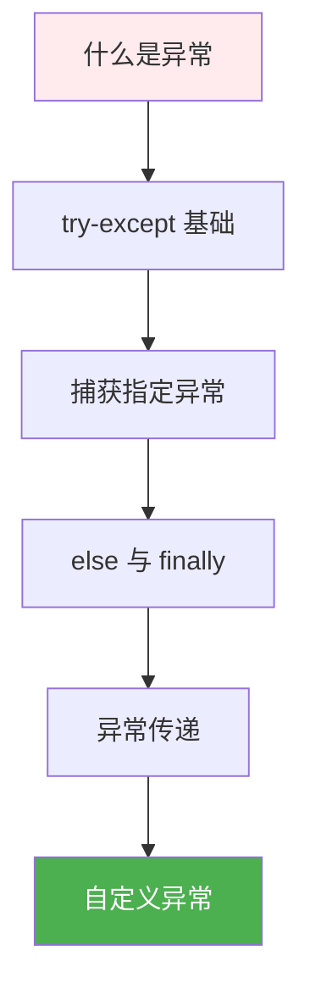
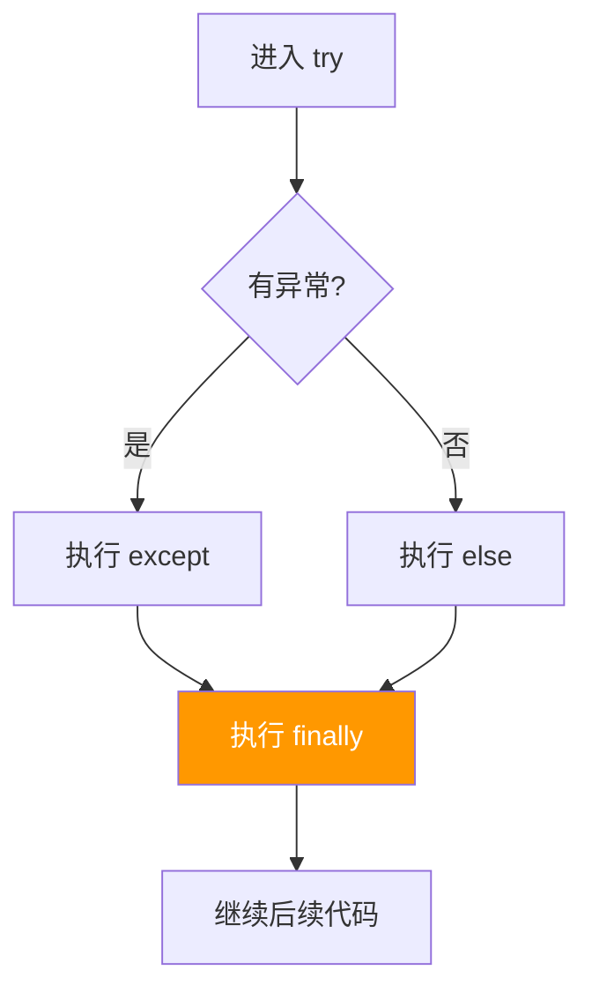

# 2.6 异常处理

<div align="center">

**第二章 · Python 面向对象编程 · 第 6 节**

*预计学习时间：1 小时 · 难度：⭐⭐*

</div>


---

## 📖 本节导读

- ✅ 理解什么是异常以及为什么需要捕获
- ✅ 掌握 `try / except / else / finally` 语法
- ✅ 学会捕获指定异常和多个异常
- ✅ 掌握自定义异常类



---

## 1. 什么是异常？

> 🟦 **知识卡片**
>
> 程序运行过程中，如果 Python **解释器检测到错误**，就无法继续执行，并显示错误提示——这就是**异常（Exception）**。
>
> 没有异常处理时，一个错误就会让整个程序崩溃。学会捕获异常，可以让程序**优雅地处理错误**。

| 常见异常 | 触发场景 |
|---------|---------|
| `NameError` | 使用了未定义的变量 |
| `ZeroDivisionError` | 除以零 |
| `FileNotFoundError` | 打开不存在的文件 |
| `TypeError` | 类型不匹配 |
| `ValueError` | 值不合法 |

> 📸 **截图位**：未捕获异常时终端显示的红色 Traceback 信息

---

## 2. 基本语法：try / except

### 2.1 语法结构

```python
try:
    # 可能发生错误的代码
    可能发生错误的代码
except:
    # 如果出现异常执行的代码
    如果出现异常执行的代码
```

### 2.2 打开文件示例

需求：尝试以 `r` 模式打开文件，如果文件不存在，则以 `w` 模式创建。

```python
try:
    f = open('test.txt', 'r')
    print('文件存在，读取成功')
except:
    f = open('test.txt', 'w')
    print('文件不存在，已创建')
finally:
    f.close()
```

**运行效果（文件不存在时）：**

```
文件不存在，已创建
```

> 🟩 **原则**：`try` 下方尽量只放**一行**可能出错的代码，便于定位问题。

---

## 3. 捕获指定异常

### 3.1 单个异常

```python
try:
    print(num)
except NameError:
    print('变量 num 未定义')
```

**运行效果：**

```
变量 num 未定义
```

> ⚠️ **避坑**：如果实际异常类型与 `except` 指定的类型**不一致**，异常**不会被捕获**，程序仍会崩溃。

### 3.2 多个异常

用**元组**指定多个异常类型：

```python
try:
    print(1 / 0)
except (NameError, ZeroDivisionError) as result:
    print(f'捕获到异常：{result}')
```

**运行效果：**

```
捕获到异常：division by zero
```

### 3.3 捕获所有异常

`Exception` 是所有非系统退出类异常的父类：

```python
try:
    print(num)
except Exception as result:
    print(f'出错了：{result}')
```

**运行效果：**

```
出错了：name 'num' is not defined
```

> 🟥 **注意**
>
> 生产环境避免裸写 `except:` 或 `except Exception` 吞掉所有错误。应**尽量捕获具体异常**，便于排查。

---

## 4. else 与 finally

### 4.1 else — 没有异常时执行

```python
try:
    print(1)
except Exception as result:
    print(result)
else:
    print('没有异常，真开心！')
```

**运行效果：**

```
1
没有异常，真开心！
```

### 4.2 finally — 无论是否异常都执行

常用于**关闭文件、释放资源**：

```python
try:
    f = open('test.txt', 'r')
except Exception as result:
    f = open('test.txt', 'w')
else:
    print('没有异常，真开心')
finally:
    f.close()
    print('文件已关闭')
```

**运行效果：**

```
没有异常，真开心
文件已关闭
```



---

## 5. 异常的传递

异常可以在**函数调用链**中传递——如果内层不捕获，会向上抛给外层。

```python
def func_a():
    return 1 / 0

def func_b():
    func_a()

def func_c():
    try:
        func_b()
    except Exception as e:
        print(f'func_c 捕获到：{e}')

func_c()
```

**运行效果：**

```
func_c 捕获到：division by zero
```

### 5.1 实际案例：读取文件被中断

```python
import time

try:
    f = open('test.txt')
    try:
        while True:
            content = f.readline()
            if len(content) == 0:
                break
            time.sleep(2)
            print(content, end='')
    except:
        print('读取过程中意外终止（如 Ctrl+C）')
except:
    print('文件不存在')
finally:
    f.close()
```

> 📸 **截图位**：运行过程中按 Ctrl+C 触发异常捕获的界面

---

## 6. 自定义异常

### 6.1 为什么需要？

内置异常无法精确描述业务错误。比如「密码长度不足 3 位」——需要自定义异常类。

### 6.2 语法

```python
raise 异常类对象
```

### 6.3 密码长度检测

```python
class ShortInputError(Exception):
    def __init__(self, length, min_len):
        self.length = length
        self.min_len = min_len

    def __str__(self):
        return f'你输入的长度是 {self.length}，不能少于 {self.min_len} 个字符'


def main():
    try:
        pwd = input('请输入密码：')
        if len(pwd) < 3:
            raise ShortInputError(len(pwd), 3)
    except ShortInputError as result:
        print(result)
    else:
        print('密码输入完成')


main()
```

**运行效果（输入 `ab`）：**

```
请输入密码：ab
你输入的长度是 2，不能少于 3 个字符
```

**运行效果（输入 `abc123`）：**

```
请输入密码：abc123
密码输入完成
```

> 🟦 **设计模式**
>
> 自定义异常继承 `Exception`，重写 `__init__` 和 `__str__`，在业务逻辑中用 `raise` 抛出，在调用处用 `except` 捕获。

---

## 7. 异常处理最佳实践

| 建议 | 说明 |
|------|------|
| 捕获具体异常 | `except FileNotFoundError` 优于 `except Exception` |
| try 块精简 | 只放可能出错的代码 |
| 用 finally 释放资源 | 文件、网络连接必须关闭 |
| 自定义异常表达业务 | 让错误信息对人友好 |
| 不要静默吞异常 | 至少 `print` 或记录日志 |

> 🟥 **危险警告**
>
> 空的 `except: pass` 会隐藏 bug，排查问题时极其痛苦。永远不要在生产代码中使用。

---

## 8. 综合练习

请你依次完成：

1. 编写除法函数，捕获 `ZeroDivisionError` 并返回提示
2. 编写 `read_file(filename)` 函数：文件不存在时捕获异常并返回 `None`
3. 自定义 `AgeError` 异常：年龄不在 0~150 范围时抛出

> 📸 **截图位**：三个练习的运行结果截图

<details>
<summary>💡 参考答案（第 1 题）</summary>

```python
def divide(a, b):
    try:
        return a / b
    except ZeroDivisionError:
        print('除数不能为零')
        return None

print(divide(10, 0))
print(divide(10, 2))
```

</details>

---

## 9. 本节小结

| 语法 | 作用 |
|------|------|
| `try / except` | 捕获并处理异常 |
| `except 异常类型 as e` | 捕获指定类型，获取描述 |
| `else` | 无异常时执行 |
| `finally` | 无论如何都执行 |
| `raise` | 主动抛出异常 |
| 自定义异常 | 继承 `Exception`，表达业务错误 |

> 🟩 异常处理是健壮程序的必备技能。下一节学习**模块与包**——组织和管理大型项目的代码结构。

---

| ← 上一节 | [第二章目录](./README.md) | 下一节 → |
|---------|--------------------------|---------|
| [2.5 多态与类方法](./05-多态与类方法.md) | | [2.7 模块与包](./07-模块与包.md) |

*源码：[`Python面向对象编程/6.异常/`](https://github.com/Drgonmancer/Leo_code/tree/main/Python面向对象编程/6.异常)*
