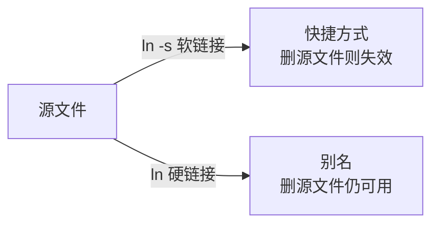
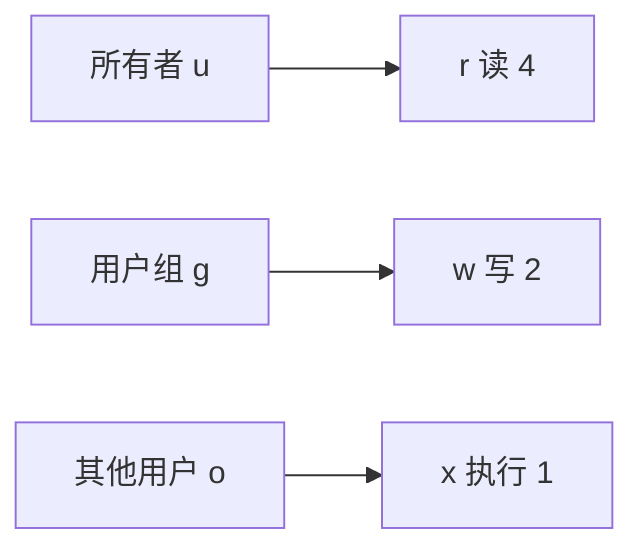

# 3.3 Linux 高级命令

<div align="center">

**第三章 · Linux 命令 · 第 3 节**

*预计学习时间：1.5 小时 · 难度：⭐⭐⭐*

</div>


---

## 📖 本节导读

- ✅ 掌握管道、链接、搜索、查找、压缩
- ✅ 理解文件权限与用户管理
- ✅ 能独立完成日常运维操作

---

## 1. 管道（|）

> 🟦 **知识卡片**
>
> **管道**：一个命令的输出，可以作为另一个命令的输入。管道本质上是存储终端数据的容器。

```bash
ls /bin | more
ls | grep 'lib'
```

**运行效果：**

```
（分页显示 /bin 目录内容，或过滤出含 lib 的行）
```

> 📸 **截图位**：`ls /bin | more` 分页浏览终端界面

---

## 2. 链接命令



| 类型 | 命令 | 特点 |
|------|------|------|
| **软链接** | `ln -s 源文件绝对路径 链接名` | 类似 Windows 快捷方式，源文件删除后失效 |
| **硬链接** | `ln 源文件 链接名` | 类似别名，与源文件共享数据，**不能给目录创建** |

```bash
ln -s /home/python/Desktop/AAA/2.txt ~/2-s2.txt
ln 2.txt hard_2.txt
ls -l
```

> ⚠️ **避坑**：创建软链接时，源文件路径**必须使用绝对路径**。

---

## 3. 文本搜索 grep

| 选项 | 作用 |
|------|------|
| `-i` | 忽略大小写 |
| `-n` | 显示匹配行号 |
| `-v` | 显示不包含匹配文本的行 |

```bash
grep 'hello' 1.txt
grep -n 'error' app.log
ls | grep lib
```

**正则常用：**

| 符号 | 含义 |
|------|------|
| `^` | 以指定字符串开头 |
| `$` | 以指定字符串结尾 |
| `.` | 匹配一个非换行符字符 |

---

## 4. 查找文件 find

```bash
find . -name "1*.txt"
find . -name "1?.txt"
```

| 通配符 | 含义 |
|--------|------|
| `*` | 0 个或多个任意字符 |
| `?` | 任意一个字符 |

> ⚠️ **避坑**：只有 `find` 使用通配符时需要加引号；`ls 1*.txt` 可直接用，但 `rm "*.txt"` 可能报错。

---

## 5. 压缩与解压缩

### 5.1 格式说明

| 格式 | 命令 |
|------|------|
| `.gz` / `.bz2` | `tar` |
| `.zip` | `zip` / `unzip` |

### 5.2 tar 常用选项

| 选项 | 作用 |
|------|------|
| `-c` | 创建打包文件 |
| `-x` | 解包 |
| `-v` | 显示详细信息 |
| `-f` | 指定文件名（必须放最后） |
| `-z` | 压缩/解压缩 `.gz` |
| `-j` | 压缩/解压缩 `.bz2` |
| `-C` | 解压缩到指定目录 |

```bash
# 压缩
tar -zcvf archive.tar.gz my_project/
# 解压缩
tar -zxvf archive.tar.gz
tar -zxvf archive.tar.gz -C /tmp/
```

```bash
# zip 格式
zip -r project.zip my_project/
unzip project.zip -d /tmp/
```

> 🟦 **技巧**：优先使用 `.gz` 格式，占用空间更小；`.zip` 更通用、操作更简单。

---

## 6. 文件权限 chmod



### 6.1 字母法

```bash
chmod u+x info.py      # 给所有者加执行权限
chmod g-w file.txt     # 撤销用户组写权限
chmod o=r file.txt     # 设置其他用户只读
chmod a+r file.txt     # 所有人加读权限
```

### 6.2 数字法

| 权限 | 数字 |
|------|------|
| r（读） | 4 |
| w（写） | 2 |
| x（执行） | 1 |
| -（无） | 0 |

```bash
chmod 755 info.py
chmod 644 config.txt
```

### 6.3 直接执行 Python 脚本

```bash
which python3
chmod +x info.py
```

在文件首行添加：

```python
#!/usr/bin/python3
# -*- coding: utf-8 -*-
```

然后执行：

```bash
./info.py
```

**运行效果：**

```
（脚本正常输出，无需手动输入 python3）
```

---

## 7. 管理员权限

| 命令 | 作用 |
|------|------|
| `sudo -s` | 切换到 root 用户 |
| `sudo 命令` | 临时获取管理员权限执行 |
| `exit` | 退出当前登录用户 |
| `who` | 查看所有登录用户 |
| `whoami` | 查看当前用户 |
| `passwd` | 修改密码 |
| `which 命令` | 查看命令位置 |
| `shutdown -h now` | 立刻关机 |
| `reboot` | 重启 |

> 🟥 **危险警告**：`shutdown` 和 `reboot` 会影响所有在线用户，生产环境务必谨慎！

---

## 8. 用户管理

### 8.1 创建与查看

```bash
sudo useradd -m laowang
sudo passwd laowang
id laowang
cat /etc/passwd
cat /etc/group
```

`/etc/passwd` 每行含义（以 `root:x:0:0:root:/root:/bin/bash` 为例）：

| 字段 | 含义 |
|------|------|
| 第 1 个 | 用户名 |
| 第 2 个 | 密码占位符 |
| 第 3 个 | uid（用户 id） |
| 第 4 个 | gid（组 id） |
| 第 5 个 | 用户描述 |
| 第 6 个 | 主目录 |
| 第 7 个 | shell 类型 |

### 8.2 切换与修改

```bash
su - laowang
sudo usermod -G test laowang
sudo usermod -g abc laowang
sudo gpasswd -a laowang developers
sudo gpasswd -d laowang developers
```

### 8.3 删除用户

```bash
sudo userdel -r laowang
```

> ⚠️ **避坑**：删除用户必须加 `-r`，否则用户主目录不会删除；默认同名用户组也会被删除。

### 8.4 用户组操作

```bash
sudo groupadd test
sudo useradd -m -g test laowang
sudo groupdel test
```

> 用户组下有用户时，需先删用户再删用户组。

---

## 9. 综合练习

请你依次完成：

1. 用 `find` 在家目录查找所有 `.py` 文件
2. 用 `grep -n` 在日志中搜索 `error`
3. 将项目目录打包为 `project.tar.gz`
4. 创建一个测试用户并设置密码

> 📸 **截图位**：find 结果、tar 打包、用户创建成功的终端输出

---

## 10. 本节小结

| 类别 | 核心命令 |
|------|---------|
| 管道 | `\|` |
| 链接 | `ln -s`, `ln` |
| 搜索 | `grep` |
| 查找 | `find` |
| 压缩 | `tar`, `zip`, `unzip` |
| 权限 | `chmod` |
| 管理 | `sudo`, `useradd`, `usermod`, `userdel` |

---

| ← 上一节 | [第三章目录](./README.md) | 下一节 → |
|---------|--------------------------|---------|
| [3.2 基础命令](./02-Linux基础命令.md) | | [3.4 远程登录](./04-远程登录.md) |

*源码：[`Linux命令/3.Linux高级命令`](https://github.com/Drgonmancer/Leo_code/tree/main/Linux命令/3.Linux高级命令)*
