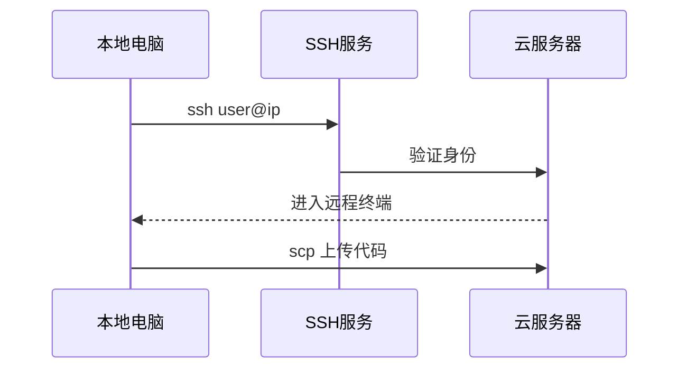

# 3.4 远程登录

<div align="center">

**第三章 · Linux 命令 · 第 4 节**

*预计学习时间：45 分钟 · 难度：⭐⭐*

</div>


---

## 📖 本节导读

- ✅ 理解 SSH 远程登录原理
- ✅ 掌握 `ssh` 和 `scp` 命令
- ✅ 了解 FileZilla 可视化传文件

---

## 1. 为什么需要远程登录？

> 🟦 **知识卡片**
>
> 你的 Python 项目最终部署在**云服务器**上。本地写代码、服务器跑服务——这就需要远程登录和文件传输。



| 场景 | 工具 |
|------|------|
| 登录服务器操作 | `ssh` |
| 上传/下载文件 | `scp` 或 FileZilla |
| 部署 Python 项目 | 先 scp 代码，再 ssh 启动服务 |

---

## 2. SSH 远程登录

### 2.1 软件安装

| 角色 | 系统 | 操作 |
|------|------|------|
| 服务器 | Ubuntu | `sudo apt-get install openssh-server` |
| 客户端 | macOS | 默认已安装，直接用 |
| 客户端 | Windows | 安装 OpenSSH 客户端 |

```bash
# 查看是否已安装
apt list | grep openssh-server
ssh -v
```

### 2.2 基本用法

```bash
ssh 用户名@ip地址
```

**示例：**

```bash
ssh python@192.168.1.100
```

**运行效果：**

```
python@192.168.1.100's password:
Welcome to Ubuntu 22.04 LTS
python@server:~$
```

> 📸 **截图位**：SSH 成功登录后的远程终端界面

> 🟦 **技巧**：一台电脑可以同时安装 SSH 客户端和服务端软件。

---

## 3. SCP 远程拷贝

> **SCP**（Secure Copy）基于 SSH 协议，用于在本地和远程服务器之间安全传输文件。

### 3.1 拷贝文件

```bash
# 本地 → 远程
scp 本地文件 用户名@ip:远程路径

# 远程 → 本地
scp 用户名@ip:远程文件 本地路径
```

**示例：**

```bash
scp main.py python@192.168.1.100:~/project/
scp python@192.168.1.100:~/project/app.log ./
```

### 3.2 拷贝目录

加 `-r` 表示递归拷贝整个目录：

```bash
scp -r my_project python@192.168.1.100:~/deploy/
scp -r python@192.168.1.100:~/logs ./local_logs/
```

**运行效果：**

```
main.py                    100%  1024     1.0MB/s   00:00
```

> 📸 **截图位**：scp 上传项目目录的进度输出

---

## 4. FileZilla 可视化传文件

> 🟦 **知识卡片**
>
> **FileZilla** 是免费开源的 FTP/SFTP 软件，用图形界面拖拽上传下载，适合不熟悉命令行的同学。

| 对比 | scp | FileZilla |
|------|-----|-----------|
| 操作方式 | 命令行 | 图形界面拖拽 |
| 学习成本 | 需记命令 | 直观易上手 |
| 适用场景 | 脚本自动化、快速单文件 | 大量文件、目录浏览 |

连接步骤：

1. 打开 FileZilla
2. 主机填服务器 IP，协议选 SFTP
3. 输入用户名和密码
4. 左侧本地、右侧远程，拖拽即可传文件

> 📸 **截图位**：FileZilla 左右分栏的文件传输界面

---

## 5. 部署实战流程


```bash
# 1. 上传项目
scp -r my_web_app python@192.168.1.100:~/apps/

# 2. 登录服务器
ssh python@192.168.1.100

# 3. 在服务器上操作
cd ~/apps/my_web_app
pip3 install -r requirements.txt
python3 app.py
```

---

## 6. 综合练习

请你依次完成：

1. 在 Ubuntu 虚拟机安装 `openssh-server`
2. 从本机 `ssh` 登录虚拟机
3. 用 `scp` 上传一个 `.py` 文件到虚拟机
4. 尝试用 FileZilla 下载该文件到本地

> 📸 **截图位**：ssh 登录 + scp 传输 + FileZilla 界面的三连截图

---

## 7. 本节小结

| 命令/工具 | 作用 |
|----------|------|
| `ssh 用户@ip` | 远程登录 |
| `scp 文件 用户@ip:路径` | 上传文件 |
| `scp -r 目录 用户@ip:路径` | 上传目录 |
| FileZilla | 可视化文件传输 |

---

| ← 上一节 | [第三章目录](./README.md) | 下一节 → |
|---------|--------------------------|---------|
| [3.3 高级命令](./03-Linux高级命令.md) | | [3.5 Vim 编辑器](./05-Vim编辑器.md) |

*源码：[`Linux命令/4.远程登录`](https://github.com/Drgonmancer/Leo_code/tree/main/Linux命令/4.远程登录)*
