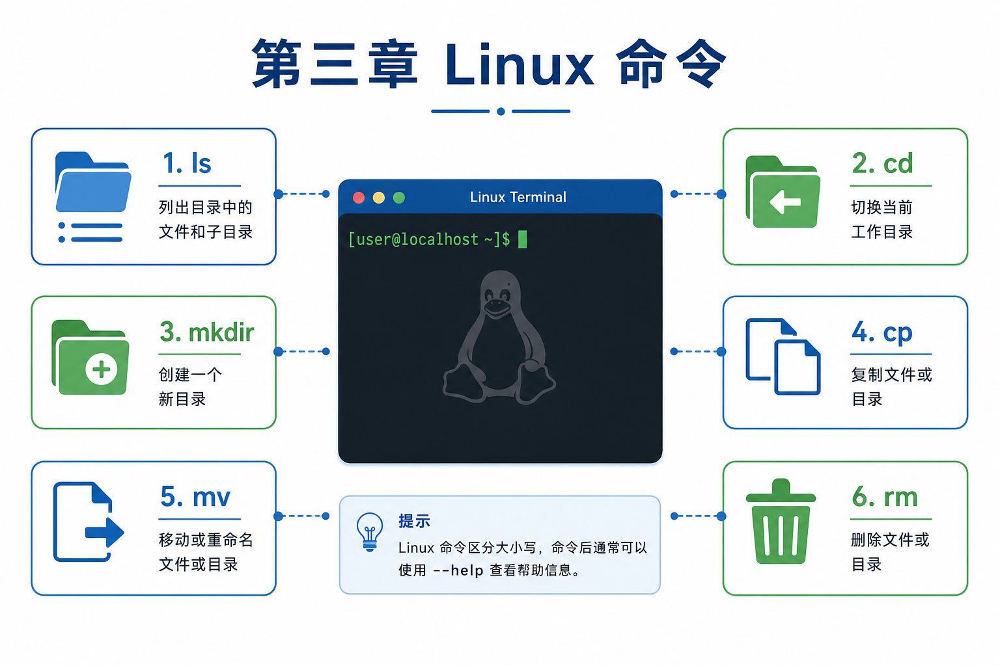

# 第三章 · Linux 命令

> 后端开发离不开 Linux。本章带你从零掌握终端操作，为部署 Web 服务、管理服务器打下基础。

| 节 | 标题 | 链接 |
|:--:|------|------|
| 3.1 | 操作系统与 Linux 入门 | [阅读](./01-操作系统与Linux入门.md) |
| 3.2 | Linux 基础命令 | [阅读](./02-Linux基础命令.md) |
| 3.3 | Linux 高级命令 | [阅读](./03-Linux高级命令.md) |
| 3.4 | 远程登录 | [阅读](./04-远程登录.md) |
| 3.5 | Vim 编辑器 | [阅读](./05-Vim编辑器.md) |
| 3.6 | 软件安装与卸载 | [阅读](./06-软件安装与卸载.md) |

*源码：[`Linux命令/`](https://github.com/Drgonmancer/Leo_code/tree/main/Linux命令)*
