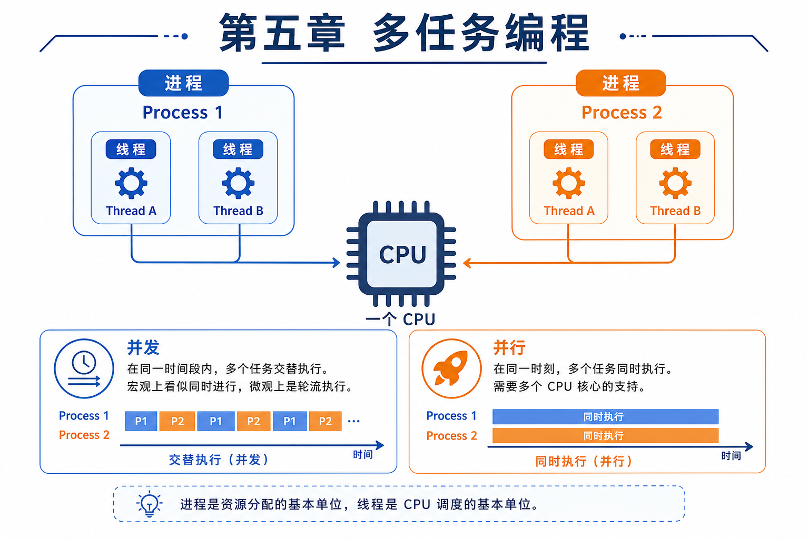

# 第五章 · 多任务编程

> 让程序同时做多件事——进程与线程，是高性能 Python 程序的必备技能。

| 节 | 标题 | 链接 |
|:--:|------|------|
| 5.1 | 多任务概念：并发与并行 | [阅读](./01-多任务概念.md) |
| 5.2 | 进程入门 | [阅读](./02-进程入门.md) |
| 5.3 | 多进程编程 | [阅读](./03-多进程编程.md) |
| 5.4 | 线程入门与多线程 | [阅读](./04-线程与多线程.md) |
| 5.5 | 进程 vs 线程 | [阅读](./05-进程与线程对比.md) |

*源码：[`多任务编程/`](https://github.com/Drgonmancer/Leo_code/tree/main/多任务编程)*
