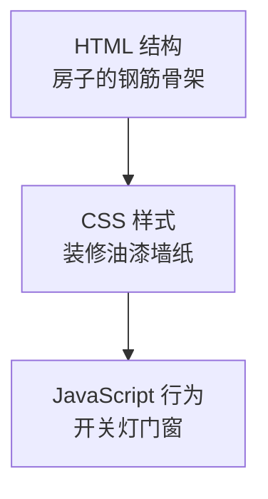

# 6.1 HTML 基础

<div align="center">

**第六章 · Web 前端开发基础 · 第 1 节**

*预计学习时间：1 小时 · 难度：⭐*

</div>


---

## 📖 本节导读

- ✅ 理解 HTML 是什么
- ✅ 写出第一个网页
- ✅ 掌握常用标签

---

## 1. 什么是 HTML？

> 🟦 **知识卡片**
>
> **HTML**（HyperText Mark-up Language）= 超文本标记语言，用来**开发网页结构**的语言。

「超文本」两层含义：
1. 页面里可以有图片、视频、音频（超越纯文字）
2. 可以点击链接跳转到其他网页

**标记** = **标签**，大多数成对出现：`<标签>内容</标签>`

---

## 2. 前端三板斧



| 技术 | 职责 | 本章 |
|------|------|:----:|
| HTML | 结构 | ✅ 本节 |
| CSS | 样式 | 6.2 |
| JavaScript | 交互 | 6.3 |

---

## 3. 第一个网页

**第一步**：新建 `index.html`

**第二步**：写入基本结构

```html
<!DOCTYPE html>
<html>
<head>
    <meta charset="UTF-8">
    <title>我的第一个网页</title>
</head>
<body>
    <h1>Hello, Web!</h1>
    <p>这是我写的第一个网页。</p>
</body>
</html>
```

**第三步**：双击文件，用浏览器打开。

> 📸 **截图位**：浏览器显示 Hello, Web! 的页面

---

## 4. 常用标签速查

| 标签 | 作用 | 示例 |
|------|------|------|
| `<h1>~<h6>` | 标题 | `<h1>大标题</h1>` |
| `<p>` | 段落 | `<p>一段文字</p>` |
| `<a href="">` | 超链接 | `<a href="https://python.org">Python</a>` |
| `` | 图片 | `` |
| `<div>` | 容器块 | `<div>内容</div>` |
| `<ul><li>` | 无序列表 | 见下方 |
| `<table>` | 表格 | 见下方 |

```html
<ul>
    <li>Python</li>
    <li>Java</li>
    <li>Go</li>
</ul>
```

---

## 5. 资源路径

| 写法 | 含义 |
|------|------|
| `images/logo.png` | 相对路径（同目录下 images 文件夹） |
| `/static/style.css` | 绝对路径（从网站根目录） |
| `https://...` | 完整 URL |

---

## 6. 动手练习

创建一个「个人简介」页面，包含：
- 一级标题（你的名字）
- 一段自我介绍
- 一张图片或头像占位
- 三个爱好的列表

> 📸 **截图位**：完成的个人简介页面

---

## 7. 小结

HTML 负责网页的**骨架**。下一节用 CSS 给它「穿上衣服」。

---

| ← 上一章 | [第六章目录](./README.md) | 下一节 → |
|---------|--------------------------|---------|
| [第五章 多任务](C5/README.md) | | [6.2 CSS 基础](./02-CSS基础.md) |

*源码：[`web前端开发基础/Html基础/`](https://github.com/Drgonmancer/Leo_code/tree/main/web前端开发基础/Html基础)*
