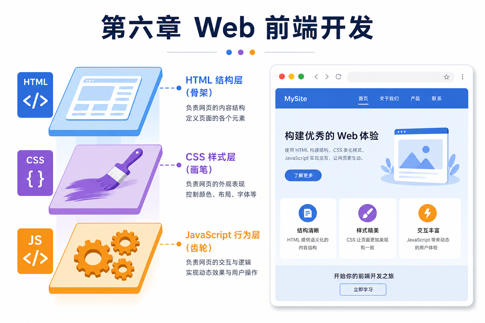

# 第六章 · Web 前端开发基础

> 后端程序员也需要懂前端。本章覆盖 HTML、CSS、JavaScript、jQuery，让你能看懂页面、改得动界面。

| 节 | 标题 | 链接 |
|:--:|------|------|
| 6.1 | HTML 基础 | [阅读](./01-HTML基础.md) |
| 6.2 | CSS 基础 | [阅读](./02-CSS基础.md) |
| 6.3 | JavaScript 基础 | [阅读](./03-JavaScript基础.md) |
| 6.4 | jQuery 与 Ajax | [阅读](./04-jQuery与Ajax.md) |

*源码：[`web前端开发基础/`](https://github.com/Drgonmancer/Leo_code/tree/main/web前端开发基础)*
