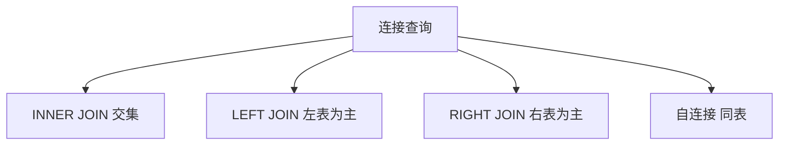
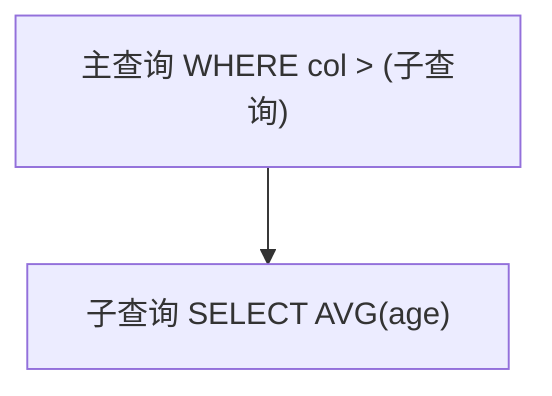

# 7.4 高级查询

<div align="center">

**第七章 · MySQL 数据库 · 第 4 节**

*预计学习时间：2.5 小时 · 难度：⭐⭐⭐*

</div>


---

## 📖 本节导读

排序、聚合、连接、子查询——让 SQL 从「查表」升级为「数据分析」。


| 你将学会 | 核心关键词 |
|----------|-----------|
| 结果排序 | `ORDER BY` `ASC` `DESC` |
| 分页显示 | `LIMIT` |
| 统计计算 | `COUNT` `MAX` `MIN` `SUM` `AVG` |
| 多表查询 | `INNER JOIN` `LEFT JOIN` |
| 嵌套查询 | 子查询 |

> 📂 本章对应源码：[MySQL高级查询/](https://github.com/Drgonmancer/Leo_code/tree/main/MySQL数据库/MySQL高级查询)

---

## 1. 排序查询

```sql
SELECT * FROM 表名 ORDER BY 列1 ASC|DESC [, 列2 ASC|DESC, ...];
```

```sql
SELECT * FROM students
WHERE gender = '男' AND isdelete = 0
ORDER BY id DESC;

SELECT * FROM students ORDER BY age DESC, height DESC;
```

**运行效果：**

```
+----+--------+-----+--------+--------+
| id | name   | age | height | gender |
+----+--------+-----+--------+--------+
|  5 | 关羽   |  58 | 1.85   | 男     |
|  4 | 张飞   |  55 | 1.75   | 男     |
+----+--------+-----+--------+--------+
```

| 规则 | 说明 |
|------|------|
| `ASC` | 升序（默认） |
| `DESC` | 降序 |
| 多列 | 先按列 1 排，相同再按列 2 |

---

## 2. 分页查询

京东商品列表一页显示不完，就是分页查询。

```sql
SELECT * FROM 表名 LIMIT start, count;
```

```sql
SELECT * FROM students WHERE gender = '男' LIMIT 0, 3;
SELECT * FROM students WHERE gender = '男' LIMIT 3;  -- start 默认 0
```

### 分页公式

第 **n** 页，每页 **m** 条：

```sql
SELECT * FROM students LIMIT (n - 1) * m, m;
```

| 页码 | 每页 10 条 | SQL |
|------|-----------|-----|
| 第 1 页 | 10 | `LIMIT 0, 10` |
| 第 2 页 | 10 | `LIMIT 10, 10` |
| 第 3 页 | 10 | `LIMIT 20, 10` |

> 📸 **截图位**：后端 API 分页接口返回的数据结构

---

## 3. 聚合函数

| 函数 | 作用 |
|------|------|
| `COUNT(col)` | 求指定列行数 |
| `MAX(col)` | 最大值 |
| `MIN(col)` | 最小值 |
| `SUM(col)` | 求和 |
| `AVG(col)` | 平均值 |

> 💡 聚合函数**忽略 NULL 值**。

```sql
SELECT COUNT(*) FROM students;
SELECT MAX(id) FROM students WHERE gender = '女';
SELECT AVG(height) FROM students WHERE gender = '男';
SELECT AVG(IFNULL(height, 0)) FROM students WHERE gender = '男';
```

**运行效果：**

```
+----------+
| COUNT(*) |
+----------+
|       10 |
+----------+
```

---

## 4. 分组查询

```sql
GROUP BY 列名 [HAVING 条件] [WITH ROLLUP]
```

```sql
SELECT gender, AVG(age) FROM students GROUP BY gender;
SELECT gender, COUNT(*) FROM students GROUP BY gender HAVING COUNT(*) > 2;
SELECT gender, COUNT(*) FROM students GROUP BY gender WITH ROLLUP;
```

**WHERE vs HAVING：**

| 对比 | WHERE | HAVING |
|------|-------|--------|
| 过滤时机 | 分组**前** | 分组**后** |
| 能否用聚合函数 | ❌ | ✅ |

```sql
SELECT gender, GROUP_CONCAT(name) FROM students GROUP BY gender;
```

---

## 5. 连接查询



### 5.1 内连接

```sql
SELECT * FROM students AS s
INNER JOIN classes AS c ON s.cls_id = c.id;
```

### 5.2 左连接

```sql
SELECT * FROM students s
LEFT JOIN classes c ON s.cls_id = c.id;
```

### 5.3 右连接

```sql
SELECT * FROM students AS s
RIGHT JOIN classes AS c ON s.cls_id = c.id;
```

| 连接类型 | 结果 |
|----------|------|
| `INNER JOIN` | 两表交集 |
| `LEFT JOIN` | 左表全部 + 右表匹配 |
| `RIGHT JOIN` | 右表全部 + 左表匹配 |

### 5.4 自连接

```sql
SELECT c.id, c.title, p.title AS parent_title
FROM areas AS c
INNER JOIN areas AS p ON c.pid = p.id
WHERE p.title = '湖南省';
```

> ⚠️ **避坑**：自连接必须给表起别名。

---

## 6. 子查询

```sql
-- 查询大于平均年龄的学生
SELECT * FROM students
WHERE age > (SELECT AVG(age) FROM students);

-- 查询学生所在的所有班级名字
SELECT name FROM classes
WHERE id IN (SELECT cls_id FROM students WHERE cls_id IS NOT NULL);

-- 查找年龄最大且身高最高的学生
SELECT * FROM students
WHERE (age, height) = (SELECT MAX(age), MAX(height) FROM students);
```



---

## 7. 综合练习

1. 查询所有学生，按年龄升序排列
2. 每页 5 条，写出第 3 页的 SQL
3. 统计每个班级人数，只显示人数 > 3 的班级
4. 用左连接查询所有学生及其班级名称
5. 查询价格高于平均价格的商品（子查询）

> 📸 **截图位**：多表 JOIN 查询结果，含 NULL 填充的行

---

## 8. 本节小结

| 知识点 | 语法要点 |
|--------|----------|
| 排序 | `ORDER BY col ASC/DESC` |
| 分页 | `LIMIT (n-1)*m, m` |
| 聚合 | `COUNT` `MAX` `MIN` `SUM` `AVG` |
| 分组 | `GROUP BY` + `HAVING` |
| 连接 | `INNER/LEFT/RIGHT JOIN ... ON ...` |
| 子查询 | 嵌套在 `()` 中的 SELECT |

---

| ← 上一节 | [第七章目录](./README.md) | 下一节 → |
|---------|--------------------------|---------|
| [7.3 WHERE 条件查询](./03-where条件查询.md) | | [7.5 高级操作](./05-高级操作.md) |

*源码：[`MySQL数据库/MySQL高级查询/`](https://github.com/Drgonmancer/Leo_code/tree/main/MySQL数据库/MySQL高级查询)*
