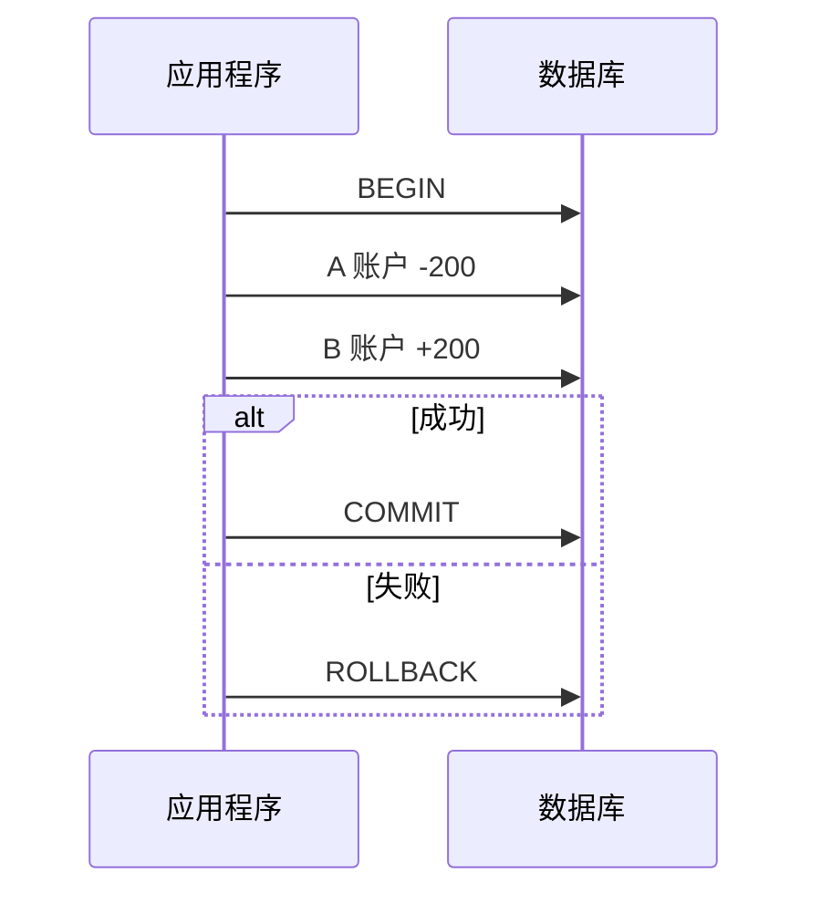

# 7.6 事务与索引

<div align="center">

**第七章 · MySQL 数据库 · 第 6 节**

*预计学习时间：2 小时 · 难度：⭐⭐⭐*

</div>


---

## 📖 本节导读

事务保证数据一致性，索引加速查询性能——后端开发的两把「安全锁」和「加速器」。


| 你将学会 | 核心关键词 |
|----------|-----------|
| 理解事务场景 | ACID |
| 控制事务 | `BEGIN` `COMMIT` `ROLLBACK` |
| 加速查询 | `INDEX` |
| 复合索引 | 最左原则 |

> 📂 本章对应源码：[事务与索引/](https://github.com/Drgonmancer/Leo_code/tree/main/MySQL数据库/事务与索引)

---

## 1. 事务的介绍

**事务**是一系列 SQL 操作，要么**全部执行**，要么**全部不执行**。

### 1.1 银行转账场景



### 1.2 ACID 四大特性

| 特性 | 说明 |
|------|------|
| **原子性** | 全部成功或全部失败 |
| **一致性** | 数据库状态始终一致 |
| **隔离性** | 未提交事务对其他事务不可见 |
| **持久性** | 提交后永久保存 |

---

## 2. 事务的使用

### 2.1 存储引擎

```sql
SHOW ENGINES;
```

| 引擎 | 事务 | 特点 |
|------|------|------|
| **InnoDB** | ✅ | 默认引擎 |
| **MyISAM** | ❌ | 速度快，适合只读场景 |

### 2.2 开启、提交、回滚

```sql
BEGIN;
UPDATE account SET balance = balance - 200 WHERE id = 1;
UPDATE account SET balance = balance + 200 WHERE id = 2;
COMMIT;

-- 或回滚
ROLLBACK;
```

### 2.3 自动提交

```sql
SET autocommit = 0;  -- 取消自动提交，需手动 COMMIT
```

> 💡 PyMySQL 中：`conn.commit()` 提交，`conn.rollback()` 回滚。

---

## 3. 索引

索引好比书的**目录**，加快查询速度。

```sql
SHOW INDEX FROM classes;
ALTER TABLE classes ADD INDEX my_name (name);
ALTER TABLE classes DROP INDEX my_name;
```

> 主键列**自动创建索引**。

---

## 4. 验证索引性能

```sql
SET profiling = 1;
SELECT * FROM test_index WHERE title = 'ha-99999';
SHOW PROFILES;

ALTER TABLE test_index ADD INDEX (title);

SELECT * FROM test_index WHERE title = 'ha-99999';
SHOW PROFILES;
```

**运行效果：**

```
+----------+------------+------------------------+
| Query_ID | Duration   | Query                  |
+----------+------------+------------------------+
|        1 | 0.05234100 | SELECT * ... ha-99999  |
|        2 | 0.00120300 | SELECT * ... ha-99999  |
+----------+------------+------------------------+
```

> 📸 **截图位**：索引创建前后 `SHOW PROFILES` 的 Duration 对比

### Python 批量插入测试

```python
import pymysql

conn = pymysql.connect(
    host="localhost", port=3306,
    user="root", password="mysql",
    database="python41", charset="utf8"
)
cursor = conn.cursor()
sql = "INSERT INTO mytest(name) VALUES(%s);"

try:
    for i in range(10000):
        cursor.execute(sql, ["test" + str(i)])
    conn.commit()
except Exception as e:
    conn.rollback()
finally:
    cursor.close()
    conn.close()
```

---

## 5. 联合索引与最左原则

```sql
ALTER TABLE teacher ADD INDEX (name, age);
```

| 查询 | 是否使用索引 |
|------|-------------|
| `WHERE name = '张三'` | ✅ |
| `WHERE name = '李四' AND age = 10` | ✅ |
| `WHERE age = 10` | ❌ 缺少最左 name |

> ⚠️ **避坑**：联合索引必须保证**最左侧字段**出现在 WHERE 中。

---

## 6. 索引使用原则

| 原则 | 说明 |
|------|------|
| 不是越多越好 | 维护成本随数据量增长 |
| 常查字段建索引 | WHERE、JOIN、ORDER BY 常用列 |
| 小表不必索引 | 全表扫描可能更快 |
| 低基数字段不建 | 如性别只有男/女 |

---

## 7. 综合练习

1. 模拟银行转账，中途出错并 ROLLBACK
2. 给 students.name 建索引，用 profiling 对比
3. 创建 `(name, age, gender)` 联合索引，测试哪些 WHERE 能命中
4. 说明为什么「性别」不适合单独建索引

---

## 8. 本节小结

| 操作 | SQL |
|------|-----|
| 开启事务 | `BEGIN;` |
| 提交 | `COMMIT;` |
| 回滚 | `ROLLBACK;` |
| 创建索引 | `ALTER TABLE 表 ADD INDEX (字段);` |
| 删除索引 | `ALTER TABLE 表 DROP INDEX 索引名;` |

---

| ← 上一节 | [第七章目录](./README.md) | 下一节 → |
|---------|--------------------------|---------|
| [7.5 高级操作](./05-高级操作.md) | | [7.7 Python 与 MySQL 交互](./07-Python与MySQL交互.md) |

*源码：[`MySQL数据库/事务与索引/`](https://github.com/Drgonmancer/Leo_code/tree/main/MySQL数据库/事务与索引)*
