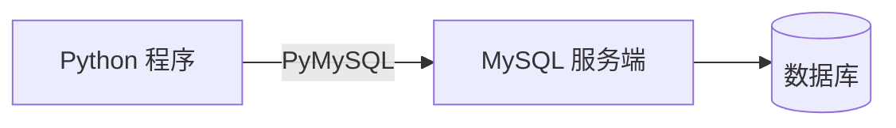
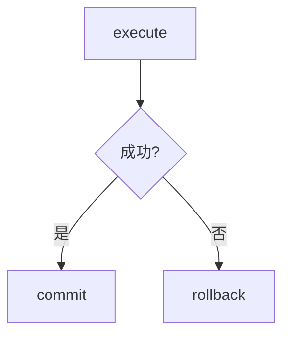
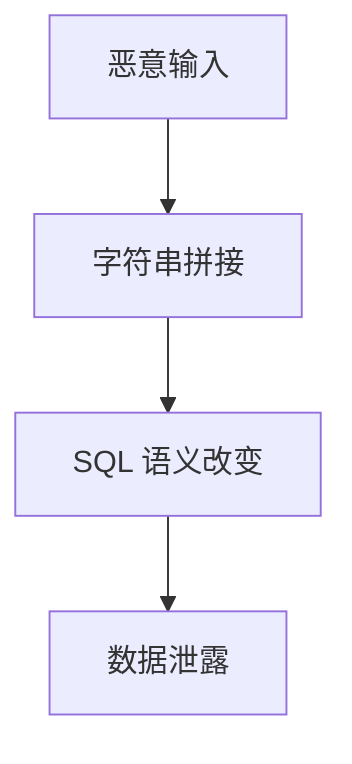

# 7.7 Python 与 MySQL 交互

<div align="center">

**第七章 · MySQL 数据库 · 第 7 节**

*预计学习时间：2 小时 · 难度：⭐⭐⭐*

</div>


---

## 📖 本节导读

用代码连接数据库，让程序成为数据的指挥官。本节学习 PyMySQL 的安装与使用，完成增删改查，并掌握 SQL 注入防护。


| 你将学会 | 核心关键词 |
|----------|-----------|
| 安装 PyMySQL | `pip install pymysql` |
| 连接与游标 | `connect()` `cursor()` |
| 结果获取 | `fetchone()` `fetchall()` |
| 防 SQL 注入 | 参数化 `%s` |

> 📂 本章对应源码：[python与mysql交互/](https://github.com/Drgonmancer/Leo_code/tree/main/MySQL数据库/python与mysql交互)

---

## 1. 为什么用 Python 操作 MySQL

插入 10000 条数据，手动操作不现实。通过**程序代码**连接 MySQL 进行增删改查，就是**数据库编程**。



---

## 2. 安装 PyMySQL

```bash
pip3 install pymysql
pip3 show pymysql
```

| 命令 | 作用 |
|------|------|
| `pip3 install pymysql` | 安装 |
| `pip3 uninstall pymysql` | 卸载 |
| `pip3 list` | 查看已安装包 |

---

## 3. 连接与游标

```python
import pymysql

conn = pymysql.connect(
    host="localhost",
    port=3306,
    user="root",
    password="mysql",
    database="python41",
    charset="utf8"
)

cursor = conn.cursor()
```

| 连接方法 | 作用 |
|----------|------|
| `conn.close()` | 关闭连接 |
| `conn.commit()` | 提交事务 |
| `conn.rollback()` | 回滚事务 |

| 游标方法 | 作用 |
|----------|------|
| `cursor.execute(sql, params)` | 执行 SQL |
| `cursor.fetchone()` | 获取一条，返回元组 |
| `cursor.fetchall()` | 获取全部，返回元组列表 |
| `cursor.close()` | 关闭游标 |

---

## 4. 查询数据

```python
import pymysql

conn = pymysql.connect(
    host="localhost", port=3306,
    user="root", password="mysql",
    database="python41", charset="utf8"
)
cursor = conn.cursor()
cursor.execute("SELECT * FROM students;")

result = cursor.fetchall()
for row in result:
    print(row)

cursor.close()
conn.close()
```

**运行效果：**

```
(1, '小明', 18, 1.75, '男')
(2, '小红', 17, 1.60, '女')
(3, '张飞', 55, 1.75, '男')
```

> 📸 **截图位**：VS Code 中 Python 脚本运行，终端打印查询结果

---

## 5. 增删改操作

```python
import pymysql

if __name__ == '__main__':
    conn = pymysql.connect(
        host="localhost", port=3306,
        user="root", password="mysql",
        database="python41", charset="utf8"
    )
    cursor = conn.cursor()

    sql = "INSERT INTO classes(name) VALUES('python50');"
    # sql = "UPDATE classes SET name = 'python45' WHERE id = 5;"
    # sql = "DELETE FROM classes WHERE id = 5;"

    try:
        cursor.execute(sql)
        conn.commit()
        print("操作成功")
    except Exception as e:
        conn.rollback()
        print(f"操作失败: {e}")
    finally:
        cursor.close()
        conn.close()
```

**运行效果：**

```
操作成功
```



| 操作 | 需要 commit |
|------|-------------|
| SELECT | ❌ |
| INSERT / UPDATE / DELETE | ✅ |

---

## 6. SQL 注入与防护

### 6.1 什么是 SQL 注入

用户提交恶意数据与 SQL **字符串拼接**，改变 SQL 语义，导致数据泄露。

```python
# ❌ 危险写法
name = "黄蓉' OR 1 = 1 OR '"
sql = "SELECT * FROM students WHERE name = '%s';" % name
# 实际: SELECT * FROM students WHERE name = '黄蓉' OR 1 = 1 OR ''
# 1=1 永远为真 → 返回全部数据！
```



### 6.2 参数化查询（正确做法）

```python
sql = "SELECT * FROM students WHERE name = %s;"
cursor.execute(sql, ("黄蓉' OR 1 = 1 OR'",))
```

> ⚠️ **避坑**：SQL 中的 `%s` 是占位符，**不是** Python 字符串格式化；**不要**给 `%s` 加引号。

### 6.3 多参数

```python
sql = "INSERT INTO students(name, age, gender, c_id) VALUES(%s, %s, %s, %s);"
cursor.execute(sql, ["司马懿", 76, '男', 3])
conn.commit()
```

| 写法 | 安全性 |
|------|--------|
| `"%" % var` / `f"{var}"` / `+` 拼接 | ❌ |
| `execute(sql, (var,))` 参数化 | ✅ |

---

## 7. 完整 CRUD 示例

```python
import pymysql

def get_connection():
    return pymysql.connect(
        host="localhost", port=3306,
        user="root", password="mysql",
        database="python41", charset="utf8"
    )

def query_all():
    conn = get_connection()
    cursor = conn.cursor()
    cursor.execute("SELECT id, name, age FROM students WHERE isdelete = 0;")
    for row in cursor.fetchall():
        print(row)
    cursor.close()
    conn.close()

def insert_student(name, age, gender):
    conn = get_connection()
    cursor = conn.cursor()
    sql = "INSERT INTO students(name, age, gender) VALUES(%s, %s, %s);"
    try:
        cursor.execute(sql, (name, age, gender))
        conn.commit()
        print(f"插入成功，ID: {cursor.lastrowid}")
    except Exception as e:
        conn.rollback()
        print(f"插入失败: {e}")
    finally:
        cursor.close()
        conn.close()

if __name__ == '__main__':
    query_all()
    insert_student("赵云", 25, '男')
    query_all()
```

**运行效果：**

```
(1, '小明', 18)
(2, '小红', 17)
插入成功，ID: 11
(1, '小明', 18)
(2, '小红', 17)
(11, '赵云', 25)
```

---

## 8. 综合练习

1. 用 PyMySQL 查询所有女生的姓名和年龄
2. 编写函数向 classes 表插入记录，使用参数化
3. 用 `executemany()` 批量插入 10 条学生记录
4. 解释为什么字符串拼接会导致 SQL 注入

> 📸 **截图位**：PyMySQL 批量插入后 Navicat 中看到的记录

---

## 9. 本节小结

| 知识点 | 要点 |
|--------|------|
| 安装 | `pip3 install pymysql` |
| 连接 | `pymysql.connect(...)` |
| 查询 | `execute` → `fetchall` |
| 增删改 | `execute` → `commit` / `rollback` |
| 防注入 | `%s` 占位 + 参数元组，禁止拼接 |

---

| ← 上一节 | [第七章目录](./README.md) | 下一节 → |
|---------|--------------------------|---------|
| [7.6 事务与索引](./06-事务与索引.md) | | — |

*源码：[`MySQL数据库/python与mysql交互/`](https://github.com/Drgonmancer/Leo_code/tree/main/MySQL数据库/python与mysql交互)*
