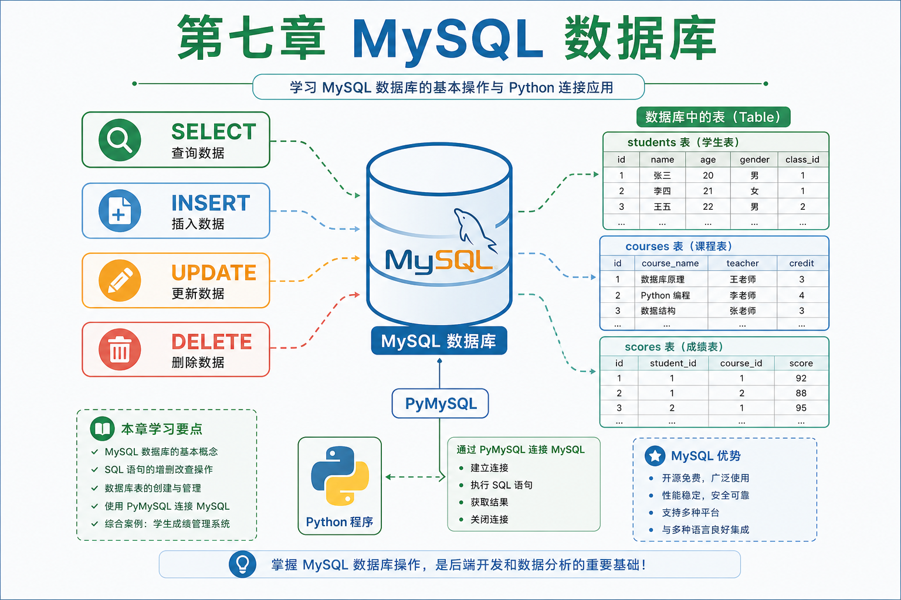

# 第七章 · MySQL 数据库

> 从数据库概念到 SQL 查询，再到 Python 编程操作——掌握后端数据存储的核心技能。

| 节 | 标题 | 预计时间 | 链接 |
|:--:|------|:--------:|------|
| 7.1 | MySQL 介绍 | 1h | [阅读](./01-MySQL介绍.md) |
| 7.2 | 数据库和表操作 | 2h | [阅读](./02-数据库和表操作.md) |
| 7.3 | WHERE 条件查询 | 2h | [阅读](./03-where条件查询.md) |
| 7.4 | 高级查询 | 2.5h | [阅读](./04-高级查询.md) |
| 7.5 | 高级操作 | 2.5h | [阅读](./05-高级操作.md) |
| 7.6 | 事务与索引 | 2h | [阅读](./06-事务与索引.md) |
| 7.7 | Python 与 MySQL 交互 | 2h | [阅读](./07-Python与MySQL交互.md) |

*源码：[`MySQL数据库/`](https://github.com/Drgonmancer/Leo_code/tree/main/MySQL数据库)*
