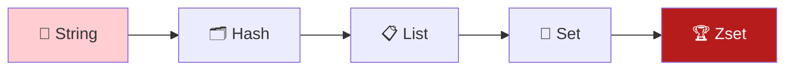
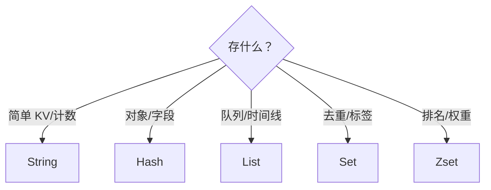

# 8.2 Redis 命令与数据结构

<div align="center">

**第八章 · Redis 数据库 · 第 2 节**

*预计学习时间：2.5 小时 · 难度：⭐⭐⭐*

</div>


---

## 📖 本节导读

Redis 不止 String！本节系统学习 **String、Hash、List、Set、Zset** 五大核心数据类型及常用命令——选对类型，事半功倍。



| 你将学会 | 核心关键词 |
|----------|-----------|
| 字符串与计数器 | `set` `incr` `mset` |
| 存储对象 | `hset` `hgetall` |
| 消息队列 | `lpush` `rpop` |
| 去重与集合运算 | `sadd` `sinter` |
| 排行榜 | `zadd` `zrevrange` |

> 📂 本章对应源码：[Redis 完整命令手册.md](https://github.com/Drgonmancer/Leo_code/blob/main/Redis数据库/Redis%20完整命令手册.md)

---

## 1. 键（Key）通用操作

| 命令 | 作用 |
|------|------|
| `set key value` | 设置键值 |
| `get key` | 获取值 |
| `del key [key...]` | 删除键 |
| `exists key` | 检查是否存在 |
| `type key` | 查看数据类型 |
| `keys pattern` | 查找匹配的键（生产慎用） |
| `rename old new` | 重命名 |
| `expire key 秒` | 设置过期 |

```bash
set user:1:name "张三"
type user:1:name
keys user:*
```

**运行效果：**

```
1) "user:1:name"
```

> ⚠️ **避坑**：`keys *` 在生产环境会阻塞 Redis，大数据量用 `scan` 代替。

---

## 2. 字符串（String）

最基础类型，二进制安全，最大 512MB。

### 2.1 基本操作

```bash
set name zhangsan
get name
mset name lisi age 20 city beijing
mget name age city
strlen name
```

**运行效果：**

```
1) "lisi"
2) "20"
3) "beijing"
```

### 2.2 数值操作（计数器）

```bash
set page_view 0
incr page_view
incrby page_view 10
decr page_view
incrbyfloat price 0.5
```

**运行效果：**

```
(integer) 11
```

| 场景 | 命令 |
|------|------|
| 页面访问量 | `INCR page:view:home` |
| 点赞数 | `INCR article:100:likes` |
| 分布式 ID | `INCR global:id` |

### 2.3 高级操作

```bash
setex token abc123 3600
setnx lock:order 1
append name "_suffix"
getrange name 0 3
```

> 📸 **截图位**：redis-cli 中 INCR 计数器连续执行的效果

---

## 3. 哈希（Hash）

适合存储**对象**，类似 `Map<String, Object>`。

```bash
hset user:1001 name zhangsan
hset user:1001 age 25
hget user:1001 name
hmset user:1002 name lisi age 30 city beijing
hgetall user:1001
hkeys user:1001
hvals user:1001
hlen user:1001
hexists user:1001 name
hdel user:1001 age
hincrby user:1001 age 1
```

**运行效果：**

```
1) "name"
2) "zhangsan"
3) "age"
4) "25"
```

| 对比 | String 存对象 | Hash 存对象 |
|------|--------------|------------|
| 灵活性 | 需 JSON 序列化 | 字段级读写 |
| 内存 | 整个对象读写 | 只读需要的字段 |
| 典型场景 | 简单 KV | 用户信息、购物车 |

---

## 4. 列表（List）

双向链表，有序，可头尾操作。

```bash
lpush tasks send_email
lpush tasks backup_db
rpush tasks clean_log
lrange tasks 0 -1
llen tasks
lindex tasks 0
lpop tasks
rpop tasks
lrem tasks 1 backup_db
lset tasks 0 "urgent_task"
ltrim tasks 0 2
```

**运行效果：**

```
1) "backup_db"
2) "send_email"
3) "clean_log"
```

### 4.1 阻塞队列

```bash
blpop tasks 0
brpop tasks 10
```

| 场景 | 用法 |
|------|------|
| 消息队列 | LPUSH 生产 + BRPOP 消费 |
| 最新动态 | LPUSH + LTRIM 保留最新 N 条 |
| 栈 | LPUSH + LPOP |


---

## 5. 集合（Set）

无序、**唯一**的字符串集合。

```bash
sadd tags python redis mysql
smembers tags
scard tags
sismember tags python
srem tags mysql
srandmember tags 1
spop tags
```

**运行效果：**

```
1) "python"
2) "redis"
```

### 5.1 集合运算

```bash
sadd user:1:follow tom jerry
sadd user:2:follow tom spike
sinter user:1:follow user:2:follow
sunion user:1:follow user:2:follow
sdiff user:1:follow user:2:follow
```

**运行效果（交集 — 共同关注）：**

```
1) "tom"
```

| 命令 | 含义 |
|------|------|
| `SINTER` | 交集 |
| `SUNION` | 并集 |
| `SDIFF` | 差集 |

---

## 6. 有序集合（Zset）

每个成员关联一个 **score**，按 score 排序。

```bash
zadd ranking 100 alice
zadd ranking 200 bob 150 charlie
zrange ranking 0 -1 WITHSCORES
zrevrange ranking 0 2 WITHSCORES
zrank ranking alice
zscore ranking bob
zincrby ranking 50 alice
zcount ranking 100 200
zrem ranking bob
```

**运行效果（排行榜 TOP 3）：**

```
1) "bob"
2) "200"
3) "charlie"
4) "150"
5) "alice"
6) "100"
```

| 场景 | 用法 |
|------|------|
| 游戏排行榜 | ZADD + ZREVRANGE |
| 延时队列 | score = 执行时间戳 |
| 热搜榜 | ZINCRBY 累加热度 |

> 📸 **截图位**：ZREVRANGE 排行榜输出 WITHSCORES 的结果

---

## 7. 数据类型选择指南



| 类型 | 典型场景 |
|------|----------|
| String | 缓存、计数器、分布式锁 |
| Hash | 用户信息、购物车 |
| List | 消息队列、最新消息 |
| Set | 标签、共同好友、抽奖 |
| Zset | 排行榜、延时任务 |

---

## 8. 综合练习

1. 用 Hash 存储一个用户（name、age、city），并 hgetall 查看
2. 用 List 模拟任务队列：LPUSH 3 个任务，BRPOP 取出一个
3. 用 Set 存储两个用户的关注列表，求交集（共同关注）
4. 用 Zset 创建游戏排行榜，添加 5 个玩家，查看 TOP 3
5. 给缓存 key 设置 300 秒过期

---

## 9. 本节小结

| 类型 | 核心命令 |
|------|---------|
| String | `set` `get` `incr` `mset` `setex` |
| Hash | `hset` `hget` `hgetall` `hincrby` |
| List | `lpush` `rpush` `lrange` `lpop` `blpop` |
| Set | `sadd` `smembers` `sinter` `sunion` |
| Zset | `zadd` `zrange` `zrevrange` `zincrby` |

---

| ← 上一节 | [第八章目录](./README.md) | 下一节 → |
|---------|--------------------------|---------|
| [8.1 NoSQL 与 Redis 入门](./01-NoSQL与Redis入门.md) | | [8.3 持久化与高可用](./03-持久化与高可用.md) |

*源码：[`Redis数据库/Redis 完整命令手册.md`](https://github.com/Drgonmancer/Leo_code/blob/main/Redis数据库/Redis%20完整命令手册.md)*
