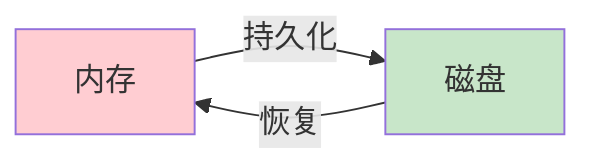
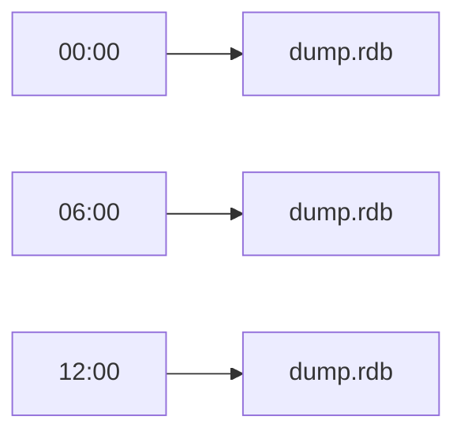
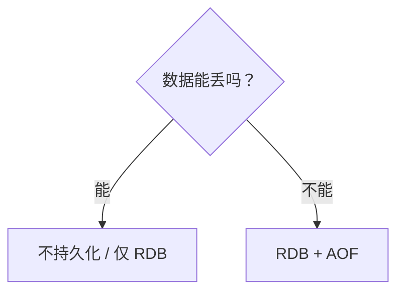
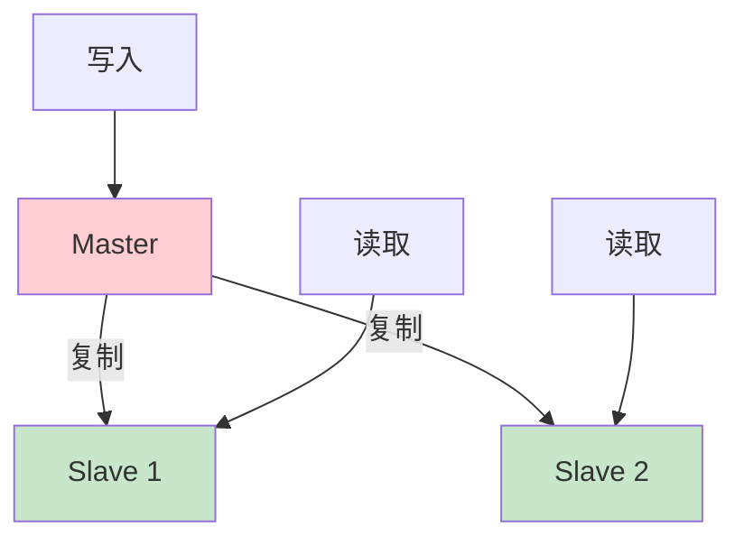
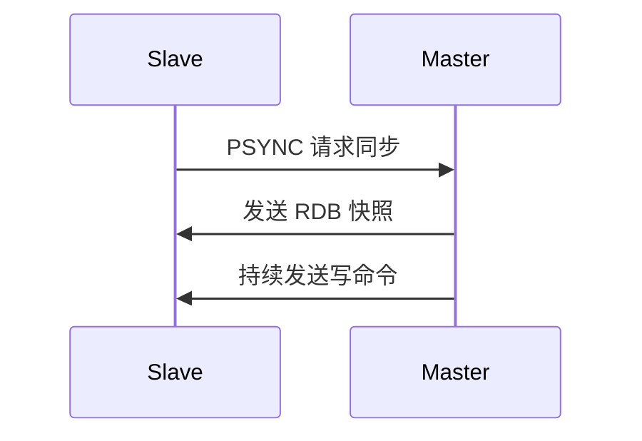

# 8.3 持久化与高可用

<div align="center">

**第八章 · Redis 数据库 · 第 3 节**

*预计学习时间：2 小时 · 难度：⭐⭐⭐*

</div>


---

## 📖 本节导读

Redis 数据在内存里，断电就没了？不一定。本节学习 **RDB 快照** 和 **AOF 日志** 两种持久化方式，以及 **主从复制** 实现高可用。


| 你将学会 | 核心关键词 |
|----------|-----------|
| 持久化的意义 | 内存 → 磁盘 |
| RDB 原理与配置 | `save` `bgsave` |
| AOF 原理与配置 | `appendonly` `appendfsync` |
| 主从复制架构 | Master / Slave |

> 📂 本章对应源码：[Redis 持久化与高可用.md](https://github.com/Drgonmancer/Leo_code/blob/main/Redis数据库/Redis%20持久化与高可用.md)

---

## 1. 什么是持久化

**持久化**将内存中的数据保存到磁盘，确保 Redis 重启后数据不丢失。



| 方式 | 全称 | 特点 | 比喻 |
|------|------|------|------|
| **RDB** | Redis Database | 定时数据快照 | 📸 拍照 |
| **AOF** | Append Only File | 记录所有写命令 | 📓 写日记 |

---

## 2. RDB 持久化

### 2.1 工作原理

在指定时间点，把内存中**全部数据**保存到硬盘文件 `dump.rdb`。



### 2.2 触发方式

**自动触发（redis.conf）：**

```bash
save 900 1       # 900 秒内至少 1 个 key 变化
save 300 10      # 300 秒内至少 10 个 key 变化
save 60 10000    # 60 秒内至少 10000 个 key 变化
```

**手动触发：**

```bash
redis-cli save          # 阻塞式保存
redis-cli bgsave        # 后台异步保存（推荐）
redis-cli lastsave      # 查看上次保存时间
```

**运行效果：**

```
OK
```

### 2.3 优缺点

| 优点 | 缺点 |
|------|------|
| 文件紧凑，适合备份 | 可能丢失最后一次快照后的数据 |
| 恢复速度快 | fork 子进程时有短暂阻塞 |
| 适合灾难恢复 | 大数据集 fork 耗时较长 |

> 🟦 **技巧**：生产环境定时备份 RDB 文件到远程存储。

---

## 3. AOF 持久化

### 3.1 工作原理

Redis 执行的**每一个写操作**都记录到 AOF 文件中，重启时**重放命令**恢复数据。


### 3.2 写入策略

| 策略 | 安全性 | 性能 | 最多丢失 |
|------|--------|------|----------|
| `always` | 最高 | 最慢 | 0 |
| `everysec` | 高 | 较快 | 约 1 秒 |
| `no` | 低 | 最快 | 不确定 |

**redis.conf 配置：**

```bash
appendonly yes
appendfsync everysec
```

> 💡 默认推荐 `everysec`，平衡性能与安全。

### 3.3 AOF 重写

AOF 文件会越来越大，**重写**可以压缩体积：

```bash
redis-cli bgrewriteaof

# 自动触发配置
auto-aof-rewrite-percentage 100
auto-aof-rewrite-min-size 64mb
```

### 3.4 优缺点

| 优点 | 缺点 |
|------|------|
| 数据更安全 | 文件通常比 RDB 大 |
| 可读（文本命令） | 恢复速度较慢 |
| 可追加 | 长期运行需重写 |

---

## 4. 持久化策略选择

| 场景 | 推荐方案 |
|------|----------|
| 数据不太重要（纯缓存） | 可不持久化 / 仅 RDB |
| 数据非常重要 | RDB + AOF |
| 大数据量 | RDB 为主 |
| 追求极致安全 | AOF always |
| 一般生产环境 | RDB + AOF everysec |



> 📸 **截图位**：redis.conf 中 save 和 appendonly 配置段

---

## 5. Redis 主从复制

### 5.1 架构

一个 **Master** 处理写操作，多个 **Slave** 从 Master 复制数据。



| 作用 | 说明 |
|------|------|
| 数据备份 | Slave 作为备份 |
| 读写分离 | Master 写，Slave 读 |
| 故障恢复 | Master 故障时 Slave 可升级 |
| 负载均衡 | 多个 Slave 分担读压力 |

### 5.2 配置（从服务器）

**redis.conf：**

```bash
replicaof 192.168.1.100 6379
masterauth your_password
```

**命令行动态配置：**

```bash
redis-cli
replicaof 192.168.1.100 6379
```

**查看复制状态：**

```bash
info replication
```

**运行效果：**

```
role:slave
master_host:192.168.1.100
master_port:6379
master_link_status:up
```

### 5.3 复制流程



> ⚠️ **避坑**：Slave 默认**只读**，写操作会报错。用 `replica-read-only no` 可改（不推荐）。

---

## 6. 高可用补充概念

| 方案 | 说明 |
|------|------|
| 主从复制 | 基础方案，手动故障转移 |
| Sentinel 哨兵 | 自动监控、故障转移 |
| Cluster 集群 | 数据分片，水平扩展 |

> 本教程掌握**主从复制**即可，Sentinel 和 Cluster 可在实际项目中深入。

---

## 7. 综合练习

1. 查看 redis.conf 中的 `save` 规则，解释 `save 900 1` 含义
2. 手动执行 `bgsave`，用 `lastsave` 确认时间变化
3. 执行 `info persistence`，查看 rdb_last_save_time
4. 画出 Master + 2 Slave 的读写分离架构图
5. 说明 RDB 和 AOF 分别适合什么场景

> 📸 **截图位**：`info replication` 显示 master_link_status:up

---

## 8. 本节小结

| 类别 | 核心知识 |
|------|---------|
| RDB | 定时快照，`bgsave` 异步保存 |
| AOF | 记录写命令，`appendfsync everysec` |
| 策略 | 重要数据 RDB+AOF，纯缓存可不持久化 |
| 主从 | Master 写 + Slave 读，数据复制 |
| 命令 | `save` `bgsave` `replicaof` `info replication` |

---

| ← 上一节 | [第八章目录](./README.md) | 下一节 → |
|---------|--------------------------|---------|
| [8.2 Redis 命令与数据结构](./02-Redis命令与数据结构.md) | | [8.4 与 Python 交互](./04-与Python交互.md) |

*源码：[`Redis数据库/Redis 持久化与高可用.md`](https://github.com/Drgonmancer/Leo_code/blob/main/Redis数据库/Redis%20持久化与高可用.md)*
