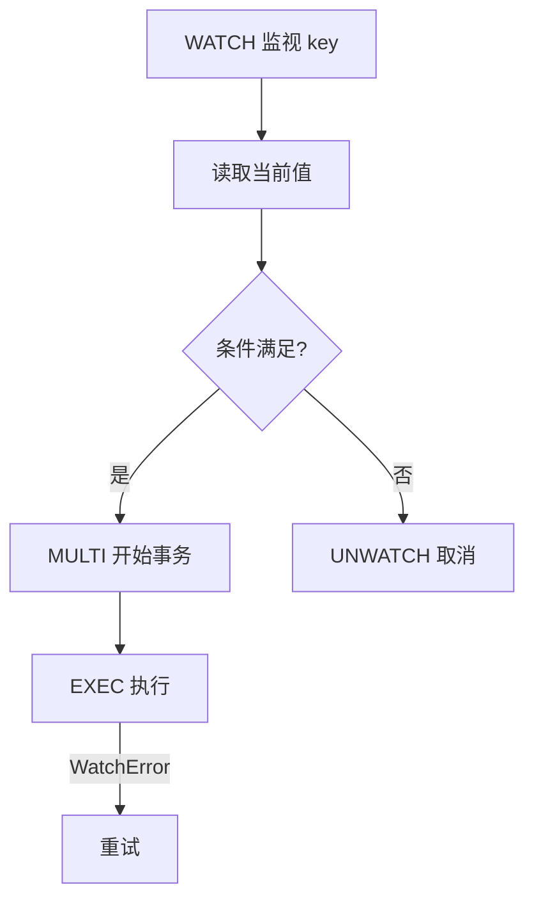

# 8.4 与 Python 交互

<div align="center">

**第八章 · Redis 数据库 · 第 4 节**

*预计学习时间：2 小时 · 难度：⭐⭐⭐*

</div>


---

## 📖 本节导读

命令行只是入门，真正开发要用 **redis-py** 在 Python 中操作 Redis。本节学习连接、五种数据类型的 Python API，以及**管道**和**事务**提升性能。


| 你将学会 | 核心关键词 |
|----------|-----------|
| 安装 redis 库 | `pip install redis` |
| 基本连接与操作 | `Redis()` `set` `get` |
| 管道批量操作 | `pipeline()` |
| 事务与乐观锁 | `multi()` `watch()` |

> 📂 本章对应源码：[与python交互.py](https://github.com/Drgonmancer/Leo_code/blob/main/Redis数据库/与python交互.py)、[在Python 中使用事务和管道.md](https://github.com/Drgonmancer/Leo_code/blob/main/Redis数据库/在Python%20中使用事务和管道.md)

---

## 1. 安装 redis-py

```bash
pip install redis
pip show redis
```

---

## 2. 基本连接与 String 操作

```python
import redis

try:
    rs = redis.Redis(
        host='localhost',
        port=6379,
        db=0,
        decode_responses=True  # 返回 str 而非 bytes
    )
except Exception as e:
    print(e)

# 添加
result = rs.set('name', 'itcast')
print(result)  # True

# 获取
name = rs.get('name')
print(name)    # itcast

# 设置过期
rs.setex('token', 3600, 'abc123')
print(rs.ttl('token'))  # 3598 左右
```

**运行效果：**

```
True
itcast
3598
```

> 📸 **截图位**：Python 脚本运行，终端打印 set/get 结果

> ⚠️ **避坑**：连接外部资源务必用 `try/except`；`decode_responses=True` 避免手动 decode bytes。

---

## 3. 五种数据类型的 Python 操作

### 3.1 Hash — 存储用户对象

```python
rs.hset('user:1001', 'name', '张三')
rs.hset('user:1001', 'age', 25)
rs.hmset('user:1002', {'name': '李四', 'age': 30})

user = rs.hgetall('user:1001')
print(user)
```

**运行效果：**

```
{'name': '张三', 'age': '25'}
```

### 3.2 List — 任务队列

```python
rs.lpush('tasks', 'send_email', 'backup', 'clean_log')
tasks = rs.lrange('tasks', 0, -1)
print(tasks)

task = rs.rpop('tasks')
print(f'处理任务: {task}')
```

**运行效果：**

```
['clean_log', 'backup', 'send_email']
处理任务: clean_log
```

### 3.3 Set — 标签去重

```python
rs.sadd('tags:article:1', 'python', 'redis', 'mysql')
rs.sadd('tags:article:2', 'python', 'django')
common = rs.sinter('tags:article:1', 'tags:article:2')
print(common)
```

**运行效果：**

```
{'python'}
```

### 3.4 Zset — 排行榜

```python
rs.zadd('ranking', {'alice': 100, 'bob': 200, 'charlie': 150})
top3 = rs.zrevrange('ranking', 0, 2, withscores=True)
print(top3)
```

**运行效果：**

```
[('bob', 200.0), ('charlie', 150.0), ('alice', 100.0)]
```

---

## 4. Pipeline 管道

**Pipeline** 将多个命令打包成**一次网络请求**，大幅减少 RTT 延迟。

```python
pipe = rs.pipeline()

pipe.set('foo', 'bar')
pipe.get('foo')
pipe.incr('counter')
pipe.get('counter')

result = pipe.execute()
print(result)
```

**运行效果：**

```
[True, 'bar', 1, '1']
```

### 4.1 批量写入

```python
def batch_set(r, data: dict):
    pipe = r.pipeline()
    for key, value in data.items():
        pipe.set(key, value)
    return pipe.execute()

data = {
    'user:1:name': 'Alice',
    'user:1:age': '25',
    'user:2:name': 'Bob',
}
batch_set(rs, data)
```

| 对比 | 普通模式 | Pipeline |
|------|----------|----------|
| 网络往返 | 每条命令 1 次 | 整批 1 次 |
| 适用场景 | 单条操作 | 批量导入、批量读取 |
| 性能提升 | 基准 | 可达 **10～20 倍** |

> 🟦 **技巧**：大批量操作建议分批，每批 1000～5000 条，避免内存溢出。

---

## 5. 事务（Transaction）

事务使用 `MULTI` / `EXEC`，保证一组命令的**原子性**。

```python
pipe = rs.pipeline(transaction=True)
pipe.set('key1', 'value1')
pipe.set('key2', 'value2')
pipe.get('key1')
result = pipe.execute()
print(result)
```

**运行效果：**

```
[True, True, 'value1']
```

### 5.1 WATCH 乐观锁

秒杀/库存扣减场景，用 `WATCH` 监视 key，防止并发超卖：

```python
from redis.exceptions import WatchError

def purchase(r, item_id, price):
    inventory_key = f'inventory:{item_id}'
    balance_key = 'balance:user001'

    for attempt in range(3):
        try:
            r.watch(inventory_key, balance_key)

            inventory = int(r.get(inventory_key) or 0)
            balance = int(r.get(balance_key) or 0)

            if inventory < 1 or balance < price:
                r.unwatch()
                return False, '库存或余额不足'

            pipe = r.pipeline()
            pipe.multi()
            pipe.decrby(inventory_key, 1)
            pipe.decrby(balance_key, price)
            pipe.execute()
            return True, '购买成功'

        except WatchError:
            print(f'第 {attempt + 1} 次冲突，重试...')
            continue

    return False, '购买失败'
```



| 概念 | 说明 |
|------|------|
| **Transaction** | MULTI/EXEC，原子执行 |
| **Pipeline** | 减少网络延迟，不一定原子 |
| **WATCH** | 乐观锁，key 被改则事务失败 |

---

## 6. 连接池（生产推荐）

```python
pool = redis.ConnectionPool(
    host='localhost',
    port=6379,
    db=0,
    max_connections=50,
    decode_responses=True
)

r = redis.Redis(connection_pool=pool)
```

> 💡 生产环境使用连接池，避免频繁创建/销毁连接。

---

## 7. 实战：缓存封装

```python
import redis
import json

class RedisCache:
    def __init__(self):
        self.r = redis.Redis(
            host='localhost', port=6379, db=0,
            decode_responses=True
        )

    def set_json(self, key, data, expire=3600):
        self.r.setex(key, expire, json.dumps(data, ensure_ascii=False))

    def get_json(self, key):
        val = self.r.get(key)
        return json.loads(val) if val else None

    def delete(self, key):
        self.r.delete(key)

# 使用
cache = RedisCache()
cache.set_json('user:1001', {'name': '张三', 'age': 25})
print(cache.get_json('user:1001'))
```

**运行效果：**

```
{'name': '张三', 'age': 25}
```

---

## 8. 综合练习

1. 用 Python 连接 Redis，set/get 一个 key
2. 用 Hash 存储商品信息（name、price、stock），Python 读取
3. 用 Pipeline 批量写入 100 个 key，对比普通写入耗时
4. 解释 Pipeline 和 Transaction 的区别
5. （选做）实现一个简单的 Redis 缓存装饰器

> 📸 **截图位**：Pipeline 批量写入 vs 普通写入的性能对比输出

---

## 9. 本节小结

| 类别 | 核心知识 |
|------|---------|
| 安装 | `pip install redis` |
| 连接 | `redis.Redis(host, port, db, decode_responses)` |
| 数据类型 | `set/get` `hset/hgetall` `lpush/lrange` `sadd/sinter` `zadd/zrevrange` |
| Pipeline | `pipeline()` → 批量命令 → `execute()` |
| 事务 | `pipeline(transaction=True)` 或 `multi()` |
| 生产 | 连接池 + 异常处理 + 过期时间 |

---

| ← 上一节 | [第八章目录](./README.md) | 下一节 → |
|---------|--------------------------|---------|
| [8.3 持久化与高可用](./03-持久化与高可用.md) | | — |

*源码：[`Redis数据库/`](https://github.com/Drgonmancer/Leo_code/tree/main/Redis数据库)*
