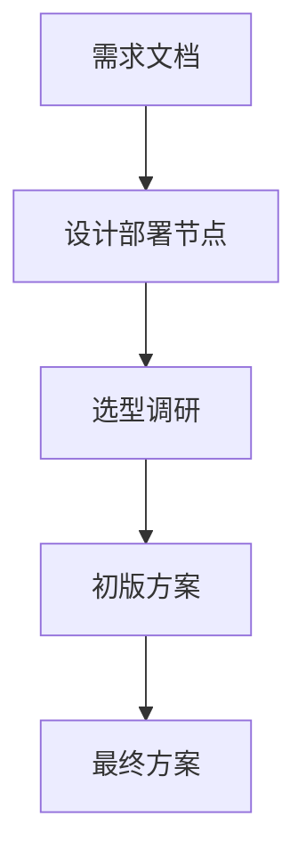
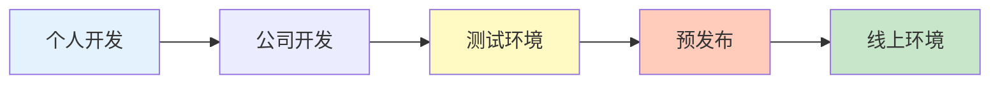
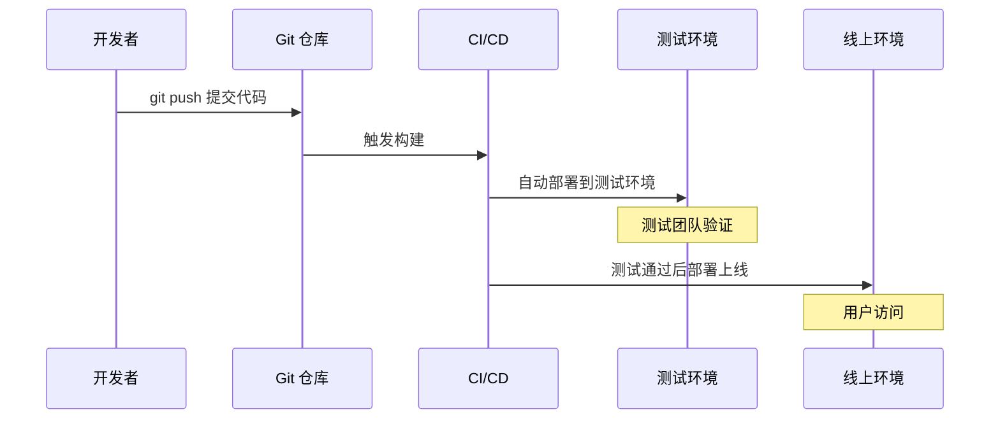
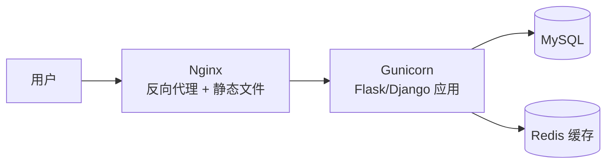

# 第 02 章 · 部署环境与流程

> **「开发环境写代码，测试环境验功能，预发布环境守最后一关，线上环境服务用户。」**

---

## 本章路线图


> 📎 对照原文：[`项目部署流程指南.md`](https://github.com/Drgonmancer/Leo_code/blob/main/项目部署/项目部署流程指南.md)

---

## 2.1 部署方案设计

上线不是「把代码拷到服务器」这么简单。规范的部署需要**先设计方案**：

| 步骤 | 说明 |
|:---:|------|
| **1** | 分析产品需求文档，明确部署方向 |
| **2** | 分析开发文档，按功能边界设计部署节点 |
| **3** | 调研功能软件，合理取舍，选符合业务场景的方案 |
| **4** | 梳理部署软件实现方案，确定初版部署方案 |
| **5** | 根据实际情况调整优化，确定最终方案 |



---

## 2.2 五种部署环境

项目从开发到上线，会经历 **5 个环境**，每个环境职责不同：



---

### ① 个人开发环境

| 项目 | 说明 |
|------|------|
| 👨‍💻 工作人员 | 自己 |
| 💻 工作平台 | 个人笔记本 / 公司电脑 |
| 🔧 平台特点 | 环境自己配置，团队成员可以不同 |
| 📝 工作内容 | 项目的子模块、子功能 |
| ✅ 完成标准 | 完成分配的功能模块开发 |

---

### ② 公司开发环境

| 项目 | 说明 |
|------|------|
| 👥 工作人员 | 开发团队 |
| 🖥️ 工作平台 | 公司内部服务器 |
| 🔧 平台特点 | 与线上环境**完全一致** |
| 🔗 工作内容 | 子模块间的功能联调 |
| ✅ 完成标准 | 项目阶段开发、调试完成 |

---

### ③ 项目测试环境

| 项目 | 说明 |
|------|------|
| 🧪 工作人员 | 测试团队 |
| 🖥️ 工作平台 | 公司内部服务器 |
| 🔧 平台特点 | 与线上环境**完全一致** |
| 🧐 工作内容 | 功能测试 / 非功能测试 / 探索测试 |
| ✅ 完成标准 | 项目阶段功能正常运行 |

---

### ④ 项目预发布环境

| 项目 | 说明 |
|------|------|
| 🚀 工作人员 | 运维团队 |
| 🖥️ 工作平台 | 线上服务器组中的**一台** |
| 🔧 平台特点 | 与线上环境**完全一致** |
| ⚡ 工作内容 | 支付等特殊功能测试、压力测试、安全测试 |
| ✅ 完成标准 | 功能正常，**上线前的最后一道防线** |

---

### ⑤ 项目线上环境

| 项目 | 说明 |
|------|------|
| 🌐 工作人员 | 运维团队 |
| 🖥️ 工作平台 | 公司线上服务器组 |
| 🔧 平台特点 | 标准线上服务器环境 |
| 📦 工作内容 | 代码部署和维护 |
| ✅ 完成标准 | 项目正常运行，服务真实用户 |

---

## 2.3 环境对比一览

| 环境 | 谁用 | 目的 | 与线上一致？ |
|------|------|------|:-----------:|
| 个人开发 | 开发者 | 写代码 | ❌ |
| 公司开发 | 开发团队 | 联调 | ✅ |
| 测试 | 测试团队 | 验功能 | ✅ |
| 预发布 | 运维 | 最后一关 | ✅ |
| 线上 | 运维 | 服务用户 | ✅（标准） |

> 📌 **总结**：个人开发 → 公司开发 → 测试 → 预发布 → 上线

---

## 2.4 典型部署流程

以 Python Web 项目为例：



### 部署检查清单

上线前逐项确认：

- [ ] 代码已通过测试环境验证
- [ ] 数据库迁移脚本已准备
- [ ] 环境变量 / 配置文件已更新
- [ ] 静态资源已同步到 CDN/OSS
- [ ] Nginx 配置已更新并重载
- [ ] 回滚方案已准备
- [ ] 监控和告警已配置

---

## 2.5 Python 项目部署常见组合

| 组件 | 作用 | 示例 |
|------|------|------|
| WSGI 服务器 | 运行 Python Web 应用 | Gunicorn、uWSGI |
| 反向代理 | 转发请求、负载均衡、HTTPS | Nginx |
| 进程管理 | 守护进程、自动重启 | Supervisor、systemd |
| 数据库 | 持久化数据 | MySQL + Redis |
| 容器化 | 环境隔离、一键部署 | Docker + Docker Compose |

**典型架构**：



**Gunicorn 启动示例**：

```bash
# 4 个 worker 进程，绑定 127.0.0.1:8000
gunicorn -w 4 -b 127.0.0.1:8000 app:app
```

---

## 本章小结

| 要点 | 内容 |
|------|------|
| 部署方案 | 先设计再实施，5 步确定方案 |
| 五个环境 | 开发 → 联调 → 测试 → 预发布 → 上线 |
| 核心原则 | 测试/预发布/线上环境保持一致 |
| Python 部署 | Nginx + Gunicorn + MySQL + Redis |

---

## 动手练习

1. 列出你的项目需要哪些部署节点（Web、DB、缓存、存储）
2. 画一张从 `git push` 到用户访问的部署流程图
3. 在本机用 Gunicorn 启动一个 Flask/Django 应用，再用 Nginx 反向代理

---

*上一章：[01-部署知识与架构演进](C9/01-部署知识与架构演进.md) · 下一章：[03-Nginx部署配置](C9/03-Nginx部署配置.md)*
