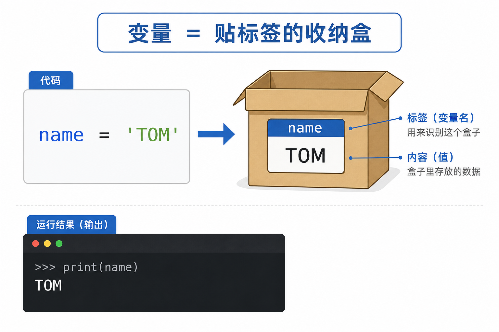
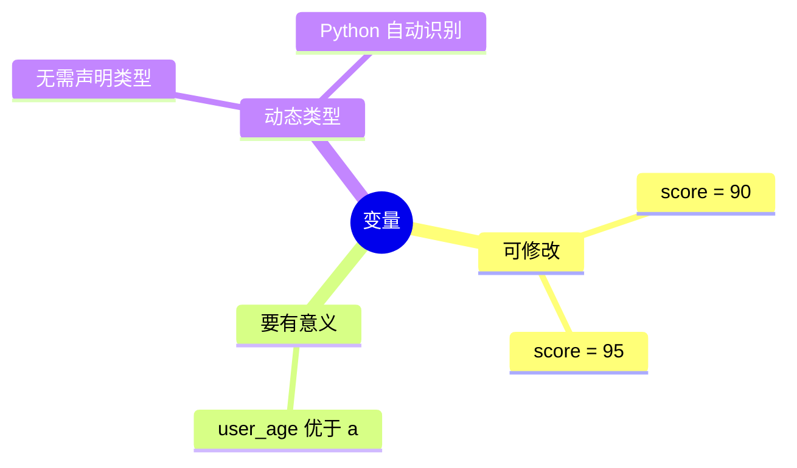
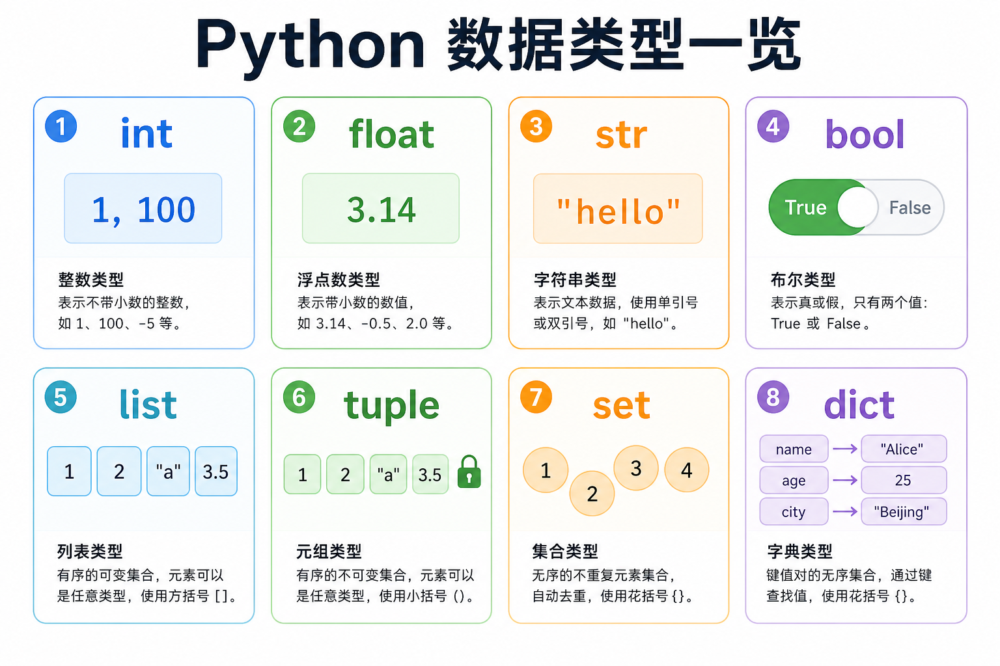

# 第 01 章 · 变量和数据类型

<div align="center">

**第一章 · Python 基础语法 · 第 1 节**

*预计学习时间：1.5 小时 · 难度：⭐*

</div>


---

## 📖 本章导读

学完本章，你将能够：

- ✅ 写出并运行第一个 Python 程序
- ✅ 使用注释让代码更易读
- ✅ 定义变量、理解 8 种数据类型
- ✅ 用 f-string 优雅地输出信息


---

## 1.1 你的第一个 Python 程序

### 💡 为什么要从这里开始？

学任何语言，第一件事都是让它「开口说话」。当终端打印出 `Hello, Python!` 的那一刻，你会真切感受到：**我在指挥计算机了。**

### 🔧 操作步骤

**第一步：确认 Python 已安装**

打开终端（Windows 按 `Win + R`，输入 `cmd`），执行：

```bash
python --version
```

> 📸 **截图位**：终端显示 `Python 3.x.x` 版本号的界面

**第二步：新建 Python 文件**

在 Cursor / VS Code 中新建文件，保存为 `hello.py`：

```python
print("Hello, Python!")
```

**第三步：运行**

```bash
python hello.py
```

> 📸 **截图位**：编辑器左侧代码 + 右侧终端输出 `Hello, Python!`

### 📤 运行效果

```
Hello, Python!
```

| 代码 | 作用 |
|------|------|
| `print()` | Python 内置的输出函数 |
| `"Hello, Python!"` | **字符串**——被双引号包裹的文字 |

---

## 1.2 注释：写给人类看的便签

> 🟦 **知识卡片**
>
> 注释是解释器**完全忽略**的内容。程序运行时不执行，但能让代码更好维护。

### 单行注释 `#`

```python
# 这是注释，不会被执行
print("Hello")  # 行尾也可以写注释
```

快捷键：`Ctrl + /` 快速切换注释。

### 多行注释 `""" """`

```python
"""
文件名：hello.py
作者：Leo
功能：第一个 Python 程序
"""
```

### ⚠️ 避坑指南

| ✅ 推荐 | ❌ 避免 |
|--------|--------|
| 解释**为什么**这么写 | 把代码翻译成中文再写一遍 |
| 标注复杂逻辑 | 大段注释掉的废弃代码 |

```python
# ✅ 用户年龄 +1，用于计算明年年龄
next_age = age + 1

# ❌ 废话注释
# age 加 1
next_age = age + 1
```

---

## 1.3 变量：给数据贴标签

### 一张图看懂变量



### 代码示例

```python
my_name = 'TOM'
print(my_name)
```

**运行效果：**

```
TOM
```

- `my_name` → 变量名（标签）
- `'TOM'` → 值（盒子里的内容）
- `=` → 赋值，**不是**数学上的「等于」

### 变量的三个特点



### 📋 命名规则速查

| 规则 | ✅ 正确 | ❌ 错误 |
|------|--------|--------|
| 字母数字下划线 | `user_name1` | `user-name` |
| 不以数字开头 | `score2` | `2score` |
| 不用关键字 | `class_name` | `class` |
| 推荐 snake_case | `student_id` | `StudentId` |

### ✏️ 动手练习 1

新建 `my_info.py`，定义你的姓名、年龄、城市并输出：

```python
name = "你的名字"
age = 20
city = "你的城市"

print(f"我叫{name}，{age}岁，来自{city}")
```

> 📸 **截图位**：修改为自己的信息后运行成功的界面

---

## 1.4 认识 8 种数据类型

### 一张图看懂全部类型



### 用 type() 验明正身

```python
print(type(1))           # <class 'int'>
print(type(1.1))         # <class 'float'>
print(type('hello'))     # <class 'str'>
print(type(True))        # <class 'bool'>
print(type([1, 2, 3]))   # <class 'list'>
print(type((1, 2)))      # <class 'tuple'>
print(type({1, 2}))      # <class 'set'>
print(type({'a': 1}))    # <class 'dict'>
```

### 本章重点：先掌握 4 种基础类型

| 类型 | 示例 | 记忆口诀 |
|------|------|---------|
| `int` 整型 | `42`, `-7` | 没有小数点 |
| `float` 浮点 | `3.14` | 有小数点 |
| `str` 字符串 | `'你好'` | **必须加引号** |
| `bool` 布尔 | `True`, `False` | 首字母大写 |

### ⚠️ 新手三大陷阱

> 🟥 **陷阱 1：数字 vs 字符串**
>
> `'10'` 是文字，`10` 是数字，不能混加！

```python
a = 10
b = '10'
# a + b  # ❌ 报错！
```

> 🟥 **陷阱 2：布尔值大小写**
>
> 必须写 `True` / `False`，不能写 `true` / `false`

> 🟥 **陷阱 3：空集合**
>
> `{}` 是空字典，空集合要写 `set()`

---

## 1.5 格式化输出

### 为什么需要格式化？

要把变量嵌进句子：`"我叫 TOM，今年 18 岁"` —— 数据散落各处，需要「填模板」。

### 方式一：f-string（⭐ 日常首选）

```python
name = 'TOM'
age = 18
print(f'我叫{name}，今年{age}岁')
print(f'明年我就{age + 1}岁了')   # 花括号里可写表达式
```

**运行效果：**

```
我叫TOM，今年18岁
明年我就19岁了
```

### 方式二：% 格式化（了解即可，读老代码会遇到）

| 符号 | 含义 | 示例 |
|------|------|------|
| `%s` | 字符串 | `'%s' % 'TOM'` |
| `%d` | 整数 | `'%d' % 18` |
| `%.2f` | 保留2位小数 | `'%.2f' % 75.5` → `75.50` |
| `%03d` | 补零 | `'%03d' % 7` → `007` |

```python
print('学号：%03d' % 1)    # 学号：001
```

### 📊 两种方式对比

| | f-string | % 格式化 |
|---|---------|---------|
| 可读性 | ⭐⭐⭐⭐⭐ | ⭐⭐⭐ |
| 表达式支持 | ✅ 任意 | 有限 |
| 推荐场景 | **日常开发** | 维护旧项目 |

---

## 1.6 转义字符

| 符号 | 效果 | 演示 |
|------|------|------|
| `\n` | 换行 | `'A\nB'` → 两行 |
| `\t` | 制表符 | 对齐列数据 |
| `\\` | 反斜杠本身 | `'C:\\Users'` |

**打印课程表：**

```python
print('科目\t成绩')
print('Python\t95')
print('数学\t88')
```

**运行效果：**

```
科目    成绩
Python  95
数学    88
```

### print 的 end 参数

```python
print('Loading', end='')
print('.', end='')
print('.', end='')
print(' Done!')
# 输出：Loading... Done!（同一行）
```

---

## 1.7 综合实战：个人信息卡片

### 🎯 目标

把本章知识串起来，打印一张个人信息卡片。

### 完整代码

```python
name = 'TOM'
age = 18
height = 1.75
weight = 75.5
hobby = '编程'
is_student = True

print('=' * 32)
print('       🎓 个人信息卡片')
print('=' * 32)
print(f'  姓名：{name}')
print(f'  年龄：{age} 岁')
print(f'  身高：{height} m')
print(f'  体重：{weight:.1f} kg')
print(f'  爱好：{hobby}')
print(f'  学生：{"是" if is_student else "否"}')
print('=' * 32)
```

### 📤 运行效果

```
================================
       🎓 个人信息卡片
================================
  姓名：TOM
  年龄：18 岁
  身高：1.75 m
  体重：75.5 kg
  爱好：编程
  学生：是
================================
```

> 📸 **截图位**：终端输出完整卡片的界面
>
> ✏️ **请你动手**：把信息改成你自己的，再运行一遍！

---

## 1.8 本章小结

```mermaid
graph TB
    subgraph 你已掌握
        A[注释 # 和 """]
        B[变量 name = 值]
        C[8种数据类型]
        D[f-string 格式化]
        E[转义字符 \n \t]
    end
    A --> B --> C --> D --> E
```

> 🟩 **恭喜你完成第一章！**
>
> 这些是所有 Python 代码的地基。务必动手敲过每一段示例。

---

## 1.9 课后作业

| 编号 | 题目 | 难度 |
|:----:|------|:----:|
| 1 | 定义 4 个变量并打印 type() | ⭐ |
| 2 | 用 f-string 输出商品信息（含补零库存） | ⭐⭐ |
| 3 | 用 `\t` 打印课程表 | ⭐⭐ |
| 4 | 制作自己的个人信息卡片 | ⭐⭐⭐ |

<details>
<summary>📎 作业 2 参考答案</summary>

```python
product = 'Python 入门书'
price = 59
stock = 7
print(f'商品：{product}')
print(f'价格：{price:.2f} 元')
print(f'库存：{stock:03d} 件')
```

</details>

---

## ⏭️ 下一章

> **第 02 章 · 数据类型转换和运算符**
>
> 程序即将能**接收你的键盘输入**并做运算——第一个可交互程序，就在下一章。

---

| ← 上一章 | [目录](../README.md) | 下一章 → |
|---------|---------------------|---------|
| [全书前言](../00-全书前言.md) | | [第 02 章](./02-数据类型转换和运算符.md) |

*源码：[`Python基础语法/1.变量和数据类型/`](../../Python基础语法/1.变量和数据类型/)*
