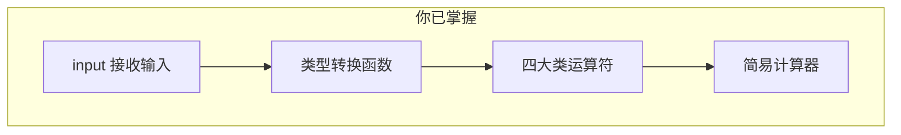

# 1.2 数据类型转换和运算符

<div align="center">

**第一章 · Python 基础语法 · 第 2 节**

*预计学习时间：1.5 小时 · 难度：⭐⭐*

</div>


---

## 📖 本节导读

上一节你学会了用变量「装」数据。本节要让程序**和用户对话**——`input()` 接收键盘输入，类型转换函数变换数据形态，各类运算符让数字和条件「动起来」。读完后，你将写出第一个可交互的 Python 程序。


---

## 1. input()：让程序听你说话

### 基本语法

```python
变量 = input("提示信息")
```

| 特点 | 说明 |
|------|------|
| 程序暂停 | 执行到 `input()` 时等待用户输入，按回车后才继续 |
| 存入变量 | 输入内容一般保存到变量，方便后续使用 |
| 全是字符串 | `input()` 收到的**任意**输入都当作 `str` 类型 |

> 🟦 **知识卡片**
>
> `input()` 是程序和用户之间的桥梁。没有它，程序只能「自说自话」；有了它，程序才真正「活」起来。

### 动手体验

请你新建 `input_demo.py`：

```python
password = input("请输入您的密码：")
print(f"您输入的密码是 {password}")
print(type(password))
```

**运行效果：**

```
请输入您的密码：123456
您输入的密码是 123456
<class 'str'>
```

> 📸 **截图位**：终端显示提示文字、用户输入密码、输出类型为 `str` 的界面

> ⚠️ **避坑**：即使用户输入的是数字 `18`，`type()` 也会显示 `<class 'str'>`。要做数学运算，必须先转换类型！

---

## 2. 数据类型转换

### 为什么需要转换？

用户输入的年龄是字符串 `"18"`，但 `age >= 18` 需要和整数比较。类型不匹配，程序就会报错或得出错误结果。

### 常用转换函数

| 函数 | 作用 | 示例 |
|------|------|------|
| `int()` | 转整数 | `int("10")` → `10` |
| `float()` | 转浮点数 | `float("3.14")` → `3.14` |
| `str()` | 转字符串 | `str(100)` → `"100"` |
| `list()` | 转列表 | `list((1, 2))` → `[1, 2]` |
| `tuple()` | 转元组 | `tuple([1, 2])` → `(1, 2)` |
| `eval()` | 计算字符串表达式 | `eval("1+2")` → `3` |

### 转换演示

请你新建 `type_convert.py`：

```python
# 1. input 得到的是 str
num = input("请输入数字：")
print(num, type(num))          # str

# 2. int() 转换
num_int = int(num)
print(num_int, type(num_int))  # int

# 3. float() 转换
print(float(1))       # 1.0
print(float("10"))    # 10.0

# 4. str() 转换
print(str(100), type(str(100)))

# 5. 序列互转
print(tuple([10, 20, 30]))   # (10, 20, 30)
print(list((100, 200)))      # [100, 200]
```

**运行效果（输入 42 时）：**

```
请输入数字：42
42 <class 'str'>
42 <class 'int'>
1.0
10.0
100 <class 'str'>
(10, 20, 30)
[100, 200]
```

> 🟥 **危险警告**：`eval()` 能执行任意 Python 表达式，**切勿**对用户输入直接使用 `eval()`，存在严重安全风险！

```python
# ❌ 绝对不要这样写
user_input = input("请输入：")
result = eval(user_input)  # 用户输入 __import__('os').system('rm -rf /') 就完了
```

---

## 3. 算术运算符

| 运算符 | 含义 | 示例 | 结果 |
|--------|------|------|------|
| `+` | 加 | `3 + 2` | `5` |
| `-` | 减 | `3 - 2` | `1` |
| `*` | 乘 | `3 * 2` | `6` |
| `/` | 除（浮点） | `9 / 4` | `2.25` |
| `//` | 整除 | `9 // 4` | `2` |
| `%` | 取余 | `9 % 4` | `1` |
| `**` | 幂运算 | `2 ** 4` | `16` |
| `()` | 提升优先级 | `(2 + 3) * 4` | `20` |

### 优先级（从高到低）

```
()  >  **  >  * / // %  >  + -
```

请你新建 `arithmetic.py`：

```python
print(9 // 4)    # 整除
print(9 % 4)     # 取余
print(2 ** 4)    # 幂运算
print(2 + 3 * 4)       # 14，先乘后加
print((2 + 3) * 4)     # 20，括号优先
```

**运行效果：**

```
2
1
16
14
20
```

---

## 4. 赋值运算符

### 基本赋值

```python
num = 1          # 单变量赋值
a, b, c = 10, 0.5, "hello"   # 多变量赋值
x = y = 10       # 多变量赋相同值
```

### 复合赋值运算符

| 运算符 | 等价写法 | 示例 |
|--------|---------|------|
| `+=` | `c = c + a` | `c += 1` |
| `-=` | `c = c - a` | `c -= 1` |
| `*=` | `c = c * a` | `c *= 2` |
| `/=` | `c = c / a` | `c /= 2` |
| `//=` | `c = c // a` | `c //= 2` |
| `%=` | `c = c % a` | `c %= 3` |
| `**=` | `c = c ** a` | `c **= 2` |

> ⚠️ **避坑**：复合赋值先算**右侧**表达式，再赋值。`d *= 1 + 2` 等价于 `d = d * (1 + 2)`，不是 `d = d * 1 + 2`。

```python
d = 10
d *= 1 + 2
print(d)  # 30，不是 12
```

---

## 5. 比较运算符

比较运算的结果是布尔值 `True` 或 `False`。

| 运算符 | 含义 | 示例 | 结果 |
|--------|------|------|------|
| `==` | 等于 | `5 == 5` | `True` |
| `!=` | 不等于 | `5 != 3` | `True` |
| `>` | 大于 | `5 > 3` | `True` |
| `<` | 小于 | `5 < 3` | `False` |
| `>=` | 大于等于 | `5 >= 5` | `True` |
| `<=` | 小于等于 | `3 <= 5` | `True` |

```python
age = 20
print(age >= 18)   # True
print(age == 18)   # False
```

---

## 6. 逻辑运算符

| 运算符 | 含义 | 示例 |
|--------|------|------|
| `and` | 与：两边都为真才为真 | `True and False` → `False` |
| `or` | 或：有一边为真就为真 | `True or False` → `True` |
| `not` | 非：取反 | `not True` → `False` |

### 短路特性

```python
# and：左边为 False，右边不再计算
False and print("不会执行")

# or：左边为 True，右边不再计算
True or print("不会执行")
```

### 数字参与逻辑运算（拓展）

```python
print(0 and 2)   # 0
print(1 and 2)   # 2
print(0 or 1)    # 1
print(0 or 2)    # 2
```

> 🟦 **知识卡片**
>
> 在 Python 中，`0` 表示假，`非 0` 表示真。`and` 返回第一个「假」值或最后一个值；`or` 返回第一个「真」值或最后一个值。

---

## 7. 综合案例：简易计算器

请你新建 `calculator.py`：

```python
print("===== 简易计算器 =====")
num1 = float(input("请输入第一个数字："))
operator = input("请输入运算符（+ - * /）：")
num2 = float(input("请输入第二个数字："))

if operator == "+":
    result = num1 + num2
elif operator == "-":
    result = num1 - num2
elif operator == "*":
    result = num1 * num2
elif operator == "/":
    if num2 == 0:
        result = "除数不能为 0"
    else:
        result = num1 / num2
else:
    result = "不支持的运算符"

print(f"计算结果：{result}")
```

**运行效果：**

```
===== 简易计算器 =====
请输入第一个数字：10
请输入运算符（+ - * /）：*
请输入第二个数字：5
计算结果：50.0
```

> 📸 **截图位**：计算器完整交互过程截图

> 🟥 **危险警告**：除法运算前务必检查除数是否为 0，否则程序会抛出 `ZeroDivisionError` 异常。

---

## 8. 综合练习

请你依次完成：

1. 新建 `age_check.py`：输入年龄，用 `int()` 转换后判断是否成年（`>= 18`），打印结果
2. 新建 `bmi_calc.py`：输入身高（m）和体重（kg），计算 BMI = 体重 / 身高²
3. 新建 `swap.py`：用一行代码交换两个变量的值（提示：`a, b = b, a`）

<details>
<summary>📎 练习 1 参考答案</summary>

```python
age = int(input("请输入年龄："))
if age >= 18:
    print(f"年龄 {age}，已成年")
else:
    print(f"年龄 {age}，未成年")
```

</details>

---

## 9. 本节小结

| 类别 | 核心内容 |
|------|---------|
| 输入 | `input()` 返回字符串，需 `int()`/`float()` 转换 |
| 转换 | `int()` `float()` `str()` `list()` `tuple()` |
| 算术 | `+ - * / // % **`，注意优先级 |
| 赋值 | `=` `+=` `-=` 等，右侧先算 |
| 比较 | `== != > < >= <=`，返回布尔值 |
| 逻辑 | `and or not`，支持短路 |



> 🟩 **恭喜！** 你的程序已经能和用户对话并做运算了。下一节学习 `if` 语句，让程序学会「做选择」。

---

| ← 上一节 | [第一章目录](./README.md) | 下一节 → |
|---------|--------------------------|---------|
| [1.1 变量和数据类型](./01-变量和数据类型.md) | | [1.3 if 语句](./03-if语句.md) |

*源码：[`Python基础语法/2.数据类型转换和运算符/`](../../Python基础语法/2.数据类型转换和运算符/)*
