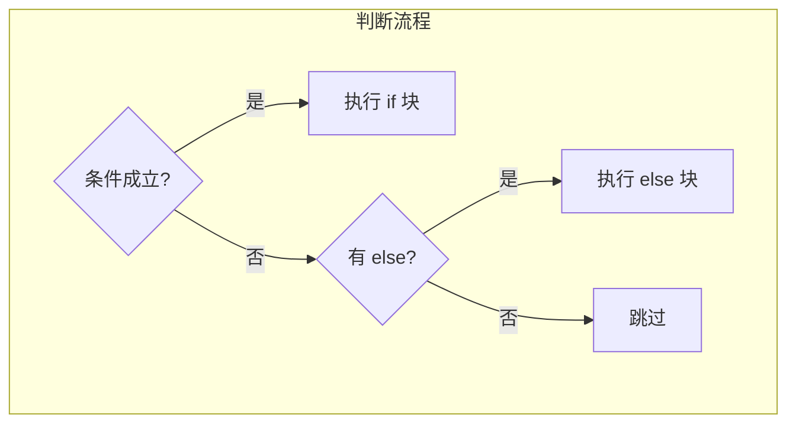

# 1.3 if 语句

<div align="center">

**第一章 · Python 基础语法 · 第 3 节**

*预计学习时间：1.5 小时 · 难度：⭐⭐*

</div>


---

## 📖 本节导读

程序不能只会「一条路走到底」——遇到不同情况要做不同的事。`if` 语句让 Python 学会**做选择**：成年才能上网、成绩分档、猜拳判输赢……本节带你掌握条件判断的完整语法。


---

## 1. if 单分支

### 语法

```python
if 条件:
    条件成立执行的代码
    # 可以有多行，必须缩进
```

> 🟦 **知识卡片**
>
> Python 用**缩进**（通常 4 个空格）表示代码块归属。`if` 下方缩进的代码只在条件为 `True` 时执行；未缩进的代码与 `if` 无关，总会执行。

### 代码示例

请你新建 `if_basic.py`：

```python
if True:
    print("条件成立执行的代码1")
    print("条件成立执行的代码2")

# 没有缩进，无论条件是否成立都执行
print("我是无论条件是否成立都要执行的代码")
```

**运行效果：**

```
条件成立执行的代码1
条件成立执行的代码2
我是无论条件是否成立都要执行的代码
```

> 📸 **截图位**：编辑器中 if 缩进结构清晰可见的截图

---

## 2. if...else 双分支

### 语法

```python
if 条件:
    条件成立执行的代码
else:
    条件不成立执行的代码
```

| 分支 | 何时执行 |
|------|---------|
| `if` 块 | 条件为 `True` |
| `else` 块 | 条件为 `False` |

### 案例：网吧上网

请你新建 `net_bar.py`：

```python
age = int(input("请输入您的年龄："))

if age >= 18:
    print(f"您输入的年龄是 {age}，已经成年，可以上网")
else:
    print(f"您输入的年龄是 {age}，小朋友，回家写作业去")

print("系统关闭")
```

**运行效果（输入 20）：**

```
请输入您的年龄：20
您输入的年龄是 20，已经成年，可以上网
系统关闭
```

**运行效果（输入 12）：**

```
请输入您的年龄：12
您输入的年龄是 12，小朋友，回家写作业去
系统关闭
```

> ⚠️ **避坑**：`input()` 返回字符串，和整数 `18` 比较前必须用 `int()` 转换，否则可能得到意外结果或报错。

---

## 3. elif 多分支

### 语法

```python
if 条件1:
    代码1
elif 条件2:
    代码2
elif 条件3:
    代码3
else:
    以上都不成立执行的代码
```

### 案例：工作年龄判断

请你新建 `work_age.py`：

```python
age = int(input("您输入的年龄是："))

if age < 18:
    print(f"您输入的年龄是 {age}，童工，不合法")
elif 18 <= age <= 60:
    print(f"您输入的年龄是 {age}，合法工作年龄")
else:
    print(f"您输入的年龄是 {age}，退休年龄")
```

**运行效果（输入 25）：**

```
您输入的年龄是：25
您输入的年龄是 25，合法工作年龄
```

### 条件写法对比

| 写法 | 可读性 | 推荐 |
|------|--------|:----:|
| `(age >= 18) and (age <= 60)` | 一般 | |
| `18 <= age <= 60` | 简洁 | ✅ |

> 🟦 **知识卡片**
>
> Python 支持链式比较：`18 <= age <= 60` 等价于 `age >= 18 and age <= 60`，写起来更自然。

---

## 4. if 嵌套

### 语法

```python
if 条件1:
    代码A
    if 条件2:
        代码B
    else:
        代码C
else:
    代码D
```

内层 `if` 缩进在外层 `if` 内部，只有外层条件成立时，内层才会被判断。

### 案例：坐公交

请你新建 `bus_ride.py`：

```python
money = 1   # 1 表示有钱，0 表示没钱
seat = 1    # 1 表示有空座，0 表示没空座

if money == 1:
    print("土豪，请上车")
    if seat == 1:
        print("有空座，坐下了")
    else:
        print("没有空座，站着等")
else:
    print("朋友，没带钱，跟着跑，跑快点")
```

**运行效果：**

```
土豪，请上车
有空座，坐下了
```

> 📸 **截图位**：修改 `money = 0` 或 `seat = 0` 后对比运行结果

---

## 5. 三目运算符（拓展）

一行写完简单的 if...else：

```python
result = "成年" if age >= 18 else "未成年"
```

等价于：

```python
if age >= 18:
    result = "成年"
else:
    result = "未成年"
```

适合赋值场景，复杂逻辑仍用标准 `if`。

---

## 6. 综合案例：猜拳游戏

石头（0）赢剪刀（1），剪刀（1）赢布（2），布（2）赢石头（0）。

请你新建 `rock_paper_scissors.py`：

```python
import random

print("===== 猜拳游戏 =====")
print("0 -- 石头  1 -- 剪刀  2 -- 布")

player = int(input("请出拳："))
computer = random.randint(0, 2)

print(f"玩家出拳：{player}，电脑出拳：{computer}")

# 玩家获胜的三种情况
if (player == 0 and computer == 1) or \
   (player == 1 and computer == 2) or \
   (player == 2 and computer == 0):
    print("玩家获胜，哈哈哈哈")
elif player == computer:
    print("平局，别走，再来一局")
else:
    print("电脑获胜")
```

**运行效果：**

```
===== 猜拳游戏 =====
0 -- 石头  1 -- 剪刀  2 -- 布
请出拳：0
玩家出拳：0，电脑出拳：1
玩家获胜，哈哈哈哈
```

### 胜负逻辑表

| 玩家 | 电脑 | 结果 |
|:----:|:----:|------|
| 0 石头 | 1 剪刀 | 玩家胜 |
| 1 剪刀 | 2 布 | 玩家胜 |
| 2 布 | 0 石头 | 玩家胜 |
| 相同 | 相同 | 平局 |
| 其他 | — | 电脑胜 |

> 🟥 **危险警告**：`int(input(...))` 如果用户输入了字母或空字符串，程序会崩溃。后续学异常处理后可以优雅地处理这类情况。

---

## 7. 综合练习

请你依次完成：

1. 新建 `score_grade.py`：输入成绩，90 以上 A、80-89 B、60-79 C、60 以下 D
2. 新建 `login_check.py`：预设用户名和密码，输入正确打印「登录成功」，否则「用户名或密码错误」
3. 升级 `rock_paper_scissors.py`：加入循环，让用户可以连续玩多局

<details>
<summary>📎 练习 1 参考答案</summary>

```python
score = int(input("请输入成绩："))

if score >= 90:
    grade = "A"
elif score >= 80:
    grade = "B"
elif score >= 60:
    grade = "C"
else:
    grade = "D"

print(f"成绩 {score}，等级 {grade}")
```

</details>

---

## 8. 本节小结

| 语法 | 场景 |
|------|------|
| `if` | 只做一件事（单分支） |
| `if...else` | 二选一 |
| `if...elif...else` | 多选一 |
| `if` 嵌套 | 条件之间有层级关系 |
| 三目运算符 | 简单赋值的一行写法 |



> 🟩 **恭喜！** 你的程序已经能「做选择」了。下一节学习 `while` 循环，让代码重复执行。

---

| ← 上一节 | [第一章目录](./README.md) | 下一节 → |
|---------|--------------------------|---------|
| [1.2 数据类型转换和运算符](./02-数据类型转换和运算符.md) | | [1.4 while 循环](./04-while循环.md) |

*源码：[`Python基础语法/3.if语句/`](../../Python基础语法/3.if语句/)*
