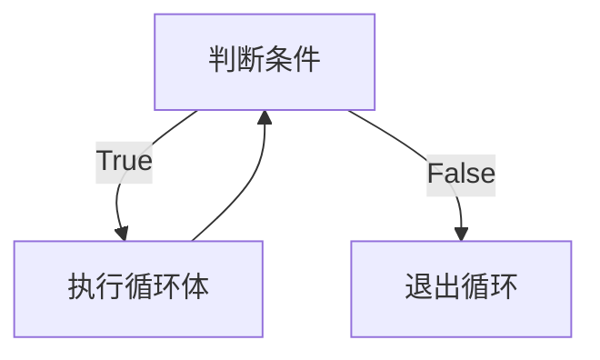
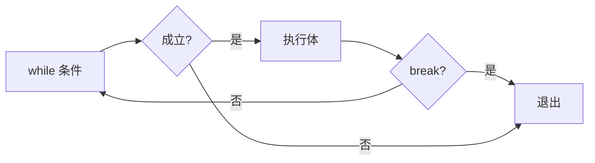

# 1.4 while 循环

<div align="center">

**第一章 · Python 基础语法 · 第 4 节**

*预计学习时间：1.5 小时 · 难度：⭐⭐*

</div>


---

## 📖 本节导读

有些代码需要**重复执行**——道歉 5 遍、累加 1 到 100、打印九九乘法表……`while` 循环让程序在满足条件时反复运行同一段代码。本节还涵盖 `break`、`continue`、嵌套循环和图形打印。


---

## 1. while 基本语法

### 语法

```python
while 条件:
    条件成立重复执行的代码
    # 别忘了更新条件，否则会死循环！
```

### 执行流程



请你新建 `while_basic.py`：

```python
i = 0
while i < 5:
    print("媳妇儿，我错了")
    i += 1   # 等价于 i = i + 1

print("原谅你了")
```

**运行效果：**

```
媳妇儿，我错了
媳妇儿，我错了
媳妇儿，我错了
媳妇儿，我错了
媳妇儿，我错了
原谅你了
```

> 🟦 **知识卡片**
>
> 循环三要素：**初始化**（`i = 0`）→ **条件判断**（`i < 5`）→ **更新变量**（`i += 1`）。缺少更新就会导致死循环。

> 🟥 **危险警告**：死循环会让程序永远跑不完！按 `Ctrl + C` 可强制终止。开发时务必确认循环变量会趋向结束条件。

---

## 2. 应用：累加求和

### 1 到 100 累加

请你新建 `while_sum.py`：

```python
# 应用一：1-100 累加和
i = 1
result = 0
while i <= 100:
    result += i
    i += 1

print(f"1 到 100 的和：{result}")
```

**运行效果：**

```
1 到 100 的和：5050
```

### 1 到 100 偶数累加

| 方法 | 思路 |
|------|------|
| 方法一 | 遍历每个数，用 `if i % 2 == 0` 判断偶数再累加 |
| 方法二 | 计数器从 0 开始，每次 `i += 2`，直接遍历偶数 |

```python
# 方法一：条件判断
i = 1
result = 0
while i <= 100:
    if i % 2 == 0:
        result += i
    i += 1
print(f"偶数和（方法一）：{result}")

# 方法二：步长为 2
i = 0
result = 0
while i <= 100:
    result += i
    i += 2
print(f"偶数和（方法二）：{result}")
```

**运行效果：**

```
偶数和（方法一）：2550
偶数和（方法二）：2550
```

> 📸 **截图位**：两种方法输出相同结果的终端截图

---

## 3. break 和 continue

| 关键字 | 作用 | 生活类比 |
|--------|------|---------|
| `break` | **终止**整个循环 | 吃 5 个苹果，第 3 个吃饱了，不吃了 |
| `continue` | **跳过**本次循环，继续下一次 | 第 3 个苹果有虫子，不吃这个，继续吃后面的 |

### break 示例

请你新建 `while_break.py`：

```python
i = 1
while i <= 5:
    if i == 4:
        print("吃饱了，不吃了")
        break
    print(f"吃了第 {i} 个苹果")
    i += 1
```

**运行效果：**

```
吃了第 1 个苹果
吃了第 2 个苹果
吃了第 3 个苹果
吃饱了，不吃了
```

### continue 示例

请你新建 `while_continue.py`：

```python
i = 1
while i <= 5:
    if i == 3:
        print("吃出了一个虫子，这个苹果不吃了")
        i += 1
        continue
    print(f"吃了第 {i} 个苹果")
    i += 1
```

**运行效果：**

```
吃了第 1 个苹果
吃了第 2 个苹果
吃出了一个虫子，这个苹果不吃了
吃了第 4 个苹果
吃了第 5 个苹果
```

> ⚠️ **避坑**：`continue` 之前别忘了 `i += 1`，否则 `i` 永远等于 3，造成死循环！

---

## 4. while 循环嵌套

### 语法

```python
while 条件1:
    代码块1
    while 条件2:
        代码块2
```

### 案例：连续惩罚 3 天

请你新建 `while_nested.py`：

```python
j = 0
while j < 3:
    i = 0
    while i < 3:
        print("媳妇儿，我错了")
        i += 1
    print("刷晚饭的碗")
    print("一套惩罚结束........")
    j += 1
```

**运行效果：**

```
媳妇儿，我错了
媳妇儿，我错了
媳妇儿，我错了
刷晚饭的碗
一套惩罚结束........
媳妇儿，我错了
媳妇儿，我错了
媳妇儿，我错了
刷晚饭的碗
一套惩罚结束........
媳妇儿，我错了
媳妇儿，我错了
媳妇儿，我错了
刷晚饭的碗
一套惩罚结束........
```

---

## 5. 嵌套应用：打印图形

### 正方形（5 × 5 星号）

请你新建 `while_stars.py`：

```python
# 正方形
j = 0
while j <= 4:
    i = 0
    while i <= 4:
        print("*", end="")
        i += 1
    print()   # 换行
    j += 1
```

**运行效果：**

```
*****
*****
*****
*****
*****
```

### 直角三角形

```python
# 三角形
j = 0
while j <= 4:
    i = 0
    while i <= j:
        print("*", end="")
        i += 1
    print()
    j += 1
```

**运行效果：**

```
*
**
***
****
*****
```

> 🟦 **知识卡片**
>
> `print("*", end="")` 中 `end=""` 表示打印后不换行，多个星号会排在同一行。外层循环控制**行数**，内层循环控制**每行星号数**。

> 📸 **截图位**：正方形和三角形两种图案的运行结果

---

## 6. 九九乘法表

请你新建 `multiplication_table.py`：

```python
j = 1
while j <= 9:
    i = 1
    while i <= j:
        print(f"{i} * {j} = {i * j}", end="\t")
        i += 1
    print()
    j += 1
```

**运行效果：**

```
1 * 1 = 1	
1 * 2 = 2	2 * 2 = 4	
1 * 3 = 3	2 * 3 = 6	3 * 3 = 9	
1 * 4 = 4	2 * 4 = 8	3 * 4 = 12	4 * 4 = 16	
1 * 5 = 5	2 * 5 = 10	3 * 5 = 15	4 * 5 = 20	5 * 5 = 25	
1 * 6 = 6	2 * 6 = 12	3 * 6 = 18	4 * 6 = 24	5 * 6 = 30	6 * 6 = 36	
1 * 7 = 7	2 * 7 = 14	3 * 7 = 21	4 * 7 = 28	5 * 7 = 35	6 * 7 = 42	7 * 7 = 49	
1 * 8 = 8	2 * 8 = 16	3 * 8 = 24	4 * 8 = 32	5 * 8 = 40	6 * 8 = 48	7 * 8 = 56	8 * 8 = 64	
1 * 9 = 9	2 * 9 = 18	3 * 9 = 27	4 * 9 = 36	5 * 9 = 45	6 * 9 = 54	7 * 9 = 63	8 * 9 = 72	9 * 9 = 81	
```

---

## 7. while...else（拓展）

```python
i = 1
while i <= 5:
    print("媳妇儿，我错了")
    i += 1
else:
    print("媳妇儿原谅我了，真开心，哈哈哈哈")
```

`else` 在循环**正常结束**（非 `break` 终止）时执行。若 `break` 跳出，`else` 不执行。

---

## 8. 综合练习

请你依次完成：

1. 新建 `guess_number.py`：随机生成 1-100 的数，用户猜，大了提示「太大」，小了提示「太小」，猜对 `break`
2. 新建 `print_diamond.py`：用嵌套 while 打印菱形星号（进阶）
3. 新建 `factorial.py`：输入 n，用 while 计算 n 的阶乘

<details>
<summary>📎 练习 3 参考答案</summary>

```python
n = int(input("请输入 n："))
i = 1
result = 1
while i <= n:
    result *= i
    i += 1
print(f"{n}! = {result}")
```

</details>

---

## 9. 本节小结

| 知识点 | 要点 |
|--------|------|
| `while` | 条件为真时重复执行，注意更新循环变量 |
| `break` | 立即终止整个循环 |
| `continue` | 跳过本次，进入下一次 |
| 嵌套循环 | 外层控行，内层控列 |
| 图形打印 | `end=""` 控制不换行 |



> 🟩 **恭喜！** 你已掌握 `while` 循环。下一节学习 `for` 循环——遍历序列更简洁的方式。

---

| ← 上一节 | [第一章目录](./README.md) | 下一节 → |
|---------|--------------------------|---------|
| [1.3 if 语句](./03-if语句.md) | | [1.5 for 循环](./05-for循环.md) |

*源码：[`Python基础语法/4.while循坏/`](https://github.com/Drgonmancer/Leo_code/tree/main/Python基础语法/4.while循坏)*
