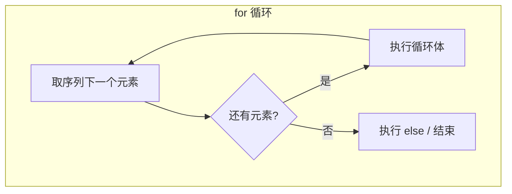

# 1.5 for 循环

<div align="center">

**第一章 · Python 基础语法 · 第 5 节**

*预计学习时间：1 小时 · 难度：⭐⭐*

</div>


---

## 📖 本节导读

`while` 适合「不知道要循环几次」的场景；`for` 适合**遍历已知序列**——字符串、列表、元组里的每个元素。语法更简洁，还能配合 `break`、`continue` 和 `else` 使用。


---

## 1. for 基本语法

### 语法

```python
for 临时变量 in 序列:
    重复执行的代码
```

| 概念 | 说明 |
|------|------|
| 序列 | 字符串、列表、元组、range 对象等可遍历对象 |
| 临时变量 | 每次循环自动取序列中的一个元素 |

### 遍历字符串

请你新建 `for_basic.py`：

```python
str1 = "itheima"
for i in str1:
    print(i)
```

**运行效果：**

```
i
t
h
e
i
m
a
```

> 🟦 **知识卡片**
>
> `for` 循环不需要手动维护计数器，Python 自动把序列中的每个元素依次赋给临时变量。比 `while` 遍历序列更简洁、更不容易出错。

> 📸 **截图位**：for 循环逐字符打印的终端输出

---

## 2. for 与 range 配合

`range()` 生成数字序列，常与 `for` 搭配：

```python
for i in range(5):       # 0, 1, 2, 3, 4
    print(i)

for i in range(1, 6):    # 1, 2, 3, 4, 5
    print(i)

for i in range(0, 10, 2):  # 0, 2, 4, 6, 8
    print(i)
```

请你新建 `for_range.py`：

```python
print("--- range(5) ---")
for i in range(5):
    print(i, end=" ")
print()

print("--- range(1, 6) ---")
for i in range(1, 6):
    print(i, end=" ")
print()

print("--- range(0, 10, 2) ---")
for i in range(0, 10, 2):
    print(i, end=" ")
print()
```

**运行效果：**

```
--- range(5) ---
0 1 2 3 4 
--- range(1, 6) ---
1 2 3 4 5 
--- range(0, 10, 2) ---
0 2 4 6 8 
```

| range 参数 | 含义 |
|-----------|------|
| `range(stop)` | 从 0 到 stop-1 |
| `range(start, stop)` | 从 start 到 stop-1 |
| `range(start, stop, step)` | 指定步长 |

> ⚠️ **避坑**：`range()` 生成的序列**不包含** end 值。`range(1, 10)` 只到 9。

---

## 3. break：终止循环

请你新建 `for_break.py`：

```python
str1 = "itheima"
for i in str1:
    if i == "e":
        print("遇到 e，终止循环")
        break
    print(i)
```

**运行效果：**

```
i
t
h
遇到 e，终止循环
```

`break` 立即退出整个 `for` 循环，后面的字符不再处理。

---

## 4. continue：跳过本次

请你新建 `for_continue.py`：

```python
str1 = "itheima"
for i in str1:
    if i == "e":
        print("遇到 e，跳过不打印")
        continue
    print(i)
```

**运行效果：**

```
i
t
h
遇到 e，跳过不打印
i
m
a
```

`continue` 跳过当前这一次，继续处理下一个字符。注意字符串中有**两个** `e`，都会触发 `continue`。

### break vs continue

| 关键字 | 效果 | 循环是否继续 |
|--------|------|:------------:|
| `break` | 终止整个循环 | ❌ |
| `continue` | 跳过本次，进入下次 | ✅ |

---

## 5. for...else

### 语法

```python
for 临时变量 in 序列:
    重复执行的代码
else:
    循环正常结束之后执行的代码
```

> 🟦 **知识卡片**
>
> `else` 块在循环**正常结束**（没有被 `break` 打断）时执行。如果 `break` 提前退出，`else` **不会**执行。

### 正常结束

请你新建 `for_else.py`：

```python
str1 = "itheima"
for i in str1:
    print(i)
else:
    print("循环正常结束之后执行的代码")
```

**运行效果：**

```
i
t
h
e
i
m
a
循环正常结束之后执行的代码
```

### break 时不执行 else

```python
str1 = "itheima"
for i in str1:
    if i == "e":
        break
    print(i)
else:
    print("循环正常结束执行的 else 代码")
```

**运行效果：**

```
i
t
h
```

没有输出 else 的内容——因为 `break` 终止了循环。

### continue 时仍执行 else

```python
str1 = "itheima"
for i in str1:
    if i == "e":
        print("遇到 e 不打印")
        continue
    print(i)
else:
    print("循环正常结束执行的 else 代码")
```

**运行效果：**

```
i
t
h
遇到 e 不打印
i
m
a
循环正常结束执行的 else 代码
```

`continue` 只是跳过单次，循环仍正常走完，所以 `else` 会执行。

---

## 6. for 遍历列表

```python
fruits = ["苹果", "香蕉", "橙子"]
for fruit in fruits:
    print(f"我喜欢吃 {fruit}")
```

**运行效果：**

```
我喜欢吃 苹果
我喜欢吃 香蕉
我喜欢吃 橙子
```

---

## 7. 综合练习

请你依次完成：

1. 新建 `for_sum.py`：用 `for` + `range` 计算 1 到 100 的和
2. 新建 `for_table.py`：用 `for` 循环打印九九乘法表（对比 while 版本）
3. 新建 `for_search.py`：遍历列表 `["Tom", "Jerry", "Spike"]`，找到 `"Jerry"` 时 `break` 并打印「找到了」

<details>
<summary>📎 练习 1 参考答案</summary>

```python
result = 0
for i in range(1, 101):
    result += i
print(f"1 到 100 的和：{result}")
```

</details>

<details>
<summary>📎 练习 2 参考答案</summary>

```python
for j in range(1, 10):
    for i in range(1, j + 1):
        print(f"{i} * {j} = {i * j}", end="\t")
    print()
```

</details>

---

## 8. 本节小结

| 知识点 | 要点 |
|--------|------|
| `for...in` | 遍历序列中每个元素 |
| `range()` | 生成数字序列，常与 for 搭配 |
| `break` | 终止循环，else 不执行 |
| `continue` | 跳过本次，循环继续 |
| `for...else` | 正常结束时执行 else |

### while vs for 怎么选？

| 场景 | 推荐 |
|------|------|
| 遍历字符串、列表等序列 | `for` |
| 不知道循环次数，靠条件控制 | `while` |
| 需要索引 | `for i in range(len(lst))` 或 `enumerate()` |



> 🟩 **恭喜！** 两种循环都掌握了。下一节深入学习**字符串**——Python 最常用的数据类型之一。

---

| ← 上一节 | [第一章目录](./README.md) | 下一节 → |
|---------|--------------------------|---------|
| [1.4 while 循环](./04-while循环.md) | | [1.6 字符串](./06-字符串.md) |

*源码：[`Python基础语法/5.for循环/`](../../Python基础语法/5.for循环/)*
