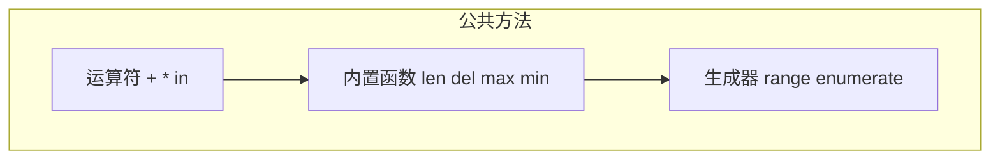

# 1.9 公共方法

<div align="center">

**第一章 · Python 基础语法 · 第 9 节**

*预计学习时间：1.5 小时 · 难度：⭐⭐*

</div>


---

## 📖 本节导读

字符串、列表、元组、字典、集合各有专属方法，但它们也共享一批**公共操作**——`+` 合并、`*` 复制、`in` 判断、`len()` 计数、`range()` 生成序列、`enumerate()` 带索引遍历。本节帮你一次性掌握这些通用工具。


---

## 1. 公共运算符

### + 合并

将两个同类型容器合并为一个**新**对象。

| 容器 | 支持 `+` | 示例 |
|------|:--------:|------|
| 字符串 | ✅ | `"aa" + "bb"` → `"aabb"` |
| 列表 | ✅ | `[1,2] + [3,4]` → `[1,2,3,4]` |
| 元组 | ✅ | `(1,2) + (3,4)` → `(1,2,3,4)` |
| 字典 | ❌ | 不支持合并运算 |

请你新建 `op_plus.py`：

```python
str1 = "aa"
str2 = "bb"
print(str1 + str2)   # aabb

list1 = [1, 2]
list2 = [10, 20]
print(list1 + list2)  # [1, 2, 10, 20]

t1 = (1, 2)
t2 = (10, 20)
print(t1 + t2)        # (1, 2, 10, 20)
```

**运行效果：**

```
aabb
[1, 2, 10, 20]
(1, 2, 10, 20)
```

### * 复制

将容器内容重复 n 次。

```python
print("a" * 5)          # aaaaa
print("-" * 10)         # ----------
print(["hello"] * 3)    # ['hello', 'hello', 'hello']
print(("world",) * 3)   # ('world', 'world', 'world')
```

> ⚠️ **避坑**：单元素元组必须加逗号：`("world",) * 3`。`("world") * 3` 中 `("world")` 只是字符串，结果是 `"worldworldworld"`。

### in / not in

判断元素是否存在于容器中。

| 容器 | 支持 `in` |
|------|:---------:|
| 字符串 | ✅（判断子串） |
| 列表 | ✅ |
| 元组 | ✅ |
| 字典 | ✅（判断的是**键**） |
| 集合 | ✅ |

请你新建 `op_in.py`：

```python
str1 = "abcd"
print("a" in str1)        # True
print("x" not in str1)    # True

list1 = [10, 20, 30, 40]
print(10 in list1)        # True
print(5 not in list1)     # True

dict1 = {"name": "python", "age": 30}
print("name" in dict1)           # True（判断键）
print("python" in dict1)         # False（值不算）
print("name" in dict1.keys())    # True
print("python" in dict1.values()) # True
```

**运行效果：**

```
True
True
True
True
True
False
True
True
```

> 🟦 **知识卡片**
>
> 对字典使用 `in`，判断的是**键名**而不是值。要判断值是否存在，用 `"python" in dict1.values()`。

---

## 2. len()：计算长度

返回容器中元素的个数。

| 容器 | len 的含义 |
|------|-----------|
| 字符串 | 字符个数 |
| 列表/元组/集合 | 元素个数 |
| 字典 | 键值对个数 |

请你新建 `common_len.py`：

```python
print(len("abcdefg"))                          # 7
print(len([10, 20, 30, 40, 50]))               # 5
print(len((10, 20, 30, 40, 50)))               # 5
print(len({10, 20, 30, 40, 50}))               # 5
print(len({"name": "TOM", "age": 18}))         # 2
```

**运行效果：**

```
7
5
5
5
2
```

---

## 3. del：删除

| 用法 | 作用 |
|------|------|
| `del 容器` | 删除整个容器 |
| `del 容器[i]` | 删除指定下标元素（列表） |
| `del 字典[key]` | 删除指定键值对 |

```python
list1 = [10, 20, 30, 40, 50]
del list1[0]
print(list1)   # [20, 30, 40, 50]

dict1 = {"name": "TOM", "age": 18}
del dict1["name"]
print(dict1)   # {'age': 18}
```

> 🟥 **危险警告**：`del` 字符串或元组的元素会报错——它们是不可变类型，不支持删除单个元素。

---

## 4. max() 和 min()

返回容器中的最大值和最小值。

```python
print(max("abcdefg"))       # g
print(min("abcdefg"))       # a
print(max([10, 20, 30]))    # 30
print(min([10, 20, 30]))    # 10
```

**运行效果：**

```
g
a
30
10
```

> 🟦 **知识卡片**
>
> 字符串比较按字典序（ASCII/Unicode 码值），`"a" < "g"`。数字列表则按数值大小比较。

---

## 5. range()：生成数字序列

### 语法

```python
range(stop)
range(start, stop)
range(start, stop, step)
```

| 规则 | 说明 |
|------|------|
| 不包含 end | `range(1, 10)` 只到 9 |
| 省略 start | 默认从 0 开始 |
| 省略 step | 默认为 1 |

请你新建 `common_range.py`：

```python
print("--- 1 到 9 ---")
for i in range(1, 10):
    print(i, end=" ")
print()

print("--- 1, 3, 5, 7, 9 ---")
for i in range(1, 10, 2):
    print(i, end=" ")
print()

print("--- 0 到 9 ---")
for i in range(10):
    print(i, end=" ")
print()
```

**运行效果：**

```
--- 1 到 9 ---
1 2 3 4 5 6 7 8 9 
--- 1, 3, 5, 7, 9 ---
1 3 5 7 9 
--- 0 到 9 ---
0 1 2 3 4 5 6 7 8 9 
```

> 📸 **截图位**：三种 range 用法的输出对比

---

## 6. enumerate()：带索引遍历

将一个可遍历对象组合为**索引序列**，同时返回下标和数据，常用于 `for` 循环。

### 语法

```python
enumerate(可遍历对象, start=0)
```

请你新建 `common_enumerate.py`：

```python
list1 = ["a", "b", "c", "d", "e"]

print("--- 默认 start=0 ---")
for item in enumerate(list1):
    print(item)

print("--- start=1 ---")
for index, char in enumerate(list1, start=1):
    print(f"下标是 {index}，对应的字符是 {char}")
```

**运行效果：**

```
--- 默认 start=0 ---
(0, 'a')
(1, 'b')
(2, 'c')
(3, 'd')
(4, 'e')
--- start=1 ---
下标是 1，对应的字符是 a
下标是 2，对应的字符是 b
下标是 3，对应的字符是 c
下标是 4，对应的字符是 d
下标是 5，对应的字符是 e
```

> 🟦 **知识卡片**
>
> `enumerate()` 返回元组 `(下标, 数据)`。用 `for index, value in enumerate(lst)` 解包，是 Python 遍历带序号数据的标准写法。

---

## 7. 容器类型转换（拓展）

| 函数 | 作用 |
|------|------|
| `list()` | 转列表 |
| `tuple()` | 转元组 |
| `set()` | 转集合（自动去重） |
| `str()` | 转字符串 |

```python
print(list("abc"))       # ['a', 'b', 'c']
print(tuple([1, 2, 3]))  # (1, 2, 3)
print(set([1, 2, 2, 3])) # {1, 2, 3}
print(str([1, 2, 3]))    # '[1, 2, 3]'
```

---

## 8. 综合练习

请你依次完成：

1. 新建 `merge_list.py`：用 `+` 合并两个列表，`in` 判断元素是否存在
2. 新建 `enum_fruits.py`：用 `enumerate(start=1)` 遍历水果列表并打印序号
3. 新建 `range_sum.py`：用 `range` + `for` 计算 1 到 50 的奇数和

<details>
<summary>📎 练习 3 参考答案</summary>

```python
result = 0
for i in range(1, 51, 2):
    result += i
print(f"1 到 50 的奇数和：{result}")   # 625
```

</details>

---

## 9. 公共方法速查表

| 方法/运算符 | 字符串 | 列表 | 元组 | 字典 | 集合 |
|------------|:------:|:----:|:----:|:----:|:----:|
| `+` 合并 | ✅ | ✅ | ✅ | ❌ | ❌ |
| `*` 复制 | ✅ | ✅ | ✅ | ❌ | ❌ |
| `in` | ✅ | ✅ | ✅ | ✅ | ✅ |
| `len()` | ✅ | ✅ | ✅ | ✅ | ✅ |
| `del` | 整个 | ✅ | 整个 | ✅ | 整个 |
| `max/min` | ✅ | ✅ | ✅ | ❌ | ❌ |

---

## 10. 本节小结

| 工具 | 用途 |
|------|------|
| `+` / `*` | 合并与复制容器 |
| `in` / `not in` | 成员判断 |
| `len()` | 获取长度 |
| `del` | 删除容器或元素 |
| `max()` / `min()` | 最值 |
| `range()` | 生成数字序列 |
| `enumerate()` | 带索引遍历 |



> 🟩 **恭喜！** 你已经掌握了 Python 基础语法的核心容器和操作。下一节学习**推导式**——用一行代码生成列表、字典、集合。

---

| ← 上一节 | [第一章目录](./README.md) | 下一节 → |
|---------|--------------------------|---------|
| [1.8 字典与集合](./08-字典与集合.md) | | [1.10 推导式](./10-推导式.md) |

*源码：[`Python基础语法/9.公共的方法/`](../../Python基础语法/9.公共的方法/)*
