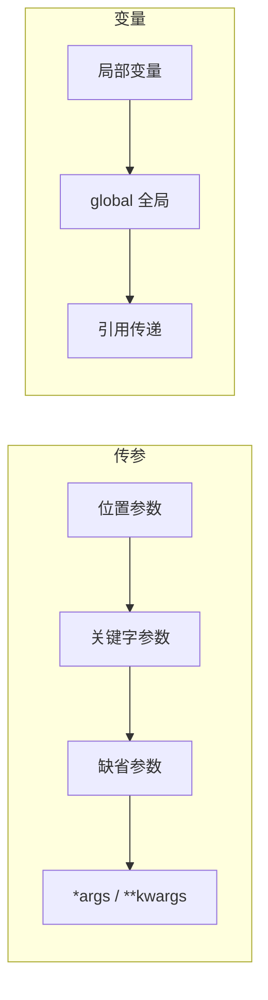

# 1.12 函数提高

<div align="center">

**第一章 · Python 基础语法 · 第 12 节**

*预计学习时间：2 小时 · 难度：⭐⭐⭐*

</div>


---

## 📖 本节导读

函数基础学会了「封装与调用」，本节深入**多种传参方式**、**局部与全局变量**、**多返回值**、**拆包**与**引用传递**——为学员管理系统项目打基础。



---

## 1. 多种传参方式

### 1.1 位置参数

调用时按**定义顺序**传递，个数必须一致：

```python
def user_info(name, age, gender):
    print(f'名字：{name}，年龄：{age}，性别：{gender}')

user_info('Tom', 20, '男')
```

> ⚠️ **避坑**：顺序传错会导致数据错位，如 `user_info(20, 'Tom', '男')` 语义混乱。

---

### 1.2 关键字参数

通过 `键=值` 指定，**消除顺序依赖**：

```python
def user_info(name, age, gender):
    print(f'名字：{name}，年龄：{age}，性别：{gender}')

user_info(name='Rose', age=20, gender='女')
user_info('小明', gender='男', age=16)  # 位置参数必须在关键字参数前
```

| 规则 | 说明 |
|------|------|
| 位置参数在前 | `user_info('Tom', age=18, gender='男')` ✅ |
| 关键字之间无顺序 | `age=18, gender='男'` 可互换 |
| 位置不能放关键字后 | `user_info(name='Tom', 18)` ❌ |

---

### 1.3 缺省参数（默认参数）

为参数提供默认值，调用时可省略：

```python
def user_info(name, age, gender='男'):
    print(f'名字：{name}，年龄：{age}，性别：{gender}')

user_info('Tom', 20)           # 使用默认 gender='男'
user_info('Rose', 18, '女')      # 覆盖默认值
```

> ⚠️ **避坑**：所有**位置参数**必须出现在**默认参数**之前。

---

### 1.4 不定长参数

#### *args —— 包裹位置参数

```python
def user_info(*args):
    print(args)       # 元组
    print(type(args)) # <class 'tuple'>

user_info('Tom')
user_info('Tom', 18, '男')
# ('Tom', 18, '男')
```

#### **kwargs —— 包裹关键字参数

```python
def user_info(**kwargs):
    print(kwargs)       # 字典
    print(type(kwargs)) # <class 'dict'>

user_info(name='Tom', age=18, id=110)
# {'name': 'Tom', 'age': 18, 'id': 110}
```

#### 组合使用

```python
def demo(a, b, *args, **kwargs):
    print(f'a={a}, b={b}')
    print(f'args={args}')
    print(f'kwargs={kwargs}')

demo(1, 2, 3, 4, name='Tom', age=20)
```

参数顺序：`位置 → 默认 → *args → **kwargs`

> 📸 **截图位**：`*args` 和 `**kwargs` 打印结果的对比

---

## 2. 局部变量与全局变量

### 2.1 局部变量

定义在**函数体内部**，只在函数内生效，调用结束后销毁：

```python
def test_a():
    a = 100
    print(a)  # 100

test_a()
# print(a)  # ❌ NameError
```

### 2.2 全局变量

函数内外都能访问：

```python
a = 100

def test_a():
    print(a)  # 100

def test_b():
    print(a)  # 100

test_a()
test_b()
```

### 2.3 修改全局变量 —— global

```python
a = 100

def test_b():
    global a
    a = 200
    print(a)  # 200

test_b()
print(a)  # 200 —— 全局变量被修改
```

不加 `global` 时，`a = 200` 只是创建了**局部变量**：

```python
a = 100

def test_b():
    a = 200   # 局部变量，不影响全局
    print(a)  # 200

test_b()
print(a)  # 100
```

> 🟥 **危险警告**：滥用 `global` 会让代码难以维护；学员管理系统中 `info` 列表需要 `global` 是因为要在函数内修改全局列表。

---

## 3. 函数返回值进阶

### 3.1 多个 return

一个函数有多个 `return` 时，**只执行第一个**：

```python
def return_num():
    return 1, 2
    return 10, 20      # 永远不会执行

result = return_num()
print(result)  # (1, 2) —— 元组
```

### 3.2 返回多个值

```python
def return_info():
    return 'Tom', 20, '男'   # 默认打包为元组

name, age, gender = return_info()  # 拆包
print(name, age, gender)  # Tom 20 男
```

也可返回列表或字典：

```python
def get_student():
    return {'name': 'Tom', 'age': 20, 'tel': '13800138000'}
```

---

## 4. 拆包

### 4.1 元组拆包

```python
def return_num():
    return 100, 200

num1, num2 = return_num()
print(num1)  # 100
print(num2)  # 200
```

### 4.2 字典拆包

```python
dict1 = {'name': 'Tom', 'age': 18}
a, b = dict1          # 拆出的是 key
print(a, b)           # name age
print(dict1[a])       # Tom
print(dict1[b])       # 18
```

### 4.3 交换变量值

```python
a, b = 10, 20
a, b = b, a           # 一行交换
print(a, b)           # 20 10
```

> 🟦 **技巧**：`a, b = b, a` 是 Python 最优雅的交换写法，无需第三变量。

---

## 5. 引用

Python 中，值靠**引用**传递。`id()` 可查看内存地址：

### 5.1 不可变类型（int）

```python
a = 1
b = a
print(id(a), id(b))  # 地址相同

a = 2
print(b)             # 1 —— b 不变
print(id(a), id(b)) # 地址不同
```

### 5.2 可变类型（list）

```python
aa = [10, 20]
bb = aa
print(id(aa), id(bb))  # 地址相同

aa.append(30)
print(bb)              # [10, 20, 30] —— bb 也变了
```

### 5.3 引用作为实参

```python
def test1(a):
    print(f'传入：{a}, id={id(a)}')
    a += a
    print(f'修改：{a}, id={id(a)}')

b = 100
test1(b)   # int 修改后 id 变化，不影响外部 b

c = [11, 22]
test1(c)   # list 修改后 id 不变，外部 c 也变了
print(c)   # [11, 22, 11, 22]
```

| 类型 | 分类 | 函数内修改是否影响外部 |
|------|------|---------------------|
| int, float, str, tuple | 不可变 | 否 |
| list, dict, set | 可变 | 是 |

---

## 6. 综合案例：灵活的用户信息

请你新建 `func_advanced.py`：

```python
def register(name, age, gender='男', **extra):
    info = {'name': name, 'age': age, 'gender': gender}
    info.update(extra)
    return info


def show_users(*users):
    print('--- 用户列表 ---')
    for u in users:
        print(f"{u['name']} | {u['age']}岁 | {u['gender']}")


u1 = register('Tom', 20)
u2 = register('Rose', 18, '女', tel='13800138000', city='北京')

show_users(u1, u2)
```

**运行效果：**

```
--- 用户列表 ---
Tom | 20岁 | 男
Rose | 18岁 | 女
```

---

## 7. 综合练习

请你依次完成：

1. 定义 `calc(a, b, op='+')`，支持 `+`、`-`、`*`、`/`，用缺省参数默认加法
2. 定义 `total(*args)`，返回所有参数之和
3. 用拆包接收 `(100, 200, 300)` 三个值
4. 验证 list 作为实参传入函数后被修改，int 不会

<details>
<summary>📎 练习 1 参考答案</summary>

```python
def calc(a, b, op='+'):
    if op == '+':
        return a + b
    elif op == '-':
        return a - b
    elif op == '*':
        return a * b
    elif op == '/':
        return a / b

print(calc(10, 3))       # 13
print(calc(10, 3, '-'))  # 7
```

</details>

<details>
<summary>📎 练习 2 参考答案</summary>

```python
def total(*args):
    return sum(args)

print(total(1, 2, 3, 4, 5))  # 15
```

</details>

---

## 8. 本节小结

| 知识点 | 要点 |
|--------|------|
| 位置参数 | 按顺序传，个数一致 |
| 关键字参数 | `键=值`，消除顺序依赖 |
| 缺省参数 | 默认值，位置参数在前 |
| *args / **kwargs | 元组 / 字典收集不定长参数 |
| global | 在函数内修改全局变量 |
| 多返回值 | `return a, b` → 元组 |
| 拆包 | `a, b = func()`；`a, b = b, a` |
| 引用 | 可变类型传参会被函数内修改 |

---

| ← 上一节 | [第一章目录](./README.md) | 下一节 → |
|---------|--------------------------|---------|
| [1.11 函数基础](./11-函数基础.md) | | [1.13 学员管理系统](./13-学员管理系统.md) |

*源码：[`Python基础语法/12.函数提高`](../../Python基础语法/12.函数提高)*
