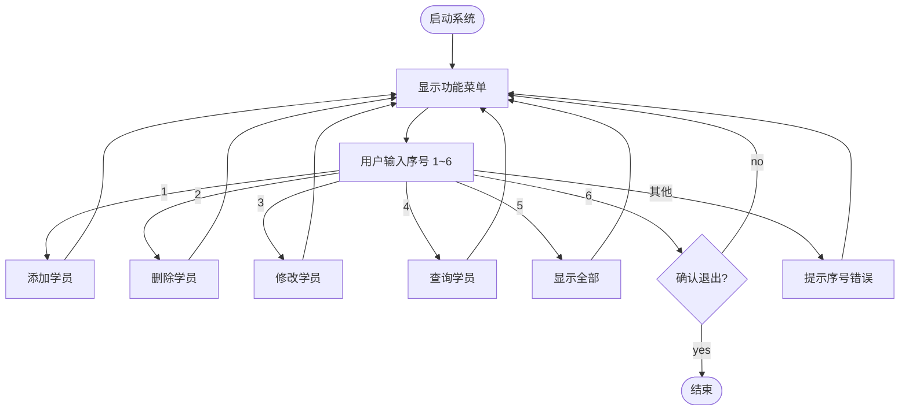

# 1.13 学员管理系统 ⭐

<div align="center">

**第一章 · Python 基础语法 · 第 13 节**

*预计学习时间：2～3 小时 · 难度：⭐⭐⭐*

</div>


---

## 📖 本节导读

这是第一章的**综合实战项目**——用函数、列表、字典、循环、`global` 等知识，从零搭建一个命令行**学员管理系统**。完成本节，你将体验「需求分析 → 模块拆分 → 编码实现 → 联调测试」的完整流程。



---

## 1. 需求分析

### 1.1 功能清单

| 序号 | 功能 | 说明 |
|:----:|------|------|
| 1 | 添加学员 | 输入学号、姓名、手机号，存入列表 |
| 2 | 删除学员 | 按姓名删除 |
| 3 | 修改学员 | 按姓名修改手机号 |
| 4 | 查询学员 | 按姓名查找并显示 |
| 5 | 显示所有学员 | 表格形式打印全部 |
| 6 | 退出系统 | 确认后 `break` 终止循环 |

### 1.2 数据结构

所有学员信息存为一个**全局列表**，每个学员是一个**字典**：

```python
info = [
    {'id': '001', 'name': 'Tom', 'tel': '13800138000'},
    {'id': '002', 'name': 'Lily', 'tel': '13900139000'},
]
```

> 🟦 **技巧**：列表 + 字典的组合，是 Python 小项目最常用的数据组织方式。

---

## 2. 步骤拆解

| 步骤 | 任务 | 对应函数 |
|:----:|------|---------|
| 1 | 显示功能界面 | `print_menu()` |
| 2 | 用户输入功能序号 | `input()` + `int()` |
| 3 | 根据序号调用不同函数 | `if / elif` 分支 |
| 4 | 循环直到退出 | `while True` + `break` |

---

## 3. 显示功能界面

```python
def print_menu():
    print('请选择功能-------------')
    print('1、添加学员')
    print('2、删除学员')
    print('3、修改学员')
    print('4、查询学员')
    print('5、显示所有学员')
    print('6、退出系统')
    print('-' * 20)
```

> 📸 **截图位**：运行后菜单界面的终端效果

---

## 4. 添加学员

**需求**：
1. 接收用户输入的学号、姓名、手机号
2. 若姓名已存在 → 提示并 `return`
3. 否则构造字典，追加到 `info` 列表

```python
def add_info():
    new_id = input('请输入学号：')
    new_name = input('请输入姓名：')
    new_tel = input('请输入手机号：')

    global info
    for i in info:
        if new_name == i['name']:
            print('该用户已经存在')
            return

    info_dict = {
        'id': new_id,
        'name': new_name,
        'tel': new_tel,
    }
    info.append(info_dict)
    print('添加成功！')
```

> ⚠️ **避坑**：`return` 在检测到重名后立即退出，后面追加代码不会执行。

---

## 5. 删除学员

**需求**：按姓名查找，存在则删除，不存在则提示。

```python
def del_info():
    del_name = input('请输入要删除的学员姓名：')
    global info
    for i in info:
        if del_name == i['name']:
            info.remove(i)
            print('删除成功！')
            break
    else:
        print('该学员不存在')
```

> 🟦 **技巧**：`for...else` 中，`else` 在循环**正常结束**（未 `break`）时执行——正好用于「没找到」的分支。

---

## 6. 修改学员

```python
def modify_info():
    modify_name = input('请输入要修改的学员姓名：')
    global info
    for i in info:
        if modify_name == i['name']:
            i['tel'] = input('请输入新的手机号：')
            print('修改成功！')
            break
    else:
        print('该学员不存在')
```

列表是可变类型，直接修改字典的 `tel` 键即可，无需 `global info` 以外的操作。

---

## 7. 查询学员

```python
def search_info():
    search_name = input('请输入要查找的学员姓名：')
    global info
    for i in info:
        if search_name == i['name']:
            print('查找到的学员信息如下：----------')
            print(f"学号：{i['id']}，姓名：{i['name']}，手机号：{i['tel']}")
            break
    else:
        print('该学员不存在')
```

> ⚠️ **避坑**：f-string 内嵌套引号时，外层用双引号、内层字典键用单引号，避免语法错误。

---

## 8. 显示所有学员

```python
def print_all():
    print('学号\t姓名\t手机号')
    print('-' * 30)
    for i in info:
        print(f"{i['id']}\t{i['name']}\t{i['tel']}")
    if not info:
        print('（暂无学员数据）')
```

**运行效果：**

```
学号    姓名    手机号
------------------------------
001     Tom     13800138000
002     Lily    13900139000
```

---

## 9. 主程序 —— 循环与退出

```python
info = []

while True:
    print_menu()
    user_num = input('请输入功能序号：')

    if user_num == '1':
        add_info()
    elif user_num == '2':
        del_info()
    elif user_num == '3':
        modify_info()
    elif user_num == '4':
        search_info()
    elif user_num == '5':
        print_all()
    elif user_num == '6':
        exit_flag = input('确定要退出吗？ yes / no：')
        if exit_flag == 'yes':
            print('感谢使用，再见！')
            break
    else:
        print('输入的功能序号有误')
```

> 🟦 **技巧**：用 `input()` 接收字符串再比较，比 `int(input())` 更安全——非法输入不会崩溃。

---

## 10. 完整代码

请你新建 `student_manager.py`，复制以下完整代码：

```python
info = []


def print_menu():
    print('请选择功能-------------')
    print('1、添加学员')
    print('2、删除学员')
    print('3、修改学员')
    print('4、查询学员')
    print('5、显示所有学员')
    print('6、退出系统')
    print('-' * 20)


def add_info():
    new_id = input('请输入学号：')
    new_name = input('请输入姓名：')
    new_tel = input('请输入手机号：')

    global info
    for i in info:
        if new_name == i['name']:
            print('该用户已经存在')
            return

    info_dict = {'id': new_id, 'name': new_name, 'tel': new_tel}
    info.append(info_dict)
    print('添加成功！')


def del_info():
    del_name = input('请输入要删除的学员姓名：')
    global info
    for i in info:
        if del_name == i['name']:
            info.remove(i)
            print('删除成功！')
            break
    else:
        print('该学员不存在')


def modify_info():
    modify_name = input('请输入要修改的学员姓名：')
    global info
    for i in info:
        if modify_name == i['name']:
            i['tel'] = input('请输入新的手机号：')
            print('修改成功！')
            break
    else:
        print('该学员不存在')


def search_info():
    search_name = input('请输入要查找的学员姓名：')
    global info
    for i in info:
        if search_name == i['name']:
            print('查找到的学员信息如下：----------')
            print(f"学号：{i['id']}，姓名：{i['name']}，手机号：{i['tel']}")
            break
    else:
        print('该学员不存在')


def print_all():
    print('学号\t姓名\t手机号')
    print('-' * 30)
    if not info:
        print('（暂无学员数据）')
        return
    for i in info:
        print(f"{i['id']}\t{i['name']}\t{i['tel']}")


while True:
    print_menu()
    user_num = input('请输入功能序号：')

    if user_num == '1':
        add_info()
    elif user_num == '2':
        del_info()
    elif user_num == '3':
        modify_info()
    elif user_num == '4':
        search_info()
    elif user_num == '5':
        print_all()
    elif user_num == '6':
        exit_flag = input('确定要退出吗？ yes / no：')
        if exit_flag == 'yes':
            print('感谢使用，再见！')
            break
    else:
        print('输入的功能序号有误')
```

> 📸 **截图位**：完整走一遍「添加 → 查询 → 修改 → 显示全部 → 删除 → 退出」的操作录屏或截图

---

## 11. 测试清单

请你按顺序自测：

| 步骤 | 操作 | 预期结果 |
|:----:|------|---------|
| 1 | 启动程序 | 显示菜单 |
| 2 | 输入 1，添加 Tom | 提示添加成功 |
| 3 | 再次输入 1，添加同名 Tom | 提示「该用户已经存在」 |
| 4 | 输入 4，查询 Tom | 显示学号、姓名、手机号 |
| 5 | 输入 3，修改 Tom 手机号 | 提示修改成功 |
| 6 | 输入 5 | 表格显示所有学员 |
| 7 | 输入 2，删除 Tom | 提示删除成功 |
| 8 | 输入 6，输入 yes | 程序退出 |
| 9 | 输入 9 | 提示「序号有误」，不崩溃 |

---

## 12. 扩展挑战（选做）

1. **数据持久化**：退出时将 `info` 写入 JSON 文件，启动时读取
2. **输入校验**：手机号必须 11 位数字
3. **按学号查询**：增加按学号查找的分支
4. **面向对象改造**：预习第二章，用类封装学员和管理器

<details>
<summary>📎 扩展 1 提示：JSON 持久化</summary>

```python
import json

def save_data():
    with open('students.json', 'w', encoding='utf-8') as f:
        json.dump(info, f, ensure_ascii=False)

def load_data():
    global info
    try:
        with open('students.json', 'r', encoding='utf-8') as f:
            info = json.load(f)
    except FileNotFoundError:
        info = []
```

在程序启动时调用 `load_data()`，退出时调用 `save_data()`。

</details>

---

## 13. 本节小结

| 知识点 | 在项目中的体现 |
|--------|--------------|
| 函数 | 每个功能独立函数，主程序调度 |
| 列表 + 字典 | `info` 存储学员数据 |
| global | 函数内修改全局 `info` 列表 |
| while + break | 主循环与退出 |
| for...else | 查找失败时的提示 |
| input | 与用户交互 |

---

| ← 上一节 | [第一章目录](./README.md) | 下一节 → |
|---------|--------------------------|---------|
| [1.12 函数提高](./12-函数提高.md) | | [1.14 递归与匿名函数](./14-递归与匿名函数.md) |

*源码：[`Python基础语法/13.函数应用-学员管理系统`](../../Python基础语法/13.函数应用-学员管理系统)*
