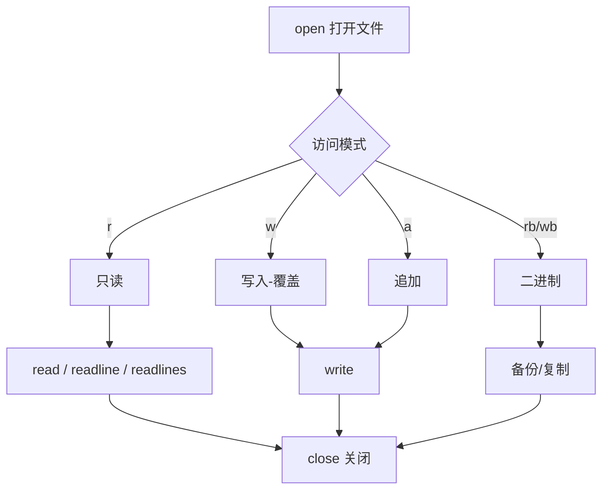

# 1.16 文件操作

<div align="center">

**第一章 · Python 基础语法 · 第 16 节**

*预计学习时间：2 小时 · 难度：⭐⭐⭐*

</div>


---

## 📖 本节导读

程序的数据不能只在内存里——**文件操作**让数据持久保存。本节掌握 open 读写、with 上下文管理、文件备份、批量重命名，以及 os 模块的常用功能。



---

## 1. 文件操作的作用

| 操作 | 作用 |
|------|------|
| 读取 | 加载上次保存的数据 |
| 写入 | 把结果存到磁盘 |
| 备份 | 复制文件防止丢失 |
| 重命名 | 批量整理文件名 |

> 🟦 **技巧**：文件操作让程序「有记忆」——下次运行不必重新输入所有数据。

---

## 2. 基本步骤

```
1. 打开文件  open()
2. 读写操作  read() / write()
3. 关闭文件  close()
```

也可以只打开和关闭，不做读写。

---

## 3. open() 打开文件

### 3.1 语法

```python
f = open(name, mode)
```

| 参数 | 说明 |
|------|------|
| name | 文件名（可含路径） |
| mode | 访问模式 |

### 3.2 常用访问模式

| 模式 | 说明 |
|------|------|
| `r` | 只读，指针在开头（默认） |
| `w` | 只写，存在则清空，不存在则创建 |
| `a` | 追加，指针在末尾 |
| `r+` | 读写 |
| `rb` | 二进制只读 |
| `wb` | 二进制只写 |

```python
f = open('test.txt', 'w')
f.write('hello world')
f.close()
```

> ⚠️ **避坑**：`w` 模式会**清空**已有内容；`r` 模式文件不存在会报错。

---

## 4. 写入与读取

### 4.1 write() 写入

```python
f = open('test.txt', 'w', encoding='utf-8')
f.write('hello world\n')
f.write('第二行内容\n')
f.close()
```

| 模式 | 文件不存在 | 文件已存在 |
|------|-----------|-----------|
| w | 创建 | 清空后写入 |
| a | 创建 | 末尾追加 |

### 4.2 read() 读取

```python
f = open('test.txt', 'r', encoding='utf-8')
content = f.read()       # 读取全部
print(content)
f.close()
```

```python
f = open('test.txt', 'r', encoding='utf-8')
content = f.read(5)      # 只读 5 个字符
print(content)           # hello
f.close()
```

### 4.3 readlines() 按行读取

```python
f = open('test.txt', 'r', encoding='utf-8')
lines = f.readlines()    # 返回列表，每行一个元素
print(lines)
f.close()
# ['hello world\n', '第二行内容\n']
```

### 4.4 readline() 逐行读取

```python
f = open('test.txt', 'r', encoding='utf-8')
print(f'第一行：{f.readline()}')
print(f'第二行：{f.readline()}')
f.close()
```

> 📸 **截图位**：read / readlines / readline 三种方式的输出对比

---

## 5. with 上下文管理（推荐）

自动关闭文件，即使发生异常也不会泄漏：

```python
with open('test.txt', 'r', encoding='utf-8') as f:
    content = f.read()
    print(content)
# 离开 with 块后自动 close
```

> 🟦 **技巧**：生产代码优先用 `with open(...) as f`，不必手动 `close()`。

---

## 6. seek() 移动文件指针

```python
with open('test.txt', 'r', encoding='utf-8') as f:
    print(f.read(5))    # hello
    f.seek(0, 0)        # 回到开头
    print(f.read(5))    # hello
```

| 起始位置 | 值 | 含义 |
|---------|:--:|------|
| 文件开头 | 0 | 默认 |
| 当前位置 | 1 | 相对当前 |
| 文件结尾 | 2 | 从末尾算 |

---

## 7. 综合案例：文件备份

**需求**：用户输入当前目录下的文件名，程序备份为 `xx[备份].后缀` 格式。

例如：`test.txt` → `test[备份].txt`

### 7.1 步骤分析


### 7.2 完整代码

请你新建 `file_backup.py`：

```python
old_name = input('请输入您想要备份的文件名：')

index = old_name.rfind('.')
if index <= 0:
    print('无效的文件名，请包含有效后缀（如 .txt）')
else:
    new_name = old_name[:index] + '[备份]' + old_name[index:]

    old_f = open(old_name, 'rb')
    new_f = open(new_name, 'wb')

    while True:
        content = old_f.read(1024)
        if len(content) == 0:
            break
        new_f.write(content)

    old_f.close()
    new_f.close()
    print(f'备份完成：{new_name}')
```

### 7.3 关键知识点

| 步骤 | 代码 | 说明 |
|------|------|------|
| 找后缀 | `old_name.rfind('.')` | 最右侧的点才是后缀 |
| 分离名和后缀 | `old_name[:index]` + `old_name[index:]` | 切片 |
| 拼接备份名 | `name + '[备份]' + suffix` | 字符串拼接 |
| 二进制读写 | `'rb'` / `'wb'` | 图片、视频等必须用二进制 |
| 循环读取 | `read(1024)` | 每次读 1KB，直到空 |

**运行效果：**

```
请输入您想要备份的文件名：test.txt
备份完成：test[备份].txt
```

> 📸 **截图位**：备份前后目录中两个文件并存的截图

> ⚠️ **避坑**：用户输入 `.txt` 这种无主体文件名时，`rfind('.')` 返回 0，应加 `if index <= 0` 校验。

---

## 8. with 版备份（改进）

```python
old_name = input('请输入您想要备份的文件名：')
index = old_name.rfind('.')

if index <= 0:
    print('无效的文件名')
else:
    new_name = old_name[:index] + '[备份]' + old_name[index:]
    with open(old_name, 'rb') as old_f, open(new_name, 'wb') as new_f:
        while True:
            content = old_f.read(1024)
            if not content:
                break
            new_f.write(content)
    print(f'备份完成：{new_name}')
```

---

## 9. os 模块 —— 文件与文件夹操作

```python
import os
```

| 函数 | 作用 | 示例 |
|------|------|------|
| `os.rename(old, new)` | 重命名文件 | `os.rename('a.txt', 'b.txt')` |
| `os.remove(path)` | 删除文件 | `os.remove('b.txt')` |
| `os.mkdir(name)` | 创建文件夹 | `os.mkdir('backup')` |
| `os.rmdir(name)` | 删除空文件夹 | `os.rmdir('backup')` |
| `os.getcwd()` | 获取当前目录 | |
| `os.chdir(path)` | 改变工作目录 | |
| `os.listdir(path)` | 列出目录内容 | `os.listdir('./')` |

---

## 10. 综合案例：批量重命名

**需求**：批量修改文件名——可添加前缀，也可删除前缀。

### 10.1 完整代码

请你新建 `batch_rename.py`：

```python
import os

# 1=添加前缀，2=删除前缀
flag = 1
prefix = 'Python-'
dir_name = './'

file_list = os.listdir(dir_name)

for name in file_list:
    if os.path.isdir(dir_name + name):
        continue

    if flag == 1:
        new_name = prefix + name
    elif flag == 2:
        if name.startswith(prefix):
            new_name = name[len(prefix):]
        else:
            continue
    else:
        print('flag 设置错误')
        break

    print(f'{name} → {new_name}')
    os.rename(dir_name + name, dir_name + new_name)

print('批量重命名完成！')
```

### 10.2 执行流程

| 步骤 | 说明 |
|:----:|------|
| 1 | 设置 `flag`：1 添加 / 2 删除 |
| 2 | `os.listdir()` 获取目录文件列表 |
| 3 | 跳过子目录，只处理文件 |
| 4 | 构造新文件名 |
| 5 | `os.rename()` 执行重命名 |

**运行效果（flag=1）：**

```
notes.txt → Python-notes.txt
demo.py → Python-demo.py
批量重命名完成！
```

> 📸 **截图位**：重命名前后文件夹内文件列表对比

> 🟥 **危险警告**：批量重命名**不可撤销**！请先在测试目录试运行，确认 `print` 输出无误后再执行 `os.rename`。

---

## 11. 常见陷阱

**陷阱一：忘记 encoding**

```python
# Windows 下读写中文可能乱码
f = open('data.txt', 'r', encoding='utf-8')
```

**陷阱二：w 模式误删数据**

```python
# w 会清空已有内容！追加请用 a
f = open('log.txt', 'a', encoding='utf-8')
f.write('新的一行\n')
f.close()
```

**陷阱三：路径拼接**

```python
import os
path = os.path.join('folder', 'file.txt')  # 跨平台安全
```

**陷阱四：rename 覆盖**

`os.rename` 目标名已存在时行为因系统而异，批量操作前先备份。

---

## 12. 综合练习

请你依次完成：

1. 用 `w` 模式创建 `my_log.txt`，写入三行内容
2. 用 `readlines()` 读回并打印
3. 用 `with` 改写文件备份代码
4. 在测试目录创建 3 个 txt 文件，用批量重命名添加 `test-` 前缀

<details>
<summary>📎 练习 1 参考答案</summary>

```python
with open('my_log.txt', 'w', encoding='utf-8') as f:
    f.write('第一行\n')
    f.write('第二行\n')
    f.write('第三行\n')
```

</details>

<details>
<summary>📎 练习 2 参考答案</summary>

```python
with open('my_log.txt', 'r', encoding='utf-8') as f:
    for line in f.readlines():
        print(line.strip())
```

</details>

---

## 13. 本节小结

| 类别 | 核心知识 |
|------|---------|
| 打开关闭 | `open()` / `close()` / `with` |
| 文本模式 | `r` 读、`w` 写、`a` 追加 |
| 二进制 | `rb` / `wb`，用于备份 |
| 读取 | `read()` / `readline()` / `readlines()` |
| 备份 | `rfind` 找后缀 + 循环 `read(1024)` |
| os 模块 | `listdir` / `rename` / `remove` / `mkdir` |
| 批量重命名 | 遍历目录 + 构造新名 + `os.rename` |

---

| ← 上一节 | [第一章目录](./README.md) | 下一节 → |
|---------|--------------------------|---------|
| [1.15 内置函数](./15-内置函数.md) | | [第二章 面向对象 →](02-Python面向对象编程/README.md) |

*源码：[`Python基础语法/16.文件操作`](https://github.com/Drgonmancer/Leo_code/tree/main/Python基础语法/16.文件操作)*
