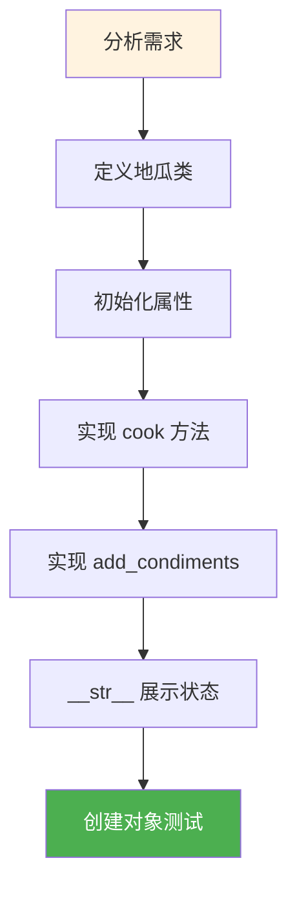
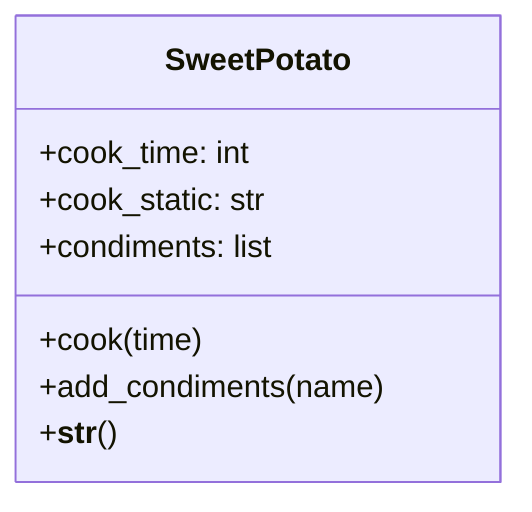
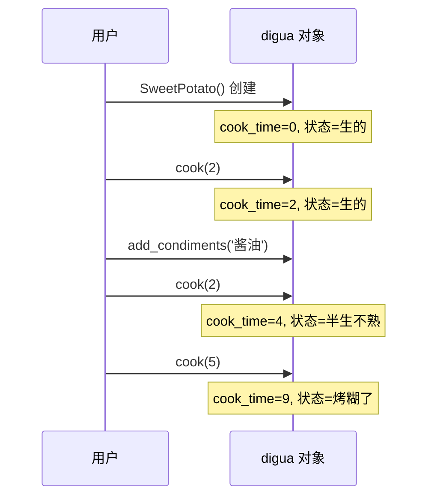

# 2.2 应用：烤地瓜

<div align="center">

**第二章 · Python 面向对象编程 · 第 2 节**

*预计学习时间：45 分钟 · 难度：⭐⭐*

</div>


---

## 📖 本节导读

- ✅ 学会用面向对象思想分析需求
- ✅ 掌握「一个事物 → 一个类」的设计方法
- ✅ 根据业务逻辑更新对象状态
- ✅ 综合运用 `__init__`、`__str__` 和实例方法



---

## 1. 为什么用案例学习？

> 🟦 **知识卡片**
>
> 上一节学了类、对象、魔法方法的**语法**。本节通过「烤地瓜」这个生活案例，练习**需求分析 → 类设计 → 代码实现**的完整流程。
>
> 真实开发中，你不是先想语法，而是先想：**这个系统里有哪些事物？每个事物有什么属性和行为？**

---

## 2. 需求分析

### 2.1 业务规则

**主线 1：被烤时间与地瓜状态**

| 被烤总时间 | 地瓜状态 |
|-----------|---------|
| 0 ~ 3 分钟 | 生的 |
| 3 ~ 5 分钟 | 半生不熟 |
| 5 ~ 8 分钟 | 熟的 |
| ≥ 8 分钟 | 烤糊了 |

**主线 2：添加调料**

- 用户可以按意愿添加调料（如酱油、辣椒面）
- 调料存储在列表中

### 2.2 面向对象分析



> 🟩 **设计原则**
>
> 需求涉及**一个事物**（地瓜）→ 定义**一个类**（地瓜类）。属性存状态，方法存行为。

---

## 3. 定义地瓜类

### 3.1 初始化属性

```python
class SweetPotato:
    def __init__(self):
        self.cook_time = 0          # 被烤时间
        self.cook_static = '生的'    # 地瓜状态
        self.condiments = []         # 调料列表
```

### 3.2 烤地瓜方法 `cook()`

用户每次设定烤的时间，程序**累加**总时间，并根据总时间更新状态。

```python
    def cook(self, time):
        """烤地瓜的方法"""
        self.cook_time += time
        if 0 <= self.cook_time < 3:
            self.cook_static = '生的'
        elif 3 <= self.cook_time < 5:
            self.cook_static = '半生不熟'
        elif 5 <= self.cook_time < 8:
            self.cook_static = '熟的'
        elif self.cook_time >= 8:
            self.cook_static = '烤糊了'
```

> ⚠️ **避坑**：状态判断用的是**累加后的总时间** `self.cook_time`，不是单次传入的 `time`。

### 3.3 添加调料 `add_condiments()`

```python
    def add_condiments(self, condiment):
        self.condiments.append(condiment)
```

### 3.4 展示信息 `__str__()`

```python
    def __str__(self):
        return (f'地瓜被烤了 {self.cook_time} 分钟，'
                f'状态是 {self.cook_static}，'
                f'调料有 {self.condiments}')
```

---

## 4. 完整代码

```python
class SweetPotato:
    def __init__(self):
        self.cook_time = 0
        self.cook_static = '生的'
        self.condiments = []

    def cook(self, time):
        self.cook_time += time
        if 0 <= self.cook_time < 3:
            self.cook_static = '生的'
        elif 3 <= self.cook_time < 5:
            self.cook_static = '半生不熟'
        elif 5 <= self.cook_time < 8:
            self.cook_static = '熟的'
        elif self.cook_time >= 8:
            self.cook_static = '烤糊了'

    def add_condiments(self, condiment):
        self.condiments.append(condiment)

    def __str__(self):
        return (f'地瓜被烤了 {self.cook_time} 分钟，'
                f'状态是 {self.cook_static}，'
                f'调料有 {self.condiments}')


# 创建对象并测试
digua = SweetPotato()
print(digua)

digua.cook(2)
digua.add_condiments('酱油')
print(digua)

digua.cook(2)
digua.add_condiments('辣椒面')
print(digua)

digua.cook(5)
print(digua)
```

**运行效果：**

```
地瓜被烤了 0 分钟，状态是 生的，调料有 []
地瓜被烤了 2 分钟，状态是 生的，调料有 ['酱油']
地瓜被烤了 4 分钟，状态是 半生不熟，调料有 ['酱油', '辣椒面']
地瓜被烤了 9 分钟，状态是 烤糊了，调料有 ['酱油', '辣椒面']
```

> 📸 **截图位**：终端中逐步烤地瓜的输出过程

---

## 5. 代码执行流程



---

## 6. 设计思路回顾

| 步骤 | 做了什么 |
|------|---------|
| 1. 找事物 | 地瓜 → `SweetPotato` 类 |
| 2. 找属性 | 时间、状态、调料 → `__init__` |
| 3. 找行为 | 烤、加调料 → `cook()`、`add_condiments()` |
| 4. 展示 | 打印友好信息 → `__str__()` |
| 5. 测试 | 创建对象，逐步调用方法验证 |

> 🟦 **技巧**
>
> 写面向对象程序的标准流程：**需求 → 类图 → 属性 → 方法 → 测试**。养成这个习惯，后面的大项目会轻松很多。

---

## 7. 综合练习

请你依次完成：

1. 给 `SweetPotato` 添加 `reset()` 方法，重置时间为 0、状态为「生的」、清空调料
2. 创建两个地瓜对象，分别烤不同时间，观察互不影响
3. （进阶）添加 `is_edible()` 方法，只有「熟的」才返回 `True`

> 📸 **截图位**：两个地瓜对象各自独立的状态输出

<details>
<summary>💡 参考答案（第 3 题）</summary>

```python
def is_edible(self):
    return self.cook_static == '熟的'

digua = SweetPotato()
digua.cook(6)
print(digua.is_edible())   # True

digua2 = SweetPotato()
digua2.cook(2)
print(digua2.is_edible())  # False
```

</details>

---

## 8. 本节小结

| 知识点 | 应用 |
|--------|------|
| 需求分析 | 一个事物 → 一个类 |
| `__init__` | 初始化三个实例属性 |
| 实例方法 | 根据逻辑更新对象状态 |
| `__str__` | 直观展示对象当前信息 |
| 列表属性 | `condiments` 存储多个调料 |

> 🟩 你已经会用面向对象解决单事物问题了。下一节「搬家具」将涉及**两个类之间的协作**。

---

| ← 上一节 | [第二章目录](./README.md) | 下一节 → |
|---------|--------------------------|---------|
| [2.1 面向对象基础](./01-面向对象基础.md) | | [2.3 搬家具案例](./03-应用搬家具.md) |

*源码：[`Python面向对象编程/2.应用-烤地瓜/`](https://github.com/Drgonmancer/Leo_code/tree/main/Python面向对象编程/2.应用-烤地瓜)*
