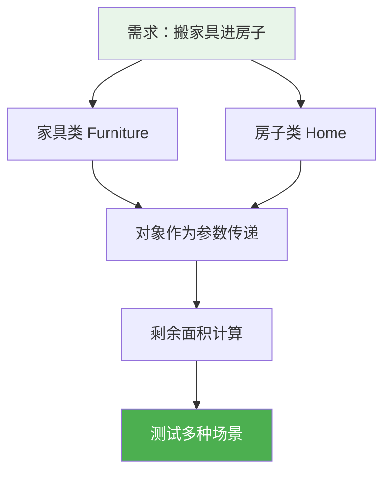
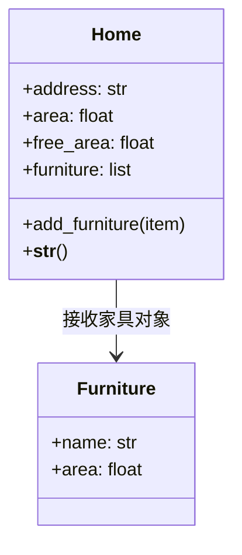
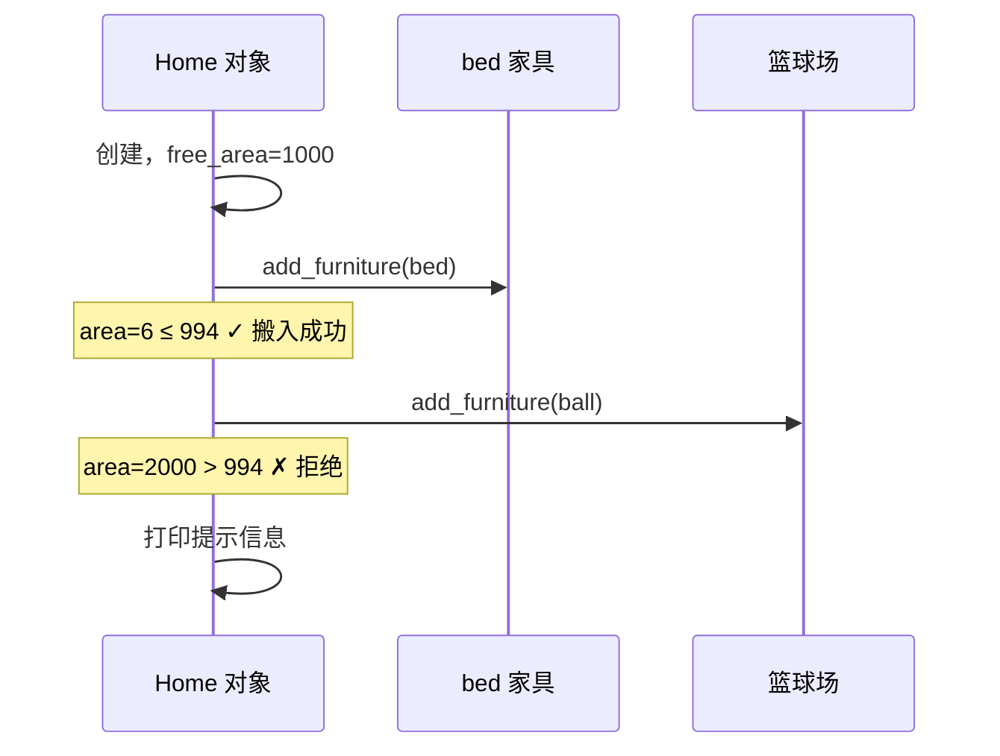

# 2.3 应用：搬家具

<div align="center">

**第二章 · Python 面向对象编程 · 第 3 节**

*预计学习时间：45 分钟 · 难度：⭐⭐*

</div>


---

## 📖 本节导读

- ✅ 学会分析涉及多个事物的需求
- ✅ 掌握两个类之间的协作关系
- ✅ 理解「对象作为参数传递」的用法
- ✅ 用条件判断实现业务逻辑



---

## 1. 从单类到多类协作

> 🟦 **知识卡片**
>
> 上一节「烤地瓜」只有一个类。真实项目中，多个事物会**互相影响**——比如家具要搬进房子，房子剩余面积会变化。
>
> 面向对象的做法：每个事物一个类，类与类之间通过**方法传参**协作。

| 案例 | 涉及类 | 协作方式 |
|------|--------|---------|
| 烤地瓜 | 1 个（地瓜） | 对象自身状态变化 |
| 搬家具 | 2 个（家具 + 房子） | 家具对象传给房子对象 |

---

## 2. 需求分析

### 2.1 业务规则

> 将**占地面积小于**房子剩余面积的家具，摆放到房子中。

### 2.2 类设计



**家具类 `Furniture`**

| 属性 | 说明 |
|------|------|
| name | 家具名称 |
| area | 占地面积 |

**房子类 `Home`**

| 属性/方法 | 说明 |
|----------|------|
| address | 地理位置 |
| area | 房屋总面积 |
| free_area | 剩余面积（初始 = 总面积） |
| furniture | 已搬入的家具列表 |
| add_furniture() | 容纳家具（核心方法） |
| `__str__()` | 展示房屋信息 |

---

## 3. 定义家具类

```python
class Furniture:
    def __init__(self, name, area):
        self.name = name
        self.area = area
```

简单明了：家具只需要名字和面积两个属性。

---

## 4. 定义房子类

### 4.1 初始化

```python
class Home:
    def __init__(self, address, area):
        self.address = address
        self.area = area
        self.free_area = area       # 初始剩余 = 总面积
        self.furniture = []         # 家具列表
```

### 4.2 展示信息

```python
    def __str__(self):
        return (f'地址：{self.address}，'
                f'总面积：{self.area}，'
                f'剩余面积：{self.free_area}，'
                f'家具：{self.furniture}')
```

### 4.3 核心方法：容纳家具

```python
    def add_furniture(self, item):
        if self.free_area >= item.area:
            self.furniture.append(item.name)
            self.free_area -= item.area
        else:
            print('家具太大，剩余面积不足，无法容纳')
```

> 🟩 **设计亮点**
>
> 参数 `item` 接收的是**家具对象**，通过 `item.area` 访问其属性——这就是「对象之间的协作」。

---

## 5. 完整代码与测试

```python
class Furniture:
    def __init__(self, name, area):
        self.name = name
        self.area = area


class Home:
    def __init__(self, address, area):
        self.address = address
        self.area = area
        self.free_area = area
        self.furniture = []

    def __str__(self):
        return (f'地址：{self.address}，'
                f'总面积：{self.area}，'
                f'剩余面积：{self.free_area}，'
                f'家具：{self.furniture}')

    def add_furniture(self, item):
        if self.free_area >= item.area:
            self.furniture.append(item.name)
            self.free_area -= item.area
        else:
            print('家具太大，剩余面积不足，无法容纳')


# 创建家具
bed = Furniture('双人床', 6)
sofa = Furniture('沙发', 10)
ball = Furniture('篮球场', 2000)

# 创建房子
jia = Home('北京', 1000)
print(jia)

# 搬入双人床 — 成功
jia.add_furniture(bed)
print(jia)

# 搬入篮球场 — 失败
jia.add_furniture(ball)
print(jia)

# 搬入沙发 — 成功
jia.add_furniture(sofa)
print(jia)
```

**运行效果：**

```
地址：北京，总面积：1000，剩余面积：1000，家具：[]
地址：北京，总面积：1000，剩余面积：994，家具：['双人床']
家具太大，剩余面积不足，无法容纳
地址：北京，总面积：1000，剩余面积：994，家具：['双人床']
地址：北京，总面积：1000，剩余面积：984，家具：['双人床', '沙发']
```

> 📸 **截图位**：终端中搬家具成功与失败的对比输出

---

## 6. 执行流程分析



---

## 7. 关键知识点

### 7.1 对象作为参数

```python
jia.add_furniture(bed)   # bed 是 Furniture 对象
```

方法内部通过 `item.name`、`item.area` 访问传入对象的属性，无需拆开传递。

### 7.2 状态联动

搬入家具后，**剩余面积自动减少**、**家具列表自动更新**——对象自己管理自己的状态，外部只需调用一个方法。

> 🟥 **注意**
>
> 当前实现只存了家具**名字**到列表。如果要查询某件家具的详细信息，应存储**对象本身**：`self.furniture.append(item)`。

### 7.3 与烤地瓜案例的对比

| 对比项 | 烤地瓜 | 搬家具 |
|--------|--------|--------|
| 类数量 | 1 | 2 |
| 状态变化 | 单对象内部 | 两对象协作 |
| 参数类型 | 基本类型（int, str） | 对象类型 |
| 失败处理 | 无 | 条件判断 + 提示 |

---

## 8. 综合练习

请你依次完成：

1. 修改 `add_furniture`，在列表中存储**家具对象**而非名字
2. 添加 `remove_furniture(name)` 方法：按名称移除家具，并恢复剩余面积
3. 添加 `furniture_count` 属性（用 `@property` 或直接方法），返回当前家具数量

> 📸 **截图位**：搬入 3 件家具后，房子对象的完整信息

<details>
<summary>💡 参考答案（第 2 题思路）</summary>

```python
def remove_furniture(self, name):
    for item in self.furniture:
        if item.name == name:
            self.free_area += item.area
            self.furniture.remove(item)
            return
    print(f'没有找到名为 {name} 的家具')
```

</details>

---

## 9. 本节小结

| 知识点 | 要点 |
|--------|------|
| 多类设计 | 每个事物一个类 |
| 对象传参 | `add_furniture(item)` 接收对象 |
| 条件判断 | 面积不足时拒绝并提示 |
| 状态维护 | 搬入后更新 `free_area` 和 `furniture` |
| `__str__` | 一站式展示对象信息 |

> 🟩 两个应用案例练完，你已经具备「分析需求 → 设计类 → 写代码」的能力。下一节进入面向对象三大特性之一的**继承**。

---

| ← 上一节 | [第二章目录](./README.md) | 下一节 → |
|---------|--------------------------|---------|
| [2.2 烤地瓜案例](./02-应用烤地瓜.md) | | [2.4 继承](./04-继承.md) |

*源码：[`Python面向对象编程/3.应用-搬家具/`](../../Python面向对象编程/3.应用-搬家具/)*
