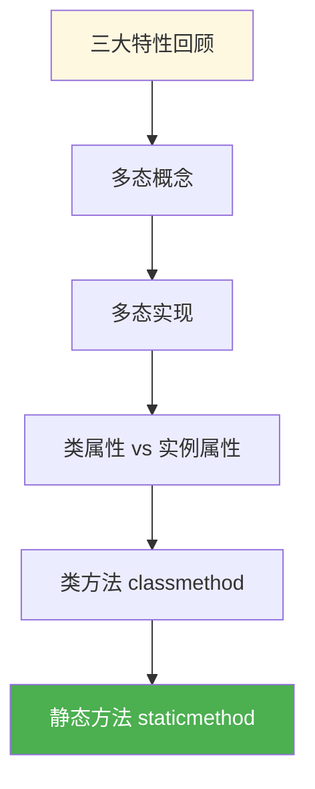
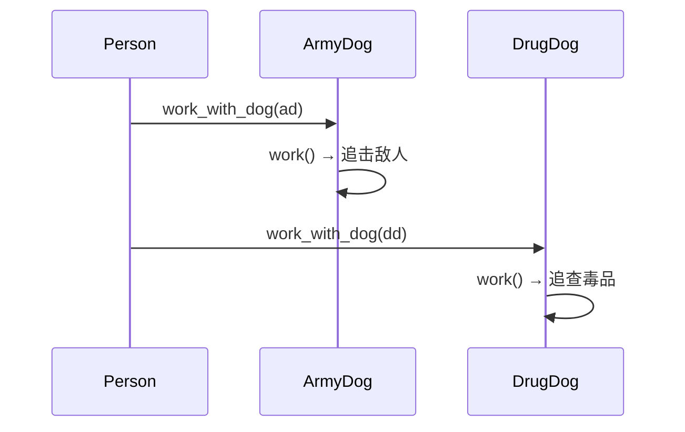

# 2.5 多态与类方法

<div align="center">

**第二章 · Python 面向对象编程 · 第 5 节**

*预计学习时间：1 小时 · 难度：⭐⭐⭐*

</div>


---

## 📖 本节导读

- ✅ 理解面向对象三大特性：封装、继承、多态
- ✅ 掌握多态的概念和实现步骤
- ✅ 区分类属性与实例属性
- ✅ 掌握 `@classmethod` 类方法和 `@staticmethod` 静态方法



---

## 1. 面向对象三大特性

> 🟦 **知识卡片**

| 特性 | 含义 | 你已经学了 |
|------|------|-----------|
| **封装** | 属性和方法写到类里；可加私有权限 | `__init__`、私有属性 |
| **继承** | 子类拥有父类属性和方法 | 单继承、多继承、重写 |
| **多态** | 传入不同对象，产生不同结果 | 👈 本节重点 |


---

## 2. 多态

### 2.1 概念

**多态**：同一个方法调用，传入不同的子类对象，执行不同的代码，产生不同的结果。

> 类比：同一个「工作」指令，传给军犬就去追击敌人，传给缉毒犬就去查毒品。

### 2.2 实现步骤

1. 定义**父类**，提供统一方法（哪怕方法是空的）
2. 定义**子类**，**重写**父类方法
3. 定义调用类，接收不同子类对象，调用同一方法，看到不同效果

### 2.3 警犬案例

```python
class Dog(object):
    def work(self):
        print('指哪打哪...')


class ArmyDog(Dog):
    def work(self):
        print('追击敌人...')


class DrugDog(Dog):
    def work(self):
        print('追查毒品...')


class Person(object):
    def work_with_dog(self, dog):
        dog.work()


ad = ArmyDog()
dd = DrugDog()

daqiu = Person()
daqiu.work_with_dog(ad)
daqiu.work_with_dog(dd)
```

**运行效果：**

```
追击敌人...
追查毒品...
```

> 📸 **截图位**：同一 `work_with_dog` 方法传入不同狗对象的输出

### 2.4 多态的好处

> 🟩 **核心价值**
>
> 有了多态，`Person.work_with_dog()` 不需要写 `if isinstance(dog, ArmyDog)` 这样的判断——**传入什么对象，就执行什么行为**。代码更通用、更易扩展。



---

## 3. 类属性与实例属性

### 3.1 区别

| 对比项 | 类属性 | 实例属性 |
|--------|--------|---------|
| 定义位置 | 类内部，方法外 | `__init__` 中 |
| 归属 | 整个类共有 | 每个对象独有 |
| 内存 | 只占用一份 | 每个对象一份 |
| 访问 | `类名.属性` 或 `对象.属性` | `对象.属性` |

### 3.2 类属性示例

```python
class Dog(object):
    tooth = 10


wangcai = Dog()
xiaohei = Dog()

print(Dog.tooth)       # 10
print(wangcai.tooth)   # 10
print(xiaohei.tooth)   # 10
```

### 3.3 修改类属性

```python
Dog.tooth = 12
print(Dog.tooth)       # 12
print(wangcai.tooth)   # 12
print(xiaohei.tooth)   # 12
```

> ⚠️ **避坑**：通过**实例**修改类属性，实际上创建了一个**实例属性**，不会影响类属性：

```python
wangcai.tooth = 20
print(Dog.tooth)       # 12（类属性未变）
print(wangcai.tooth)   # 20（实例属性）
print(xiaohei.tooth)   # 12（仍读类属性）
```

**运行效果：**

```
12
20
12
```

> 🟦 **使用场景**
>
> 某项数据**全类统一**且**始终一致**时，用类属性（如狗的牙齿数量）。每个对象各不相同时，用实例属性。

---

## 4. 类方法 `@classmethod`

### 4.1 特点

- 用 `@classmethod` 装饰
- 第一个参数是**类对象**（通常命名为 `cls`）
- 一般与**类属性**配合使用

### 4.2 示例

```python
class Dog(object):
    __tooth = 10

    @classmethod
    def get_tooth(cls):
        return cls.__tooth


wangcai = Dog()
print(wangcai.get_tooth())
print(Dog.get_tooth())
```

**运行效果：**

```
10
10
```

> 🟩 类方法可以通过**对象**或**类**两种方式调用。

---

## 5. 静态方法 `@staticmethod`

### 5.1 特点

- 用 `@staticmethod` 装饰
- **不需要** `self` 或 `cls` 参数
- 既可通过对象调用，也可通过类调用

### 5.2 使用场景

方法中**既不需要实例对象，也不需要类对象**时使用——减少不必要的参数传递。

```python
class Dog(object):
    @staticmethod
    def info_print():
        print('这是一个狗类，用于创建狗实例...')


wangcai = Dog()
wangcai.info_print()
Dog.info_print()
```

**运行效果：**

```
这是一个狗类，用于创建狗实例...
这是一个狗类，用于创建狗实例...
```

### 5.3 三种方法对比

| 类型 | 装饰器 | 第一个参数 | 访问类属性 | 访问实例属性 |
|------|--------|-----------|-----------|-------------|
| 实例方法 | 无 | `self` | ✅ | ✅ |
| 类方法 | `@classmethod` | `cls` | ✅ | ❌ |
| 静态方法 | `@staticmethod` | 无 | ❌ | ❌ |

> 📸 **截图位**：三种方法调用方式的 IDE 演示

---

## 6. 拓展：`__new__` 方法

`__new__` 是一个**静态方法**，在创建实例时被调用，负责**创建并返回**实例对象。

```python
class Dog(object):
    def __new__(cls):
        print('__new__ 被调用，创建对象')
        return super().__new__(cls)

    def __init__(self):
        print('__init__ 被调用，初始化对象')


d = Dog()
```

**运行效果：**

```
__new__ 被调用，创建对象
__init__ 被调用，初始化对象
```

执行顺序：`__new__` → `__init__`（只有 `__new__` 返回了实例，`__init__` 才会被调用）。

---

## 7. 综合练习

请你依次完成：

1. 用多态实现：`Shape` 父类有 `area()` 方法，`Circle` 和 `Rectangle` 子类分别计算面积
2. 给 `Shape` 添加类属性 `count`，每创建一个对象 `count + 1`
3. 用 `@classmethod` 实现 `get_count()` 返回当前创建了多少个图形

> 📸 **截图位**：创建多个图形后 `get_count()` 的输出

<details>
<summary>💡 参考答案（第 1 题）</summary>

```python
import math

class Shape(object):
    def area(self):
        pass

class Circle(Shape):
    def __init__(self, r):
        self.r = r

    def area(self):
        return math.pi * self.r ** 2

class Rectangle(Shape):
    def __init__(self, w, h):
        self.w = w
        self.h = h

    def area(self):
        return self.w * self.h

for s in [Circle(3), Rectangle(4, 5)]:
    print(f'面积：{s.area():.2f}')
```

</details>

---

## 8. 本节小结

| 知识点 | 要点 |
|--------|------|
| 多态 | 同一方法，不同对象，不同结果 |
| 类属性 | 全类共有，修改用类名 |
| 实例属性 | 每个对象独有 |
| `@classmethod` | 第一个参数 `cls`，配合类属性 |
| `@staticmethod` | 无 self/cls，工具型方法 |

> 🟩 三大特性全部掌握！下一节学习**异常处理**——让程序在遇到错误时不崩溃。

---

| ← 上一节 | [第二章目录](./README.md) | 下一节 → |
|---------|--------------------------|---------|
| [2.4 继承](./04-继承.md) | | [2.6 异常处理](./06-异常处理.md) |

*源码：[`Python面向对象编程/5.多态 类方法 类属性/`](https://github.com/Drgonmancer/Leo_code/tree/main/Python面向对象编程/5.多态%20类方法%20类属性)*
