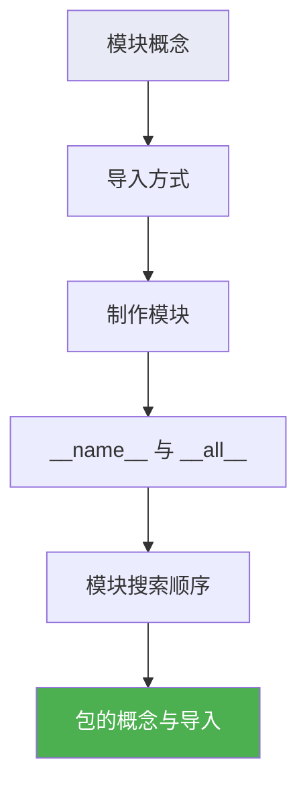
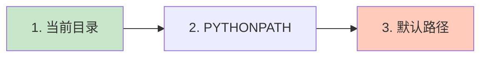
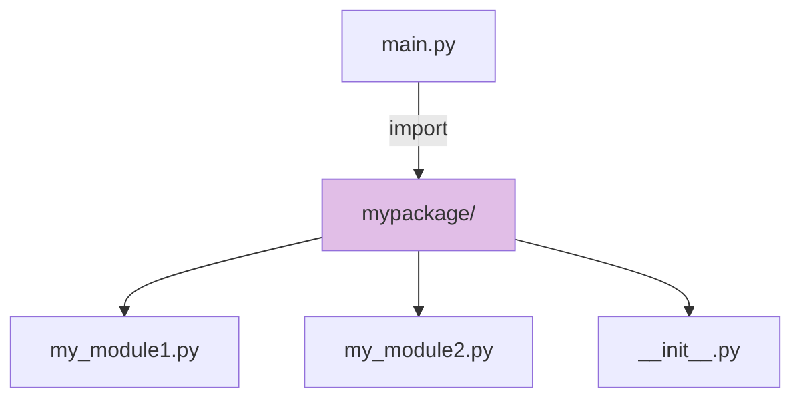

# 2.7 模块与包

<div align="center">

**第二章 · Python 面向对象编程 · 第 7 节**

*预计学习时间：1 小时 · 难度：⭐⭐*

</div>


---

## 📖 本节导读

- ✅ 理解模块的概念和作用
- ✅ 掌握五种导入模块的方式
- ✅ 学会制作自定义模块
- ✅ 了解模块搜索顺序和 `__name__`
- ✅ 掌握包的概念与导入方式



---

## 1. 什么是模块？

> 🟦 **知识卡片**
>
> **模块（module）** 就是一个 Python 文件（`.py` 结尾），里面可以定义函数、类和变量。
>
> Python 标准库提供了大量模块（如 `math`、`time`、`random`），你也可以**自己制作模块**来组织代码。

| 好处 | 说明 |
|------|------|
| 代码复用 | 写一次，多处导入 |
| 命名空间 | 避免变量名冲突 |
| 项目结构 | 按功能拆分文件 |

> 📸 **截图位**：项目目录中多个 `.py` 模块文件的组织结构

---

## 2. 导入模块的五种方式

### 2.1 `import` 模块名

```python
import math

print(math.sqrt(9))
```

**运行效果：**

```
3.0
```

调用时需要写 `模块名.功能名()`。

### 2.2 `from ... import ...`

```python
from math import sqrt

print(sqrt(9))
```

**运行效果：**

```
3.0
```

直接调用功能名，不需要模块名前缀。

### 2.3 `from ... import *`

```python
from math import *

print(sqrt(9))
print(pi)
```

导入模块中**所有**功能（受 `__all__` 限制，见后文）。

> ⚠️ **避坑**：`import *` 可能导致命名冲突，大型项目中**不推荐**使用。

### 2.4 `import ... as ...`（模块别名）

```python
import time as tt

tt.sleep(1)
print('hello')
```

**运行效果：**

```
hello
```

### 2.5 `from ... import ... as ...`（功能别名）

```python
from time import sleep as s

s(1)
print('hello')
```

### 2.6 五种方式对比

| 方式 | 语法 | 调用方式 | 推荐度 |
|------|------|---------|--------|
| import | `import math` | `math.sqrt(9)` | ⭐⭐⭐ |
| from import | `from math import sqrt` | `sqrt(9)` | ⭐⭐⭐ |
| import * | `from math import *` | `sqrt(9)` | ⭐ |
| 模块别名 | `import time as t` | `t.sleep(1)` | ⭐⭐ |
| 功能别名 | `from time import sleep as s` | `s(1)` | ⭐⭐ |

---

## 3. 制作自定义模块

### 3.1 定义模块

新建 `my_module1.py`：

```python
def testA(a, b):
    print(a + b)

def testB():
    print('testB')
```

### 3.2 调用模块

```python
import my_module1

my_module1.testA(1, 1)
```

**运行效果：**

```
2
```

### 3.3 测试代码的陷阱

如果在模块末尾写了测试代码：

```python
def testA(a, b):
    print(a + b)

testA(1, 1)   # 导入时也会执行！
```

**问题**：其他文件 `import my_module1` 时，测试代码**也会自动执行**。

### 3.4 解决方案：`__name__`

```python
def testA(a, b):
    print(a + b)

if __name__ == '__main__':
    testA(1, 1)
```

| `__name__` 的值 | 场景 |
|----------------|------|
| `'__main__'` | 当前文件**直接运行** |
| 模块名（如 `'my_module1'`） | 被其他文件 **import** |

> 🟩 **最佳实践**
>
> 模块中的测试代码一律放在 `if __name__ == '__main__':` 块内。

---

## 4. `__all__` 列表

控制 `from module import *` 能导入哪些功能。

**my_module1.py：**

```python
__all__ = ['testA']

def testA():
    print('testA')

def testB():
    print('testB')
```

**调用文件：**

```python
from my_module1 import *

testA()    # ✅ 正常
testB()    # ❌ 报错：不在 __all__ 列表中
```

> 🟦 **规则**
>
> 只有 `__all__` 列表中的名字，才能被 `import *` 导入。

---

## 5. 模块搜索顺序

Python 导入模块时，按以下顺序搜索：



1. **当前目录**
2. `PYTHONPATH` 环境变量下的目录
3. Python 安装目录下的默认路径

搜索路径存储在 `sys.path` 中：

```python
import sys
print(sys.path)
```

> 🟥 **避坑清单**
>
> 1. **文件名不要与标准库模块重名**（如 `random.py`），否则自己的模块会覆盖标准库
> 2. `from module import func` 时，如果功能名重复，**后导入的覆盖先导入的**

---

## 6. 包（Package）

### 6.1 概念

**包**是将多个有联系的模块组织在同一个文件夹中，并在文件夹内创建 `__init__.py` 文件。

```
mypackage/
├── __init__.py
├── my_module1.py
└── my_module2.py
```

> 🟩 **判断标准**
>
> 文件夹 + `__init__.py` = 包。`__init__.py` 控制包的导入行为。

### 6.2 包内模块代码

**my_module1.py：**

```python
def info_print1():
    print('my_module1')
```

**my_module2.py：**

```python
def info_print2():
    print('my_module2')
```

---

## 7. 导入包的两种方式

### 7.1 方法一：`import 包名.模块名`

```python
import mypackage.my_module1

mypackage.my_module1.info_print1()
```

**运行效果：**

```
my_module1
```

### 7.2 方法二：`from 包名 import *`

需要在 `__init__.py` 中设置 `__all__`：

**`__init__.py`：**

```python
__all__ = ['my_module1', 'my_module2']
```

**调用文件：**

```python
from mypackage import *

my_module1.info_print1()
my_module2.info_print2()
```

**运行效果：**

```
my_module1
my_module2
```



> 📸 **截图位**：PyCharm / VS Code 中创建 Python Package 的界面

---

## 8. 模块 vs 包

| 对比项 | 模块 | 包 |
|--------|------|-----|
| 是什么 | 一个 `.py` 文件 | 一个文件夹 |
| 标志 | 文件名 | `__init__.py` |
| 导入 | `import module` | `import package.module` |
| 适用 | 少量功能 | 多个相关模块 |

---

## 9. 综合练习

请你依次完成：

1. 创建 `tools.py` 模块，包含 `add(a, b)` 和 `sub(a, b)` 函数，用 `import` 方式调用
2. 添加 `if __name__ == '__main__':` 测试块，验证直接运行和导入行为不同
3. 创建 `utils/` 包，内含 `str_tools.py`（字符串工具）和 `file_tools.py`（文件工具）

> 📸 **截图位**：包目录结构和导入运行的终端输出

<details>
<summary>💡 参考答案（第 1 题）</summary>

```python
# tools.py
def add(a, b):
    return a + b

def sub(a, b):
    return a - b

if __name__ == '__main__':
    print(add(1, 2))

# main.py
import tools
print(tools.add(10, 5))
print(tools.sub(10, 5))
```

</details>

---

## 10. 本节小结

| 知识点 | 要点 |
|--------|------|
| 模块 | 一个 `.py` 文件 |
| 导入 | import / from import / as 别名 |
| `__name__` | 区分直接运行 vs 被导入 |
| `__all__` | 控制 `import *` 的范围 |
| 搜索顺序 | 当前目录 → PYTHONPATH → 默认路径 |
| 包 | 文件夹 + `__init__.py` |

> 🟩 模块与包是组织大型项目的基础。下一节是本章**综合实战**——面向对象版学员管理系统！

---

| ← 上一节 | [第二章目录](./README.md) | 下一节 → |
|---------|--------------------------|---------|
| [2.6 异常处理](./06-异常处理.md) | | [2.8 学员管理系统](./08-面向对象学员管理系统.md) |

*源码：[`Python面向对象编程/7.模块和包/`](../../Python面向对象编程/7.模块和包/)*
