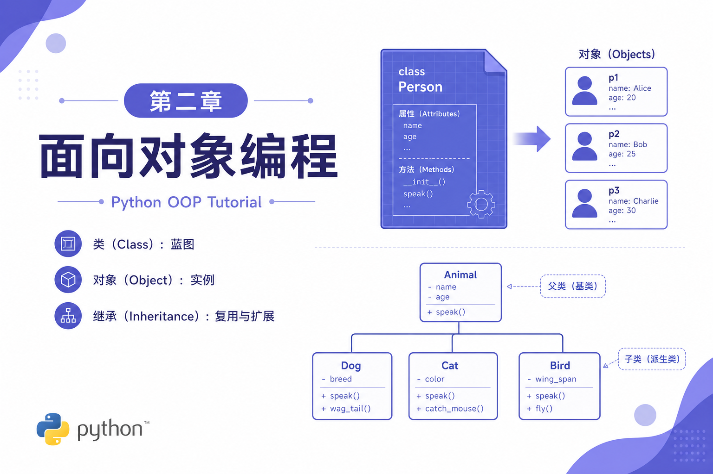
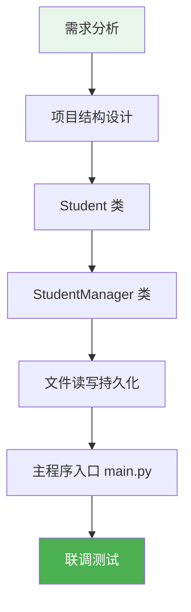
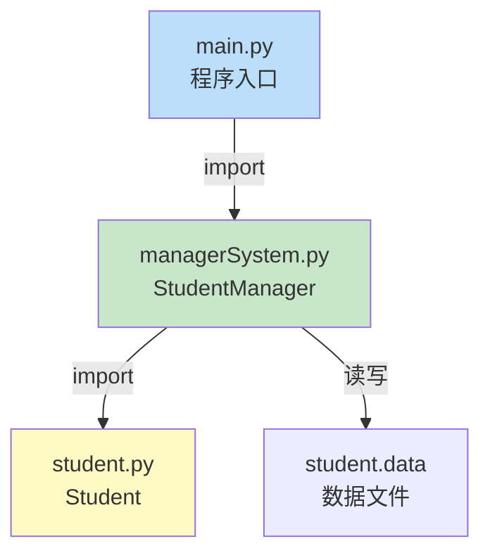
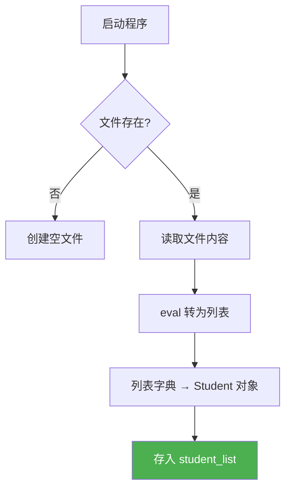

# 2.8 面向对象学员管理系统

<div align="center">

**第二章 · Python 面向对象编程 · 第 8 节**

*预计学习时间：2 小时 · 难度：⭐⭐⭐⭐*

</div>



---

## 📖 本节导读

- ✅ 用面向对象思想完成完整项目
- ✅ 掌握「一个角色一个文件」的项目组织方式
- ✅ 实现增删改查 + 文件持久化
- ✅ 综合运用类、继承、静态方法、异常处理、模块导入



---

## 1. 项目需求

> 🟦 **知识卡片**
>
> 这是第二章的**综合实战**。你在基础语法篇用函数写过学员管理系统，现在用**面向对象**重写——体验 OOP 在项目中的真实应用。

### 1.1 功能清单

| 序号 | 功能 | 说明 |
|:--:|------|------|
| 1 | 添加学员 | 输入姓名、性别、手机号 |
| 2 | 删除学员 | 按姓名删除 |
| 3 | 修改学员 | 按姓名查找并修改信息 |
| 4 | 查询学员 | 按姓名查找并显示 |
| 5 | 显示所有学员 | 表格形式展示 |
| 6 | 保存学员 | 写入文件 |
| 7 | 退出系统 | 结束程序 |

### 1.2 数据存储

- 学员数据保存在 `student.data` 文件中
- 程序启动时**自动加载**文件数据
- 退出前**手动保存**（也可每次操作后保存）

---

## 2. 项目结构设计

### 2.1 角色分析

| 角色 | 职责 | 对应文件 |
|------|------|---------|
| 学员 | 存储姓名、性别、手机号 | `student.py` |
| 管理系统 | 增删改查、文件读写 | `managerSystem.py` |
| 主程序 | 程序入口 | `main.py` |

> 🟩 **开发规范**
>
> 1. **一个角色一个文件**——方便维护
> 2. 项目必须有**主程序入口** `main.py`
> 3. 模块之间通过 `import` 协作

### 2.2 目录结构

```
StudentManagerSystem/
├── main.py              # 程序入口
├── student.py           # 学员类
├── managerSystem.py     # 管理系统类
└── student.data         # 数据文件（运行后自动生成）
```



> 📸 **截图位**：IDE 中的项目目录结构

---

## 3. 学员类 `student.py`

### 3.1 需求

- 属性：姓名、性别、手机号
- 魔法方法：`__str__` 方便查看学员信息

### 3.2 代码

```python
class Student(object):
    def __init__(self, name, gender, tel):
        self.name = name
        self.gender = gender
        self.tel = tel

    def __str__(self):
        return f'{self.name}, {self.gender}, {self.tel}'
```

### 3.3 测试

```python
s = Student('张三', '男', '13800138000')
print(s)
```

**运行效果：**

```
张三, 男, 13800138000
```

---

## 4. 管理系统类 `managerSystem.py`

### 4.1 整体框架

```python
from student import Student

class StudentManager(object):
    def __init__(self):
        self.student_list = []

    def run(self):
        self.load_student()
        while True:
            self.show_menu()
            menu_num = int(input('请输入功能序号：'))
            if menu_num == 1:
                self.add_student()
            elif menu_num == 2:
                self.del_student()
            elif menu_num == 3:
                self.modify_student()
            elif menu_num == 4:
                self.search_student()
            elif menu_num == 5:
                self.show_student()
            elif menu_num == 6:
                self.save_student()
            elif menu_num == 7:
                break
```

### 4.2 显示菜单（静态方法）

菜单内容与对象状态无关，适合用 `@staticmethod`：

```python
    @staticmethod
    def show_menu():
        print('请选择如下功能：')
        print('1：添加学员')
        print('2：删除学员')
        print('3：修改学员信息')
        print('4：查询学员信息')
        print('5：显示所有学员信息')
        print('6：保存学员信息')
        print('7：退出系统')
```

---

## 5. 核心功能实现

### 5.1 添加学员

```python
    def add_student(self):
        name = input('请输入姓名：')
        gender = input('请输入性别：')
        tel = input('请输入手机号：')
        student = Student(name, gender, tel)
        self.student_list.append(student)
        print('添加成功')
```

### 5.2 删除学员

```python
    def del_student(self):
        del_name = input('请输入要删除的学员姓名：')
        for stu in self.student_list:
            if stu.name == del_name:
                self.student_list.remove(stu)
                print('删除成功')
                break
        else:
            print('查无此人')
```

> 🟦 **技巧**：`for...else` 结构中，`else` 在循环**正常结束**（没有 break）时执行——说明没找到目标。

### 5.3 修改学员

```python
    def modify_student(self):
        modify_name = input('请输入要修改的学员姓名：')
        for stu in self.student_list:
            if stu.name == modify_name:
                stu.name = input('请输入新姓名：')
                stu.gender = input('请输入新性别：')
                stu.tel = input('请输入新手机号：')
                print(f'修改成功：{stu}')
                break
        else:
            print('查无此人')
```

### 5.4 查询学员

```python
    def search_student(self):
        search_name = input('请输入要查询的学员姓名：')
        for stu in self.student_list:
            if stu.name == search_name:
                print(f'姓名：{stu.name}，性别：{stu.gender}，手机号：{stu.tel}')
                break
        else:
            print('查无此人')
```

### 5.5 显示所有学员

```python
    def show_student(self):
        if not self.student_list:
            print('暂无学员数据')
            return
        print('姓名\t性别\t手机号')
        for stu in self.student_list:
            print(f'{stu.name}\t{stu.gender}\t{stu.tel}')
```

---

## 6. 文件持久化

### 6.1 保存数据

```python
    def save_student(self):
        f = open('student.data', 'w')
        new_list = [stu.__dict__ for stu in self.student_list]
        f.write(str(new_list))
        f.close()
        print('保存成功')
```

> 🟦 **原理**
>
> 1. `__dict__` 返回对象的属性字典
> 2. 文件只能存字符串，所以 `str(new_list)` 转换后写入
> 3. 格式示例：`[{'name': '张三', 'gender': '男', 'tel': '138...'}]`

### 6.2 加载数据

```python
    def load_student(self):
        try:
            f = open('student.data', 'r')
        except:
            f = open('student.data', 'w')
        else:
            data = f.read()
            if data:
                new_list = eval(data)
                self.student_list = [
                    Student(i['name'], i['gender'], i['tel'])
                    for i in new_list
                ]
        finally:
            f.close()
```

**流程说明：**



> 🟥 **安全提示**
>
> `eval()` 会将字符串当作 Python 代码执行，存在安全风险。学习阶段可以使用，生产环境应改用 `json` 模块。

---

## 7. 主程序 `main.py`

```python
from managerSystem import StudentManager

if __name__ == '__main__':
    student_manager = StudentManager()
    student_manager.run()
```

> 🟩 **入口规范**
>
> `if __name__ == '__main__':` 保证只有直接运行 `main.py` 时才启动系统，被 import 时不会自动运行。

---

## 8. 运行演示

启动程序后的交互流程：

```
请选择如下功能：
1：添加学员
2：删除学员
3：修改学员信息
4：查询学员信息
5：显示所有学员信息
6：保存学员信息
7：退出系统
请输入功能序号：1
请输入姓名：张三
请输入性别：男
请输入手机号：13800138000
添加成功

请输入功能序号：5
姓名    性别    手机号
张三    男      13800138000

请输入功能序号：6
保存成功

请输入功能序号：7
```

> 📸 **截图位**：完整的添加 → 显示 → 保存 → 退出操作流程

---

## 9. 面向对象 vs 函数式对比

| 对比项 | 函数版（基础语法篇） | 面向对象版（本章） |
|--------|-------------------|------------------|
| 数据存储 | 全局列表 | `self.student_list` |
| 功能组织 | 独立函数 | 类的方法 |
| 学员信息 | 字典 | `Student` 对象 |
| 菜单显示 | 普通函数 | `@staticmethod` |
| 代码文件 | 单文件 | 多文件模块化 |
| 可维护性 | 一般 | 更好 |

---

## 10. 拓展：`__dict__` 属性

类对象和实例对象都拥有 `__dict__` 属性，返回属性和方法组成的字典：

```python
class Student(object):
    school = '黑马程序员'

    def __init__(self, name):
        self.name = name

s = Student('张三')
print(Student.__dict__)   # 类属性 + 方法
print(s.__dict__)         # 实例属性
```

**运行效果：**

```
{'__module__': '__main__', 'school': '黑马程序员', ...}
{'name': '张三'}
```

---

## 11. 综合练习

请你依次完成：

1. 运行完整项目，添加 3 名学员并保存，关闭后重新启动验证数据加载
2. 添加「按手机号查询」功能（修改 `search_student` 或新增方法）
3. （进阶）用 `json` 模块替换 `eval()` 实现文件读写

> 📸 **截图位**：重启程序后学员数据仍然存在的验证截图

<details>
<summary>💡 参考答案（第 3 题思路）</summary>

```python
import json

def save_student(self):
    with open('student.data', 'w', encoding='utf-8') as f:
        data = [stu.__dict__ for stu in self.student_list]
        json.dump(data, f, ensure_ascii=False)

def load_student(self):
    try:
        with open('student.data', 'r', encoding='utf-8') as f:
            data = json.load(f)
            self.student_list = [
                Student(i['name'], i['gender'], i['tel'])
                for i in data
            ]
    except FileNotFoundError:
        pass
```

</details>

---

## 12. 本章总结

恭喜你完成第二章的全部内容！


| 章节 | 你学会了 |
|------|---------|
| 2.1 | 类、对象、self、魔法方法 |
| 2.2-2.3 | 需求分析、类设计、多类协作 |
| 2.4 | 单/多继承、重写、super、私有 |
| 2.5 | 多态、类属性、类方法、静态方法 |
| 2.6 | try/except/else/finally、自定义异常 |
| 2.7 | 模块导入、制作模块、包 |
| 2.8 | 完整 OOP 项目实战 |

> 🟩 面向对象是 Python 进阶的基石。下一章将进入 **Linux 命令**，为后续部署 Web 服务打下基础。

---

| ← 上一节 | [第二章目录](./README.md) | 下一章 → |
|---------|--------------------------|---------|
| [2.7 模块与包](./07-模块与包.md) | | [第三章 Linux 命令](../03-Linux命令/README.md) |

*源码：[`Python面向对象编程/8.案例-面向对象版学员管理系统/`](https://github.com/Drgonmancer/Leo_code/tree/main/Python面向对象编程/8.案例-面向对象版学员管理系统)*
