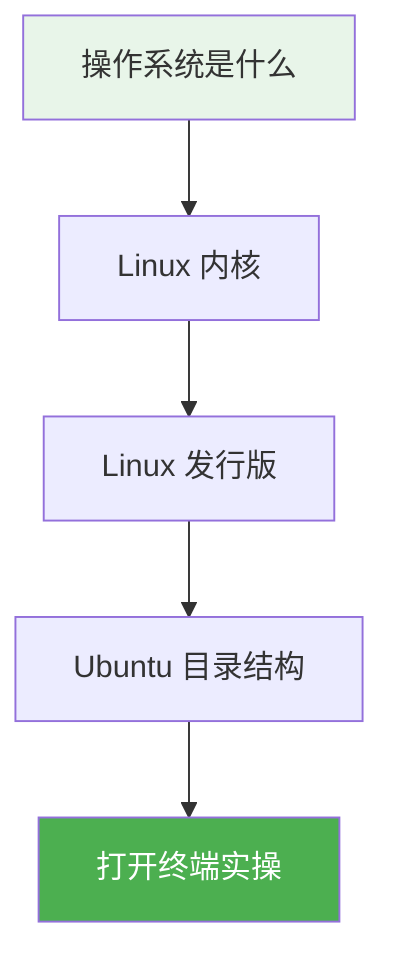
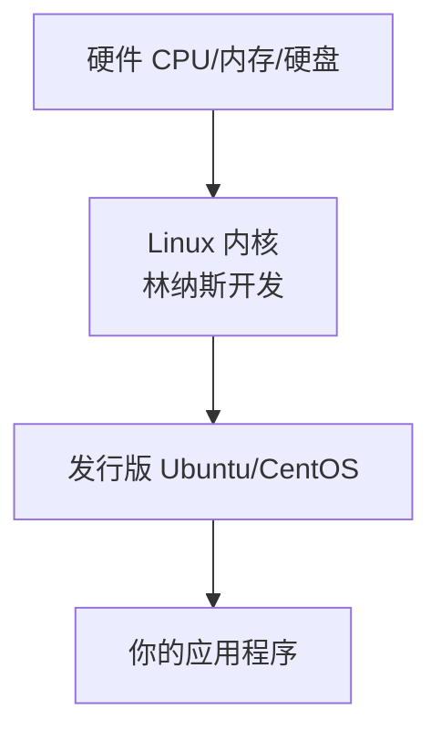

# 3.1 操作系统与 Linux 入门

<div align="center">

**第三章 · Linux 命令 · 第 1 节**

*预计学习时间：40 分钟 · 难度：⭐*

</div>

---

## 📖 本节导读

- ✅ 理解 Linux 与 Windows 的区别
- ✅ 认识 Ubuntu 目录结构
- ✅ 知道什么是内核与发行版



---

## 1. 为什么后端要学 Linux？

> 🟦 **知识卡片**
>
> 你写的 Python Web 程序，最终要部署在 **Linux 服务器** 上。不会 Linux，就无法上线项目、无法排查线上问题。

| 场景 | 需要 Linux |
|------|-----------|
| 部署 Django / Flask 项目 | 在服务器上操作 |
| 查看日志 | `tail -f app.log` |
| 安装 MySQL / Redis / Nginx | 终端命令 |
| 连接云服务器 | SSH 远程登录 |

---

## 2. Linux 与 Windows 的区别

| 对比项 | Windows | Linux（Ubuntu） |
|--------|---------|----------------|
| 图形界面 | 菜单栏常驻 | 菜单栏自动隐藏 |
| 盘符 | C: D: E: | **无盘符**，只有 `/` 根目录 |
| 稳定性 | 一般 | 服务器首选，更稳定 |
| 终端 | PowerShell / CMD | Bash 终端 |

> 📸 **截图位**：Ubuntu 桌面与 Windows 桌面对比

---

## 3. Ubuntu 主要目录

Linux 一切从根目录 `/` 开始：

```
/                    ← 根目录（类似 Windows 的 C:\）
├── bin/             ← 可执行命令
├── etc/             ← 系统配置文件
├── home/            ← 用户家目录
│   └── python/      ← 你的个人目录 ~
├── tmp/             ← 临时文件
└── var/             ← 日志等可变数据
```

> 🟩 **记忆口诀**
>
> `home` 是你的家，`etc` 是配置，`bin` 是命令，`var` 是日志。

---

## 4. 内核与发行版



- **内核**：真正控制硬件的核心程序
- **发行版**：内核 + 常用软件的组合产品（我们日常说的「Linux 系统」）

常见发行版：**Ubuntu**（学习首选）、CentOS、Red Hat

---

## 5. 动手：打开终端

**Ubuntu / Mac：**

```bash
# 快捷键
Ctrl + Alt + T
```

**Windows（WSL）：**

在开始菜单搜索 `Ubuntu` 或 `WSL` 打开。

在终端输入：

```bash
pwd
```

**运行效果：**

```
/home/你的用户名
```

`pwd` = Print Working Directory，显示当前所在目录。

> 📸 **截图位**：终端中执行 `pwd` 的界面

---

## 6. 本节小结

> 🟩 你已了解 Linux 的定位、目录结构和发行版概念。下一节开始大量实操终端命令。

---

| ← 上一章 | [第三章目录](./README.md) | 下一节 → |
|---------|--------------------------|---------|
| [第二章 OOP](../02-Python面向对象编程/README.md) | | [3.2 基础命令](./02-Linux基础命令.md) |

*源码：[`Linux命令/1.操作系统介绍`](../../Linux命令/1.操作系统介绍)*
