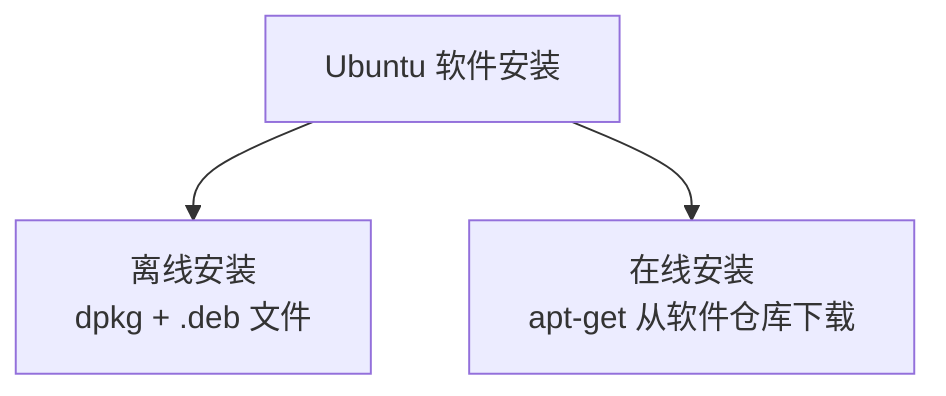

# 3.6 软件安装与卸载

<div align="center">

**第三章 · Linux 命令 · 第 6 节**

*预计学习时间：40 分钟 · 难度：⭐⭐*

</div>


---

## 📖 本节导读

- ✅ 掌握 Ubuntu 两种安装方式
- ✅ 学会在线安装与离线安装
- ✅ 配置国内镜像源加速下载

---

## 1. 安装包格式对比

| 系统 | 安装包后缀 |
|------|-----------|
| Windows | `.exe` |
| macOS | `.dmg` |
| Ubuntu | `.deb` |

Ubuntu 软件安装有两种方式：



---

## 2. 离线安装（deb 格式）

> 🟦 **知识卡片**
>
> **dpkg** 用于安装和卸载本地的 `.deb` 安装包，不需要联网。

### 2.1 安装

```bash
sudo dpkg -i package.deb
```

### 2.2 卸载

```bash
sudo dpkg -r 安装包名
```

**运行效果：**

```
Selecting previously unselected package xxx.
(Reading database ... 100%)
Setting up xxx ...
```

> 📸 **截图位**：dpkg 安装 deb 包的终端输出

---

## 3. 在线安装（apt-get）

> **apt-get** 从互联网软件仓库搜索、安装、升级、卸载软件——日常开发最常用。

### 3.1 安装

```bash
sudo apt-get install 软件包名
```

**示例：**

```bash
sudo apt-get install openssh-server
sudo apt-get install python3-pip
sudo apt-get install nginx
```

### 3.2 卸载

```bash
sudo apt-get remove 软件包名
```

### 3.3 常用组合

```bash
sudo apt-get update          # 更新软件源列表
sudo apt-get upgrade         # 升级已安装软件
sudo apt-get install tree    # 安装 tree 命令
```

**运行效果：**

```
Reading package lists... Done
Building dependency tree... Done
The following NEW packages will be installed:
  tree
```

---

## 4. 更改镜像源

> ⚠️ **避坑**：apt-get 默认从国外服务器下载，国内网速很慢。换成国内镜像源可大幅提速。

> 🟦 **知识卡片**
>
> **镜像源**就是下载软件的服务器。国内镜像与国外服务器信息同步，但下载速度更快。

### 4.1 两种方式

| 方式 | 说明 |
|------|------|
| 可视化 | 系统设置 → 软件和更新 → 选择国内镜像 |
| 手动 | 编辑 `/etc/apt/sources.list` |

### 4.2 手动更换示例

```bash
sudo cp /etc/apt/sources.list /etc/apt/sources.list.bak
sudo vim /etc/apt/sources.list
```

将源地址替换为国内镜像（如阿里云、清华源），然后：

```bash
sudo apt-get update
```

> 📸 **截图位**：更换镜像源后 `apt-get update` 快速完成的界面

---

## 5. 安装 vs 卸载对照

| 操作 | 离线（deb） | 在线（apt-get） |
|------|------------|----------------|
| 安装 | `sudo dpkg -i xxx.deb` | `sudo apt-get install xxx` |
| 卸载 | `sudo dpkg -r xxx` | `sudo apt-get remove xxx` |
| 是否需要联网 | 否 | 是 |
| 适用场景 | 拿到 deb 安装包时 | 日常开发安装工具 |

---

## 6. 后端开发常用软件

```bash
# Python 环境
sudo apt-get install python3 python3-pip python3-venv

# 数据库
sudo apt-get install mysql-server redis-server

# Web 服务
sudo apt-get install nginx

# 远程登录
sudo apt-get install openssh-server
```

---

## 7. 综合练习

请你依次完成：

1. 用 `apt-get` 安装 `tree` 命令
2. 运行 `tree` 查看家目录结构
3. 用 `apt-get remove` 卸载 `tree`
4. 查看系统软件源配置位置

> 📸 **截图位**：安装 tree → 运行 tree → 卸载成功的完整流程

---

## 8. 本节小结

| 方式 | 安装命令 | 卸载命令 |
|------|---------|---------|
| 离线 deb | `sudo dpkg -i` | `sudo dpkg -r` |
| 在线 apt | `sudo apt-get install` | `sudo apt-get remove` |

换国内镜像源 + `apt-get update`，是 Ubuntu 开发环境的第一步。

---

| ← 上一节 | [第三章目录](./README.md) | 下一章 → |
|---------|--------------------------|---------|
| [3.5 Vim 编辑器](./05-Vim编辑器.md) | | [第四章 Web 服务器](04-Web服务器/README.md) |

*源码：[`Linux命令/6.软件安装`](https://github.com/Drgonmancer/Leo_code/tree/main/Linux命令/6.软件安装)、[`Linux命令/7.软件卸载`](https://github.com/Drgonmancer/Leo_code/tree/main/Linux命令/7.软件卸载)*
