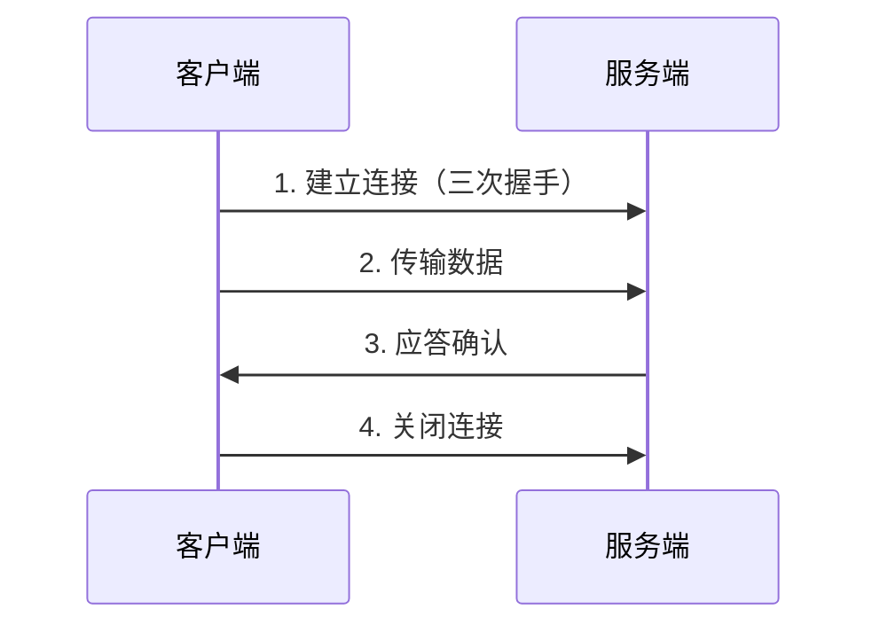
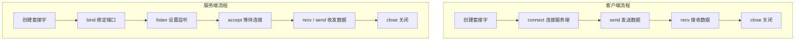
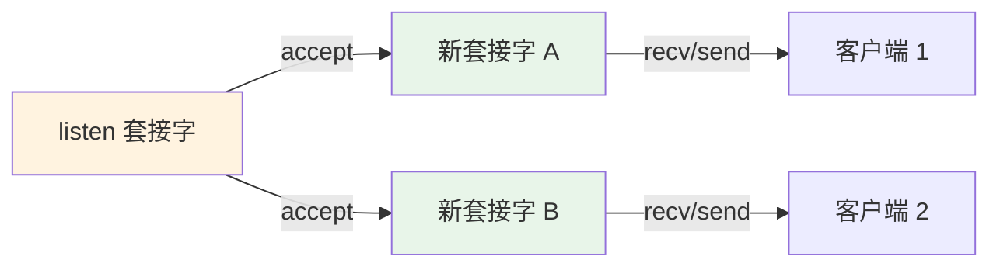

# 4.1 网络编程基础

<div align="center">

**第四章 · Web 服务器 · 第 1 节**

*预计学习时间：1.5 小时 · 难度：⭐⭐*

</div>


---

## 📖 本节导读

Web 开发离不开网络通信。本节从 **IP 地址 → 端口 → TCP → Socket** 层层递进，搞懂「数据是怎么从一台电脑跑到另一台电脑的」。


| 你将学会 | 核心关键词 |
|----------|-----------|
| 定位网络中的设备 | IP 地址 |
| 区分同一设备上的不同程序 | 端口号 |
| 可靠传输数据 | TCP |
| Python 网络编程工具 | `socket` 模块 |

> 📂 本章对应源码：[网络编程基础/](https://github.com/Drgonmancer/Leo_code/tree/main/web服务器/网络编程基础)

---

## 1. IP 地址

### 1.1 概念

**IP 地址**是标识网络中设备的一个地址，好比现实生活中的家庭地址。通过 IP 地址，可以在网络中找到唯一的一台设备。

### 1.2 两种表现形式

| 类型 | 格式 | 说明 |
|------|------|------|
| IPv4 | 点分十进制，如 `192.168.1.100` | 目前广泛使用 |
| IPv6 | 冒号十六进制，如 `2001:0db8:85a3::8a2e:0370:7334` | 未来趋势，地址空间更大 |

> 💡 **域名**是 IP 地址的别名。访问 `www.baidu.com` 时，DNS 会先把它解析成对应的 IP 地址。

### 1.3 查看 IP 地址

| 操作系统 | 命令 |
|----------|------|
| Linux / macOS | `ifconfig` |
| Windows | `ipconfig` |

```bash
# Windows 示例
ipconfig

# Linux 示例
ifconfig
```

> 📸 **截图位**：终端执行 `ipconfig` 后显示 IPv4 地址的界面

### 1.4 检查网络是否正常 —— ping

| 命令 | 作用 |
|------|------|
| `ping www.baidu.com` | 检查能否访问公网 |
| `ping 192.168.1.1` | 检查是否在同一局域网 |
| `ping 127.0.0.1` | 检查本机网卡是否正常（本地回环） |

```bash
ping www.baidu.com
```

**运行效果：**

```
正在 Ping www.a.shifen.com [36.152.44.3] 具有 32 字节的数据:
来自 36.152.44.3 的回复: 字节=32 时间=15ms TTL=52
来自 36.152.44.3 的回复: 字节=32 时间=14ms TTL=52
```

> 🟦 **技巧**：`127.0.0.1` 永远指向本机，排查网络问题时先 ping 它，能通说明网卡驱动正常。

---

## 2. 端口与端口号

### 2.1 概念

| 概念 | 说明 |
|------|------|
| **端口** | 传输数据的通道，是数据传输的必经之路 |
| **端口号** | 一个数字，对端口进行编号（共 **65536** 个，0～65535） |

**通信流程：**


> 通过 IP 地址找到设备，通过端口号找到设备上运行的具体程序。

### 2.2 端口号分类

| 类型 | 范围 | 说明 | 常见示例 |
|------|------|------|----------|
| **知名端口号** | 0～1023 | 固定分配给知名服务 | 21-FTP、25-SMTP、**80-HTTP**、**443-HTTPS** |
| **动态端口号** | 1024～65535 | 程序员开发应用程序使用 | 自定义 Web 服务器常用 8000、9090 |

> ⚠️ **避坑**：程序退出后，操作系统不会立刻释放占用的端口号，可能需等待 1～2 分钟。开发时若提示「端口被占用」，可换端口号或设置端口复用（后面会讲）。

---

## 3. TCP 协议

### 3.1 网络通信三要素

数据发送前需要三样东西配合：

1. **IP 地址** —— 找到网络中的设备
2. **端口号** —— 找到设备上对应进程的端口
3. **传输协议** —— 保证数据可靠传输

### 3.2 TCP 是什么

**TCP**（Transmission Control Protocol，传输控制协议）是一种**面向连接的、可靠的、基于字节流**的传输层通信协议。



**TCP 通信步骤：**

1. 创建连接
2. 传输数据
3. 关闭连接

> 💡 TCP 就像**打电话**：通话前必须先拨号建立连接，说完再挂断，不能「扔完就走」。

### 3.3 TCP 的特点

| 特点 | 说明 |
|------|------|
| **面向连接** | 通信双方必须先建立连接，结束必须断开，释放系统资源 |
| **可靠传输** | 发送应答机制、超时重传、错误校验、流量控制和阻塞管理 |

| 对比 | TCP | UDP |
|------|-----|-----|
| 连接 | 面向连接 | 无连接 |
| 可靠性 | 可靠 | 不保证 |
| 速度 | 相对慢 | 相对快 |
| 典型场景 | HTTP、文件传输 | 视频直播、DNS |

---

## 4. Socket

### 4.1 概念

**Socket**（套接字）是进程之间进行网络通信的工具，好比**插座**——不同设备通过插座才能通电通信。

| 角色 | 说明 |
|------|------|
| 作用 | 负责进程之间的网络数据传输，是数据的「搬运工」 |
| 使用场景 | 几乎所有网络相关应用程序都基于 Socket |

> 进程之间的网络数据传输，均通过 Socket 完成。

---

## 5. TCP 网络应用程序开发流程

TCP 程序分为 **客户端** 和 **服务端** 两部分：

| 角色 | 说明 |
|------|------|
| **客户端** | 运行在用户设备上，**主动**发起连接请求 |
| **服务端** | 运行在服务器上，**被动**等待连接，为客户端提供数据 |



### 5.1 socket 类常用方法

```python
import socket

# 创建套接字
# AF_INET: IPv4    SOCK_STREAM: TCP
tcp_socket = socket.socket(socket.AF_INET, socket.SOCK_STREAM)
```

| 方法 | 适用端 | 作用 |
|------|--------|------|
| `bind(('', port))` | 服务端 | 绑定端口号 |
| `listen(n)` | 服务端 | 设置监听，n 为最大等待连接数 |
| `accept()` | 服务端 | 等待并接受客户端连接，返回新套接字 |
| `connect((host, port))` | 客户端 | 连接服务端 |
| `send(data)` | 两端 | 发送二进制数据 |
| `recv(size)` | 两端 | 接收数据，size 为最大字节数 |
| `close()` | 两端 | 关闭套接字 |

> ⚠️ **避坑**：`send` / `recv` 操作的是**二进制数据**，字符串需要先 `encode()`，接收后需要 `decode()`。

---

## 6. TCP 服务端程序开发

### 6.1 完整代码

```python
import socket

if __name__ == '__main__':
    # 1. 创建服务端套接字
    tcp_server_socket = socket.socket(socket.AF_INET, socket.SOCK_STREAM)

    # 设置端口复用：程序退出后端口立即释放
    tcp_server_socket.setsockopt(socket.SOL_SOCKET, socket.SO_REUSEADDR, True)

    # 2. 绑定端口号（空字符串表示本机任意 IP）
    tcp_server_socket.bind(('', 9090))

    # 3. 设置监听
    tcp_server_socket.listen(128)

    # 4. 等待接受客户端连接（返回新套接字，专门用于和该客户端通信）
    new_client, ip_port = tcp_server_socket.accept()
    print('客户端的 ip 和端口号为：', ip_port)

    # 5. 接收数据
    recv_data = new_client.recv(1024)
    recv_content = recv_data.decode('utf-8')
    print('接收客户端的数据为：', recv_content)

    # 6. 发送数据
    send_content = '问题正在处理中...'
    send_data = send_content.encode('utf-8')
    new_client.send(send_data)

    # 7. 关闭套接字
    new_client.close()
    tcp_server_socket.close()
```

> 📸 **截图位**：先运行服务端，再用网络调试助手连接 9090 端口，终端打印客户端 IP 和消息

**运行效果（服务端）：**

```
客户端的 ip 和端口号为： ('192.168.1.5', 52341)
接收客户端的数据为： 你好，我是客户端小白
```

### 6.2 端口复用

程序退出后，端口号默认不会立即释放。推荐设置端口复用：

```python
tcp_server_socket.setsockopt(socket.SOL_SOCKET, socket.SO_REUSEADDR, True)
```

| 参数 | 含义 |
|------|------|
| `SOL_SOCKET` | 当前套接字 |
| `SO_REUSEADDR` | 复用端口选项 |
| `True` | 开启复用 |

---

## 7. TCP 客户端程序开发

```python
import socket

if __name__ == '__main__':
    # 1. 创建客户端套接字
    tcp_client_socket = socket.socket(socket.AF_INET, socket.SOCK_STREAM)

    # 2. 连接服务端
    tcp_client_socket.connect(('127.0.0.1', 9090))

    # 3. 发送数据
    send_content = '你好，我是客户端小白'
    send_data = send_content.encode('utf-8')
    tcp_client_socket.send(send_data)

    # 4. 接收数据
    recv_data = tcp_client_socket.recv(1024)
    recv_content = recv_data.decode('utf-8')
    print('接收服务端的数据为：', recv_content)

    # 5. 关闭套接字
    tcp_client_socket.close()
```

**运行效果（客户端）：**

```
接收服务端的数据为： 问题正在处理中...
```

> 🟦 **技巧**：Windows 网络调试助手常用 `gbk` 编码，Linux 常用 `utf-8`，编码不一致会出现乱码。

---

## 8. TCP 网络应用程序的注意点

| # | 注意点 |
|---|--------|
| 1 | TCP 客户端和服务端通信**必须先建立连接** |
| 2 | TCP **客户端一般不需要** bind 端口号（主动发起连接） |
| 3 | TCP **服务端必须** bind 端口号，否则客户端找不到它 |
| 4 | `listen` 后的套接字是**被动套接字**，只负责接受新连接，不能收发消息 |
| 5 | 连接成功后，服务端会产生**新的套接字**，与该客户端的收发都用新套接字 |
| 6 | 关闭 `accept` 返回的套接字 = 和该客户端通信完毕 |
| 7 | 关闭 `listen` 后的套接字 = 不再接受新连接，但已连接的客户端仍可通信 |
| 8 | 客户端 `close` 后，服务端 `recv` 返回**长度为 0** 的数据，可据此判断客户端下线 |



---

## 9. 综合练习

请你依次完成：

1. 编写 TCP 服务端，绑定端口 `9090`，收到消息后回复「已收到」
2. 编写 TCP 客户端，连接服务端并发送你的名字
3. 用 `ping 127.0.0.1` 确认本机网络正常
4. 思考：如果两个客户端同时连接，服务端需要怎样改造？（提示：循环 + `accept`）

> 📸 **截图位**：客户端和服务端同时运行，双方终端都有输出的界面

---

## 10. 本节小结

| 类别 | 核心知识 |
|------|---------|
| 寻址 | IP 地址定位设备，端口号定位程序 |
| 协议 | TCP 面向连接、可靠传输 |
| 工具 | Socket 是网络编程的核心 API |
| 开发 | 服务端 bind → listen → accept；客户端 connect → send/recv |
| 避坑 | 编码统一、端口复用、区分 listen 套接字和 accept 套接字 |

---

| ← 上一节 | [第四章目录](./README.md) | 下一节 → |
|---------|--------------------------|---------|
| — | | [4.2 HTTP 协议](./02-HTTP协议.md) |

*源码：[`web服务器/网络编程基础/`](https://github.com/Drgonmancer/Leo_code/tree/main/web服务器/网络编程基础)*
