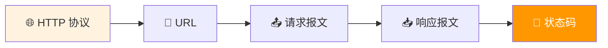
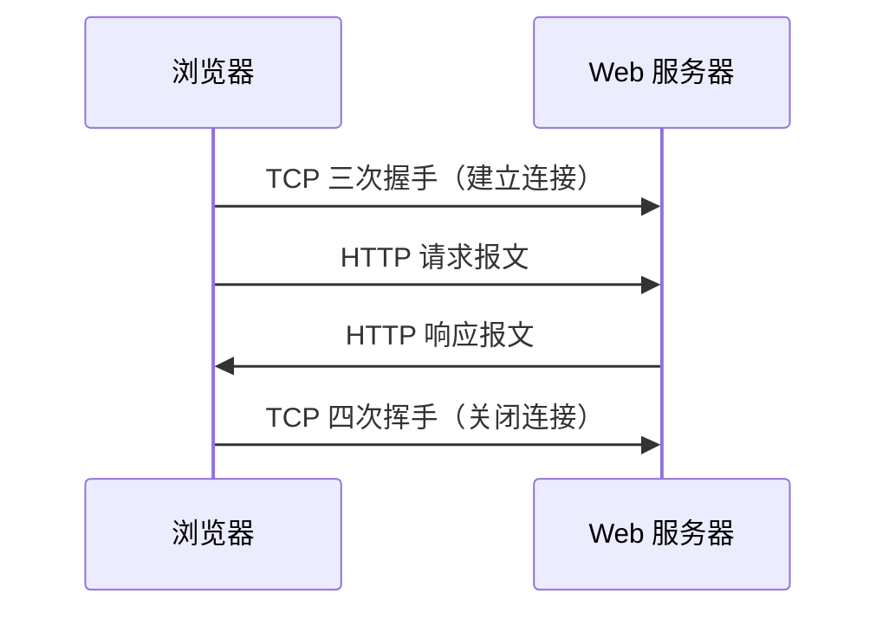
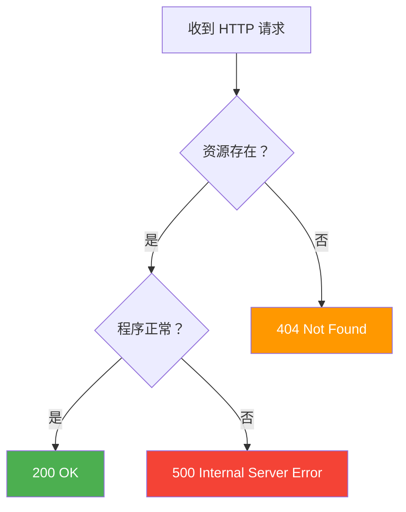

# 4.2 HTTP 协议

<div align="center">

**第四章 · Web 服务器 · 第 2 节**

*预计学习时间：1.5 小时 · 难度：⭐⭐*

</div>


---

## 📖 本节导读

浏览器和 Web 服务器之间说什么「语言」？答案是 **HTTP**。本节搞懂 URL 结构、GET/POST 请求报文、响应报文和常见状态码——这是手写 Web 服务器的理论基础。



| 你将学会 | 核心关键词 |
|----------|-----------|
| HTTP 的设计目的与传输基础 | 超文本传输、基于 TCP |
| 解析网址各部分含义 | URL、域名、查询参数 |
| 读懂浏览器发出的请求 | 请求行、请求头、请求体 |
| 构造服务器返回的响应 | 响应行、响应头、响应体 |

> 📂 本章对应源码：[http协议介绍/](../../web服务器/http协议介绍/)

---

## 1. HTTP 协议介绍

### 1.1 什么是 HTTP

**HTTP**（HyperText Transfer Protocol，超文本传输协议）最初为传输**网页数据**而设计，现在可以传输任意类型的数据（图片、音频、JSON 等都属于「超文本」范畴）。

| 要点 | 说明 |
|------|------|
| 作用 | 规定浏览器和 Web 服务器之间通信数据的格式 |
| 传输基础 | 基于 **TCP** 协议，发送数据前需先建立连接 |
| 模式 | 请求-响应模式：浏览器发请求，服务器回响应 |



> 💡 可以把它理解成：TCP 负责「修路」，HTTP 负责「路上跑什么格式的货车」。

---

## 2. URL 介绍

### 2.1 概念

**URL**（Uniform Resource Locator，统一资源定位符）就是**网络资源的地址**，通俗说就是你在浏览器地址栏输入的那一串。

### 2.2 URL 的组成

以 `https://news.163.com/18/1122/10/E178J2O4000189FH.html?page=1&count=10` 为例：

```
https://news.163.com/18/1122/10/E178J2O4000189FH.html?page=1&count=10
└─┬──┘ └─────┬─────┘ └──────────────────┬──────────────────┘ └─────┬─────┘
 协议       域名                    资源路径                    查询参数
```

| 部分 | 示例 | 说明 |
|------|------|------|
| 协议 | `https://` | `http://` 默认端口 **80**；`https://` 默认端口 **443**（加密版） |
| 域名 | `news.163.com` | IP 地址的别名，方便记忆 |
| 资源路径 | `/18/1122/10/xxx.html` | 服务器上资源的位置 |
| 查询参数 | `?page=1&count=10` | `?` 后第一个参数，多个参数用 `&` 连接 |

> 🟦 **技巧**：浏览器地址栏看不到端口号时，HTTP 默认用 80，HTTPS 默认用 443。

> 📸 **截图位**：浏览器地址栏，标注协议、域名、路径各部分

---

## 3. HTTP 请求报文

HTTP 最常见的两种请求方式是 **GET** 和 **POST**：

| 方法 | 作用 | 典型场景 |
|------|------|----------|
| **GET** | 从 Web 服务器**获取**数据 | 浏览新闻列表、打开网页 |
| **POST** | 向 Web 服务器**提交**数据 | 登录、注册、提交表单 |

### 3.1 GET 请求报文结构

```
GET / HTTP/1.1
Accept: text/html,application/xhtml+xml,...
Accept-Encoding: gzip, deflate, br
Accept-Language: zh-CN,zh;q=0.9
Connection: keep-alive
Host: yun.itheima.com
User-Agent: Mozilla/5.0 (Windows NT 10.0; Win64; x64) ...
Cookie: session_id=abc123

（空行）
```

| 部分 | 说明 |
|------|------|
| **请求行** | `请求方法 资源路径 HTTP版本`，如 `GET / HTTP/1.1` |
| **请求头** | 键值对，描述客户端信息和请求偏好 |
| **空行** | `\r\n`，分隔请求头和请求体 |
| **请求体** | GET 请求**一般没有**请求体 |

**常见请求头：**

| 请求头 | 作用 |
|--------|------|
| `Host` | 目标服务器的主机名（和端口） |
| `User-Agent` | 客户端程序名称（爬虫常伪造此字段） |
| `Accept` | 客户端能接受的数据类型 |
| `Cookie` | 客户端身份标识 |
| `Connection: keep-alive` | 保持长连接，减少重复握手 |

### 3.2 POST 请求报文结构

POST 比 GET 多了**请求体**，表单数据通过请求体发送：

```
POST /login HTTP/1.1
Host: example.com
Content-Type: application/x-www-form-urlencoded
Content-Length: 27

username=admin&password=123456
```

| 部分 | GET | POST |
|------|-----|------|
| 请求行 | ✅ | ✅ |
| 请求头 | ✅ | ✅ |
| 空行 | ✅ | ✅ |
| 请求体 | ❌ 通常无 | ✅ 通常有 |

### 3.3 请求报文格式小结

```
请求行\r\n
请求头\r\n
空行\r\n
请求体\r\n        ← GET 一般没有；POST 通常有
```

> ⚠️ **避坑**：HTTP 协议规定，每两项信息之间用 `\r\n` 分隔。手写 Web 服务器时漏掉 `\r\n` 会导致浏览器解析失败。

> 📸 **截图位**：Chrome 开发者工具 → Network → 选中请求 → Headers 面板

---

## 4. HTTP 响应报文

**响应报文**是 Web 服务器发送给浏览器的数据。

### 4.1 响应报文示例

```
HTTP/1.1 200 OK
Date: Wed, 10 Dec 2025 02:57:53 GMT
Content-Type: text/html; charset=utf-8
Content-Length: 1234
Connection: keep-alive
Server: nginx

<!DOCTYPE html>
<html>
<head><title>首页</title></head>
<body>Hello World</body>
</html>
```

| 部分 | 说明 |
|------|------|
| **响应行** | `HTTP版本 状态码 状态描述`，如 `HTTP/1.1 200 OK` |
| **响应头** | 描述响应的元信息 |
| **空行** | `\r\n` |
| **响应体** | 真正返回给浏览器的数据（HTML、JSON、图片二进制等） |

### 4.2 常见响应头

| 响应头 | 作用 |
|--------|------|
| `Content-Type` | 响应体的数据类型和编码 |
| `Content-Length` | 响应体字节长度（与 `Transfer-Encoding: chunked` 二选一） |
| `Date` | 服务器时间 |
| `Server` | 服务器软件名称 |
| `Connection: keep-alive` | 保持长连接 |

> 💡 请求头和响应头都可以**自定义**，按客户端和服务端的约定来即可，如 `X-Request-ID: abc123`。

### 4.3 响应报文格式小结

```
响应行\r\n
响应头\r\n
空行\r\n
响应体\r\n
```

---

## 5. HTTP 状态码

**状态码**是 3 位数字，表示 Web 服务器对请求的处理结果。

| 状态码 | 含义 | 说明 |
|--------|------|------|
| **200** | 请求成功 | 最常见，页面正常返回 |
| **307** | 临时重定向 | 如 HTTP 跳转到 HTTPS |
| **400** | 错误请求 | 请求地址或参数有误 |
| **404** | 资源不存在 | 服务器找不到请求的文件 |
| **500** | 服务器内部错误 | 服务端代码出 bug |



**运行效果（404 页面）：**

```
HTTP/1.1 404 Not Found
Server: pws/1.0

<h1>404 - 页面不存在</h1>
```

> 📸 **截图位**：浏览器访问不存在的路径，显示 404 页面

---

## 6. 开发者工具查看 HTTP 通信

Chrome / Edge 开发者工具（F12）→ **Network（网络）** 面板可以实时查看 HTTP 请求和响应：

| 步骤 | 操作 |
|------|------|
| 1 | 按 F12 打开开发者工具 |
| 2 | 切换到 Network 面板 |
| 3 | 刷新页面 |
| 4 | 点击任意请求，查看 Headers、Preview、Response |

> 🟦 **技巧**：写 Web 服务器时，先把浏览器发出的原始请求 `print` 出来，对照报文格式逐项解析——这是最有效的调试方法。

---

## 7. GET vs POST 对比

| 对比项 | GET | POST |
|--------|-----|------|
| 数据位置 | URL 查询参数 | 请求体 |
| 数据大小 | 有限（URL 长度限制） | 相对较大 |
| 安全性 | 参数暴露在地址栏 | 相对更安全 |
| 缓存 | 可被缓存 | 一般不缓存 |
| 典型用途 | 查询、浏览 | 提交、登录 |

---

## 8. 综合练习

请你依次完成：

1. 用浏览器访问 `http://127.0.0.1:8000`，在 Network 面板找到 GET 请求，截图请求行和 Host 头
2. 说出 GET 请求报文由哪几部分组成
3. 构造一条最小的 HTTP 响应报文字符串（含 200 状态码和 `Hello` 响应体）
4. 解释 404 和 500 分别代表什么问题

> 📸 **截图位**：开发者工具 Network 面板中某条请求的 Request Headers 和 Response Headers

---

## 9. 本节小结

| 类别 | 核心知识 |
|------|---------|
| 协议 | HTTP 基于 TCP，规定浏览器与服务器通信格式 |
| URL | 协议 + 域名 + 路径 + 查询参数 |
| 请求 | 请求行 + 请求头 + 空行 + 请求体（GET 通常无请求体） |
| 响应 | 响应行 + 响应头 + 空行 + 响应体 |
| 状态码 | 200 成功、404 未找到、500 服务器错误 |

---

| ← 上一节 | [第四章目录](./README.md) | 下一节 → |
|---------|--------------------------|---------|
| [4.1 网络编程基础](./01-网络编程基础.md) | | [4.3 静态 Web 服务器](./03-静态Web服务器.md) |

*源码：[`web服务器/http协议介绍/`](../../web服务器/http协议介绍/)*
