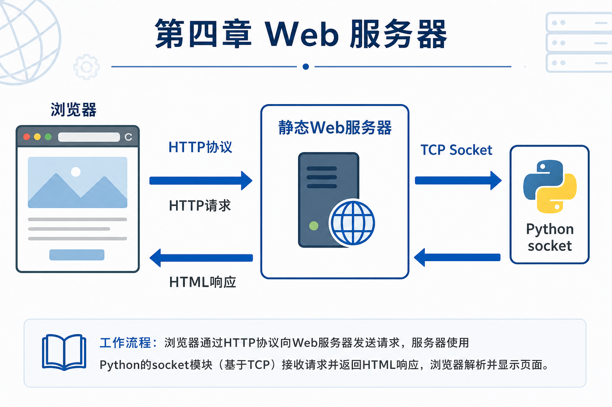
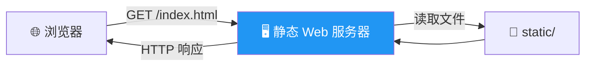
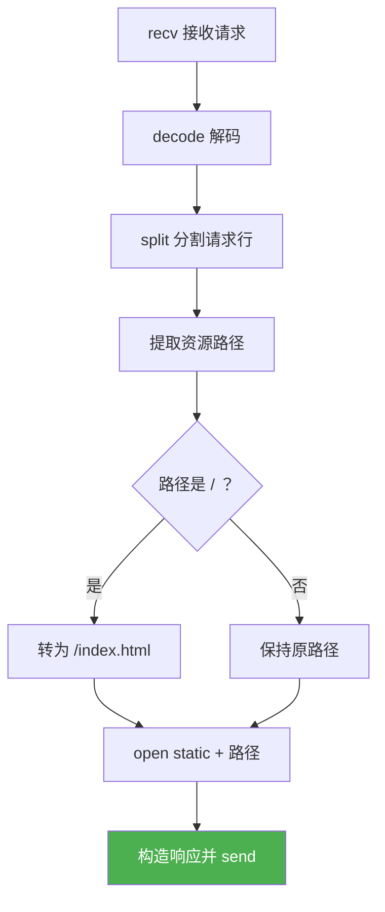

# 4.3 静态 Web 服务器

<div align="center">

**第四章 · Web 服务器 · 第 3 节**

*预计学习时间：2 小时 · 难度：⭐⭐⭐*

</div>



---

## 📖 本节导读

前面学了 Socket 和 HTTP，本节把它们**串起来**：先用 Python 自带命令快速搭建静态服务器，再**从零手写**一个能返回指定页面、处理 404 的静态 Web 服务器。


| 你将学会 | 核心关键词 |
|----------|-----------|
| 快速验证静态资源 | `python -m http.server` |
| 解析 HTTP GET 请求 | `recv` + `split` |
| 构造 HTTP 响应报文 | 响应行 + 响应头 + 响应体 |
| 按路径返回不同文件 | `static` 目录 + 404 |

> 📂 本章对应源码：[web服务器/](https://github.com/Drgonmancer/Leo_code/tree/main/web服务器/web服务器)

---

## 1. 静态 Web 服务器是什么

**静态 Web 服务器**是可以为浏览器提供**静态文档**（HTML、CSS、JS、图片等）的程序。文件内容固定，服务器只负责「找到文件 → 按 HTTP 格式发回去」。



| 类型 | 说明 | 示例 |
|------|------|------|
| 静态服务器 | 返回固定文件 | 本节课内容 |
| 动态服务器 | 根据请求动态生成内容 | Django、Flask |

---

## 2. Python 自带的静态 Web 服务器

### 2.1 一行命令搭建

在项目目录下执行：

```bash
python -m http.server 8080
```

| 参数 | 说明 |
|------|------|
| `-m http.server` | 运行标准库中的 http.server 模块 |
| `8080` | 端口号（省略则默认 **8000**） |

> 💡 `-m` 表示运行包里的模块。当前目录下的文件都会变成可通过浏览器访问的静态资源。

### 2.2 访问与验证

浏览器打开：

```
http://127.0.0.1:8080
```

**运行效果：**

```
# 终端输出
Serving HTTP on 0.0.0.0 port 8080 (http://0.0.0.0:8080/) ...
127.0.0.1 - - [07/Jun/2026 10:00:00] "GET / HTTP/1.1" 200 -
127.0.0.1 - - [07/Jun/2026 10:00:01] "GET /index.html HTTP/1.1" 200 -
```

> 📸 **截图位**：浏览器显示目录列表或 index 页面，终端有 GET 请求日志

### 2.3 查看通信过程

按 F12 → Network → 刷新页面，可看到浏览器发出的 GET 请求和服务器的 200 响应——和上一节学的 HTTP 报文完全对应。

---

## 3. 项目目录准备

手写服务器前，先准备静态资源目录：

```
web_project/
├── static/
│   ├── index.html
│   ├── css/
│   │   └── style.css
│   └── images/
│       └── logo.png
└── server.py
```

**index.html 示例：**

```html
<!DOCTYPE html>
<html>
<head>
    <meta charset="utf-8">
    <title>我的首页</title>
</head>
<body>
    <h1>Hello, Static Web Server!</h1>
</body>
</html>
```

---

## 4. 静态 Web 服务器 —— 返回固定页面

最简版本：不管浏览器请求什么，都返回同一个 HTML 文件。

```python
import socket

def main():
    tcp_server_socket = socket.socket(socket.AF_INET, socket.SOCK_STREAM)
    tcp_server_socket.setsockopt(socket.SOL_SOCKET, socket.SO_REUSEADDR, True)
    tcp_server_socket.bind(('', 8000))
    tcp_server_socket.listen(128)

    while True:
        new_socket, ip_port = tcp_server_socket.accept()
        recv_data = new_socket.recv(4096)

        if len(recv_data) == 0:
            new_socket.close()
            continue

        # 读取固定页面
        with open('static/index.html', 'rb') as f:
            file_data = f.read()

        # 构造 HTTP 响应报文
        response_line = 'HTTP/1.1 200 OK\r\n'
        response_header = 'Server: pws/1.0\r\nContent-Type: text/html; charset=utf-8\r\n'
        response = (response_line + response_header + '\r\n').encode('utf-8') + file_data

        new_socket.send(response)
        new_socket.close()

if __name__ == '__main__':
    main()
```

**运行效果：**

```
# 浏览器访问 http://127.0.0.1:8000
# 页面显示：Hello, Static Web Server!
```

> 📸 **截图位**：浏览器显示 index.html 内容

---

## 5. 静态 Web 服务器 —— 返回指定页面

真实场景下，浏览器请求 `/`、`/css/style.css`、`/images/logo.png` 等不同路径，服务器需要**解析请求路径**，返回对应文件。

### 5.1 核心思路



### 5.2 完整代码

```python
import socket

def main():
    tcp_server_socket = socket.socket(socket.AF_INET, socket.SOCK_STREAM)
    tcp_server_socket.setsockopt(socket.SOL_SOCKET, socket.SO_REUSEADDR, True)
    tcp_server_socket.bind(('', 8000))
    tcp_server_socket.listen(128)

    while True:
        new_socket, ip_port = tcp_server_socket.accept()
        recv_data = new_socket.recv(4096)

        if len(recv_data) == 0:
            new_socket.close()
            continue

        recv_content = recv_data.decode('utf-8')
        print(recv_content)

        # 按空格分割，取请求行中的资源路径
        request_list = recv_content.split(' ', 2)
        request_path = request_list[1]
        print('请求路径：', request_path)

        # 根目录默认返回 index.html
        if request_path == '/':
            request_path = '/index.html'

        try:
            # rb 模式：兼容图片等二进制文件
            with open('static' + request_path, 'rb') as f:
                file_data = f.read()

            response_line = 'HTTP/1.1 200 OK\r\n'
            response_header = 'Server: pws/1.0\r\n'
            response_body = file_data
            response = (response_line + response_header + '\r\n').encode('utf-8') + response_body

        except FileNotFoundError:
            # 文件不存在，返回 404
            response_line = 'HTTP/1.1 404 Not Found\r\n'
            response_header = 'Server: pws/1.0\r\nContent-Type: text/html; charset=utf-8\r\n'
            response_body = '<h1>404 - 页面不存在</h1>'.encode('utf-8')
            response = (response_line + response_header + '\r\n').encode('utf-8') + response_body

        new_socket.send(response)
        new_socket.close()

if __name__ == '__main__':
    main()
```

**运行效果（终端）：**

```
GET / HTTP/1.1
Host: 127.0.0.1:8000
...

请求路径： /
```

**运行效果（访问不存在路径）：**

```
# 浏览器访问 http://127.0.0.1:8000/notexist.html
# 页面显示：404 - 页面不存在
```

> ⚠️ **避坑**：
> - 打开文件用 **`rb` 二进制模式**，否则图片等资源会损坏
> - 响应头和响应体之间必须有 **`\r\n` 空行**
> - HTML 用 `encode('utf-8')` 拼在报文头后面；二进制文件直接拼接

---

## 6. 获取请求路径的细节

浏览器发来的原始数据类似：

```
GET /css/style.css HTTP/1.1\r\n
Host: 127.0.0.1:8000\r\n
...
\r\n
```

解析步骤：

| 步骤 | 代码 / 操作 |
|------|-------------|
| 1 | `recv_data.decode('utf-8')` 解码 |
| 2 | `split(' ', 2)` 按空格分割请求行 |
| 3 | `request_list[1]` 取资源路径 |
| 4 | `/` 映射为 `/index.html` |
| 5 | `'static' + request_path` 拼接本地文件路径 |

---

## 7. 多任务版静态 Web 服务器

单线程版一次只能服务一个浏览器。用**多线程**可以让多个客户端同时访问：

```python
import socket
from threading import Thread

def handle_client(new_socket):
    recv_data = new_socket.recv(4096)
    if len(recv_data) == 0:
        new_socket.close()
        return

    recv_content = recv_data.decode('utf-8')
    request_path = recv_content.split(' ', 2)[1]
    if request_path == '/':
        request_path = '/index.html'

    try:
        with open('static' + request_path, 'rb') as f:
            file_data = f.read()
        response = ('HTTP/1.1 200 OK\r\nServer: pws/1.0\r\n\r\n').encode('utf-8') + file_data
    except FileNotFoundError:
        body = '<h1>404 Not Found</h1>'.encode('utf-8')
        response = ('HTTP/1.1 404 Not Found\r\nServer: pws/1.0\r\n\r\n').encode('utf-8') + body

    new_socket.send(response)
    new_socket.close()

def main():
    tcp_server_socket = socket.socket(socket.AF_INET, socket.SOCK_STREAM)
    tcp_server_socket.setsockopt(socket.SOL_SOCKET, socket.SO_REUSEADDR, True)
    tcp_server_socket.bind(('', 8000))
    tcp_server_socket.listen(128)

    while True:
        new_socket, ip_port = tcp_server_socket.accept()
        # 每来一个客户端，开一个新线程处理
        t = Thread(target=handle_client, args=(new_socket,))
        t.start()

if __name__ == '__main__':
    main()
```

> 💡 多进程版思路类似，把 `Thread` 换成 `Process` 即可（参考多任务编程章节）。

---

## 8. 命令行动态绑定端口

进阶：通过命令行参数指定端口号，不用改代码：

```python
import sys

# python server.py 9090
if len(sys.argv) == 2:
    port = int(sys.argv[1])
else:
    port = 8000

tcp_server_socket.bind(('', port))
```

```bash
python server.py 9090
```

**运行效果：**

```
# 浏览器访问 http://127.0.0.1:9090
```

---

## 9. 综合练习

请你依次完成：

1. 用 `python -m http.server 8080` 搭建自带服务器，浏览器访问并截图
2. 创建 `static` 目录，放入 `index.html` 和一张图片
3. 手写静态 Web 服务器，能根据路径返回 HTML 和图片
4. 访问不存在的路径，验证 404 页面
5. （选做）改造成多线程版，两个浏览器标签同时刷新

> 📸 **截图位**：浏览器同时打开 HTML 页面和图片资源的效果图

---

## 10. 本节小结

| 类别 | 核心知识 |
|------|---------|
| 快速验证 | `python -m http.server 端口号` |
| 核心流程 | accept → recv → 解析路径 → 读文件 → 构造 HTTP 响应 → send |
| 响应格式 | 响应行 + 响应头 + `\r\n` + 响应体（二进制） |
| 404 处理 | `try/except FileNotFoundError` |
| 性能优化 | 多线程 / 多进程处理多个客户端 |

---

| ← 上一节 | [第四章目录](./README.md) | 下一节 → |
|---------|--------------------------|---------|
| [4.2 HTTP 协议](./02-HTTP协议.md) | | — |

*源码：[`web服务器/web服务器/`](https://github.com/Drgonmancer/Leo_code/tree/main/web服务器/web服务器)*
