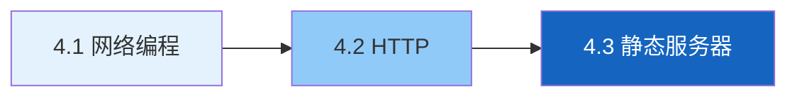

# 第四章 · Web 服务器

> 从 Socket 到 HTTP，再到手写静态 Web 服务器——理解浏览器和服务器如何对话。

| 节 | 标题 | 预计时间 | 链接 |
|:--:|------|:--------:|------|
| 4.1 | 网络编程基础（IP、TCP、Socket） | 1.5h | [阅读](./01-网络编程基础.md) |
| 4.2 | HTTP 协议 | 1.5h | [阅读](./02-HTTP协议.md) |
| 4.3 | 静态 Web 服务器实战 | 2h | [阅读](./03-静态Web服务器.md) |

*源码：[`web服务器/`](../../web服务器/)*
