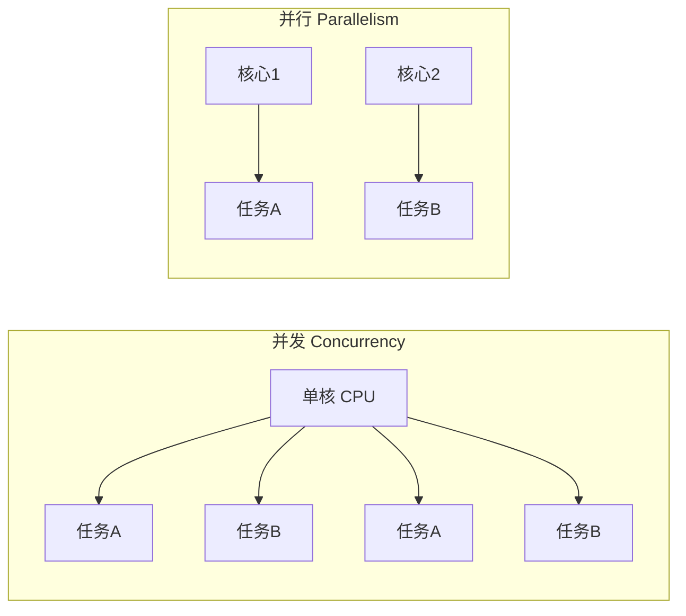

# 5.1 多任务概念：并发与并行

**第五章 · 多任务编程 · 第 1 节**

*预计学习时间：30 分钟 · 难度：⭐⭐*

---

## 📖 本节导读

- ✅ 理解多任务的概念和价值
- ✅ 区分并发与并行
- ✅ 知道何时用多进程 / 多线程

---

## 1. 什么是多任务？

> 🟦 **知识卡片**
>
> **多任务**：在同一时间段内，让程序执行多个任务，充分利用 CPU，提高执行效率。

想象你是厨师：
- **单任务**：炒菜时只能干等，水烧开了也不管
- **多任务**：炒菜的同时烧水、蒸饭——效率翻倍

---

## 2. 并发 vs 并行

| 概念 | 含义 | 生活类比 |
|------|------|---------|
| **并发** | 交替执行，看起来同时 | 一个人轮流切菜和炒菜 |
| **并行** | 真正同时执行 | 两个人各干各的 |

> 任务数 > CPU 核数 → 并发为主  
> 任务数 ≤ CPU 核数 → 可真正并行

---

## 3. Python 多任务两种方式

| 方式 | 模块 | 适用场景 |
|------|------|---------|
| **多进程** | `multiprocessing` | CPU 密集型（计算、图像处理） |
| **多线程** | `threading` | IO 密集型（网络请求、文件读写） |

第四章写的**多任务版 Web 服务器**，就是用多线程同时处理多个浏览器请求。

---

## 4. 小结

多任务让程序从「一件事做完再做下一件」变成「同时推进多件事」。下一节进入**进程**的具体编程。

---

| ← 上一章 | [第五章目录](./README.md) | 下一节 → |
|---------|--------------------------|---------|
| [第四章 Web](../04-Web服务器/README.md) | | [5.2 进程入门](./02-进程入门.md) |

*源码：[`多任务编程/1.多任务介绍`](https://github.com/Drgonmancer/Leo_code/tree/main/多任务编程/1.多任务介绍)*
