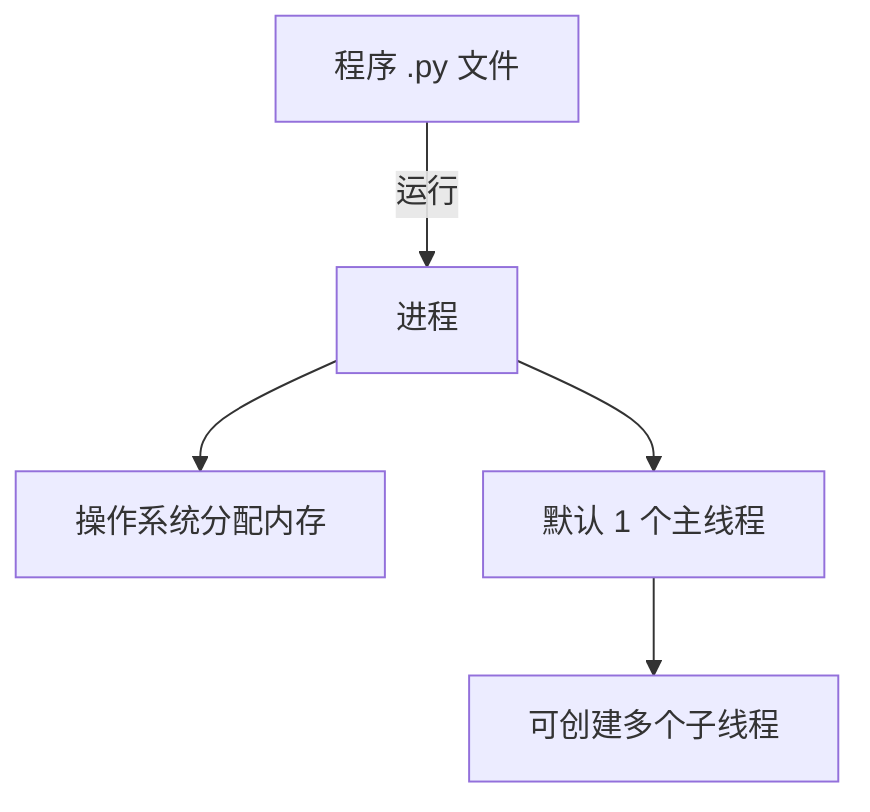
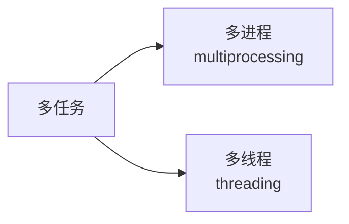

# 5.2 进程入门

<div align="center">

**第五章 · 多任务编程 · 第 2 节**

*预计学习时间：30 分钟 · 难度：⭐⭐*

</div>


---

## 📖 本节导读

- ✅ 理解进程的概念
- ✅ 知道进程与程序、线程的关系
- ✅ 为下一节多进程编程打基础

---

## 1. 什么是进程？

> 🟦 **知识卡片**
>
> **进程**：一个正在运行的程序或软件。操作系统给每个进程分配内存等资源，保证它能正常运行。



| 概念 | 说明 |
|------|------|
| 程序 | 磁盘上的代码文件，静态 |
| 进程 | 运行中的程序，动态，有资源 |
| 线程 | 进程内的执行分支，CPU 调度的基本单位 |

---

## 2. 生活类比

想象一家餐厅：

| 角色 | 对应 |
|------|------|
| 餐厅（厨房+桌椅） | 进程（有独立资源） |
| 厨师 | 线程（在厨房里干活） |
| 菜谱 | 程序（代码文件） |

- 一个程序运行后**至少有一个进程**
- 一个进程默认有**一个主线程**
- 进程里可以创建**多个线程**

---

## 3. 进程在 Python 中的位置

在 Python 中，多任务有两种实现方式：



| 方式 | 模块 | 一句话 |
|------|------|--------|
| 多进程 | `multiprocessing` | 每个进程独立内存，适合 CPU 密集型 |
| 多线程 | `threading` | 共享内存，适合 IO 密集型 |

第四章的多任务版 Web 服务器，就是用**多线程**同时处理多个浏览器请求。

---

## 4. 第一个进程示例（预览）

先看一眼多进程长什么样，下一节详细讲：

```python
import multiprocessing
import time

def dance():
    for i in range(3):
        print('跳舞中...')
        time.sleep(0.2)

def sing():
    for i in range(3):
        print('唱歌中...')
        time.sleep(0.2)

if __name__ == '__main__':
    dance_process = multiprocessing.Process(target=dance)
    sing_process = multiprocessing.Process(target=sing)

    dance_process.start()
    sing_process.start()
```

**运行效果：**

```
跳舞中...
唱歌中...
跳舞中...
唱歌中...
跳舞中...
唱歌中...
```

> 进程执行是**无序的**，具体哪个先执行由操作系统调度决定。

> 📸 **截图位**：终端中跳舞和唱歌交替输出的效果

---

## 5. 核心结论

| 要点 | 说明 |
|------|------|
| 资源分配单位 | 进程是操作系统分配资源的基本单位 |
| Python 实现 | 通过 `multiprocessing` 模块创建进程 |
| 与线程关系 | 线程依附于进程，没有进程就没有线程 |
| 与程序关系 | 程序是静态文件，进程是运行实例 |

---

## 6. 小结

进程 = 运行中的程序 + 操作系统分配的资源。下一节学习如何用 `multiprocessing` 创建和管理进程。

---

| ← 上一节 | [第五章目录](./README.md) | 下一节 → |
|---------|--------------------------|---------|
| [5.1 多任务概念](./01-多任务概念.md) | | [5.3 多进程编程](./03-多进程编程.md) |

*源码：[`多任务编程/进程/2.进程的介绍`](../../多任务编程/进程/2.进程的介绍)*
