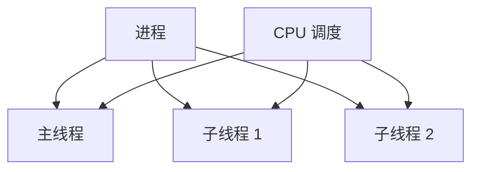
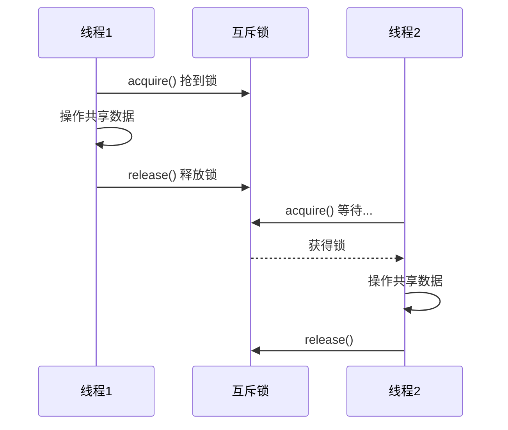

# 5.4 线程与多线程

<div align="center">

**第五章 · 多任务编程 · 第 4 节**

*预计学习时间：1 小时 · 难度：⭐⭐⭐*

</div>


---

## 📖 本节导读

- ✅ 理解线程概念与作用
- ✅ 掌握 `threading.Thread` 创建多线程
- ✅ 理解线程注意点与互斥锁

---

## 1. 什么是线程？

> 🟦 **知识卡片**
>
> **线程**是进程中执行代码的一个分支，是 CPU 调度的基本单位。每个进程至少有一个线程（主线程）。



| 概念 | 说明 |
|------|------|
| 主线程 | 程序启动时默认创建的线程 |
| 子线程 | 程序员手动创建的线程 |
| 作用 | 多线程可以完成多任务，提高 IO 密集型程序效率 |

---

## 2. Thread 类

```python
import threading
```

### 2.1 构造参数

```python
Thread([group[, target[, name[, args[, kwargs]]]]])
```

| 参数 | 说明 |
|------|------|
| `group` | 线程组，目前只能用 `None` |
| `target` | 执行的目标任务函数 |
| `args` | 元组方式传参 |
| `kwargs` | 字典方式传参 |
| `name` | 线程名，一般不用设置 |

### 2.2 创建多线程

```python
import threading
import time

def sing():
    for i in range(3):
        print('唱歌中...')
        time.sleep(0.2)

def dance():
    for i in range(3):
        print('跳舞中...')
        time.sleep(0.2)

if __name__ == '__main__':
    print('主线程:', threading.current_thread())

    sing_thread = threading.Thread(target=sing)
    dance_thread = threading.Thread(target=dance)

    sing_thread.start()
    dance_thread.start()
```

**运行效果：**

```
主线程: <_MainThread(MainThread, started 12345)>
唱歌中...
跳舞中...
唱歌中...
跳舞中...
唱歌中...
跳舞中...
```

> 📸 **截图位**：主线程和子线程交替输出的终端界面

---

## 3. 线程传参

与进程传参方式完全一致：

```python
def show_info(name, age):
    print('name: %s age: %d' % (name, age))

if __name__ == '__main__':
    # 元组传参
    t1 = threading.Thread(target=show_info, args=("李四", 20))
    # 字典传参
    t2 = threading.Thread(target=show_info, kwargs={"name": "王五", "age": 30})

    t1.start()
    t2.start()
```

**运行效果：**

```
name: 李四 age: 20
name: 王五 age: 30
```

---

## 4. 线程注意点

### 4.1 线程执行是无序的

```python
import threading
import time

def task():
    time.sleep(1)
    print(threading.current_thread())

if __name__ == '__main__':
    for i in range(5):
        t = threading.Thread(target=task)
        t.start()
```

**运行效果：**

```
（5 个线程的输出顺序每次运行可能不同）
```

### 4.2 主线程等待子线程结束

主线程会等所有子线程执行完再退出（与进程类似）。

让主线程先退出：

```python
sub_thread = threading.Thread(target=task, daemon=True)
# 或
sub_thread = threading.Thread(target=task)
sub_thread.daemon = True
```

### 4.3 线程之间共享全局变量

与进程不同，**同进程内的线程共享全局变量**：

```python
import threading
import time

g_list = []

def add_data():
    for i in range(3):
        g_list.append(i)
        print('add:', i)
        time.sleep(0.2)
    print('添加完成：', g_list)

def read_data():
    print('read:', g_list)

if __name__ == '__main__':
    add_thread = threading.Thread(target=add_data)
    read_thread = threading.Thread(target=read_data)

    add_thread.start()
    add_thread.join()
    read_thread.start()
```

**运行效果：**

```
add: 0
add: 1
add: 2
添加完成： [0, 1, 2]
read: [0, 1, 2]
```

> 线程能读到完整数据——因为共享同一块内存。

### 4.4 共享全局变量的竞争问题

多个线程同时修改全局变量，可能出现数据错误：

```python
import threading

g_num = 0

def task():
    global g_num
    for i in range(1000000):
        g_num = g_num + 1

if __name__ == '__main__':
    t1 = threading.Thread(target=task)
    t2 = threading.Thread(target=task)
    t1.start()
    t2.start()
    t1.join()
    t2.join()
    print('g_num =', g_num)  # 期望 2000000，实际可能更小
```

**运行效果：**

```
g_num = 1356724
（每次运行结果可能不同，且小于 2000000）
```

---

## 5. 互斥锁

> 🟦 **知识卡片**
>
> **互斥锁（Lock）**：对共享数据加锁，保证同一时刻只有一个线程操作，避免竞争。



```python
import threading

g_num = 0
lock = threading.Lock()

def task():
    lock.acquire()
    global g_num
    for i in range(1000000):
        g_num = g_num + 1
    lock.release()

if __name__ == '__main__':
    t1 = threading.Thread(target=task)
    t2 = threading.Thread(target=task)
    t1.start()
    t1.join()
    t2.start()
    t2.join()
    print('g_num =', g_num)
```

**运行效果：**

```
g_num = 2000000
```

> ⚠️ **权衡**：互斥锁保证数据准确，但把多任务变成了「排队执行」，性能会下降。

---

## 6. 综合练习

请你完成：

1. 创建 3 个线程，分别打印不同信息
2. 验证线程共享全局变量（列表 append）
3. 用互斥锁保护一个共享计数器
4. 对比加锁前后的 `g_num` 结果

> 📸 **截图位**：共享变量成功读取 + 互斥锁修复计数器的结果对比

---

## 7. 本节小结

| 知识点 | 要点 |
|--------|------|
| 创建线程 | `Thread(target=函数)` + `start()` |
| 传参 | `args` / `kwargs`，与进程相同 |
| 共享变量 | 同进程内线程共享全局变量 |
| 竞争问题 | 多线程同时写可能出错 |
| 解决方案 | `threading.Lock()` 互斥锁 |

---

| ← 上一节 | [第五章目录](./README.md) | 下一节 → |
|---------|--------------------------|---------|
| [5.3 多进程编程](./03-多进程编程.md) | | [5.5 进程与线程对比](./05-进程与线程对比.md) |

*源码：[`多任务编程/线程/`](../../多任务编程/线程/)*
