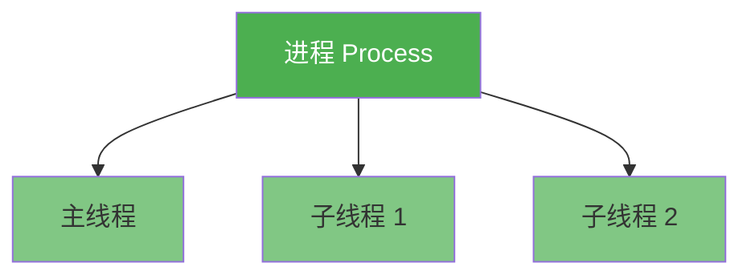
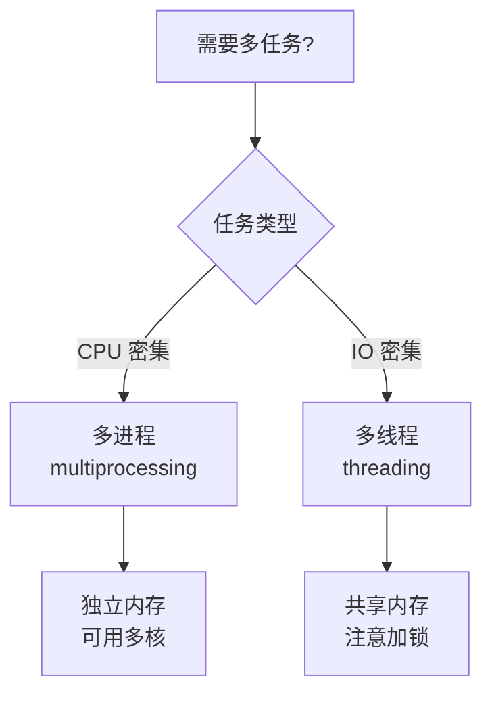

# 5.5 进程与线程对比

<div align="center">

**第五章 · 多任务编程 · 第 5 节**

*预计学习时间：30 分钟 · 难度：⭐⭐*

</div>


---

## 📖 本节导读

- ✅ 从三个维度对比进程与线程
- ✅ 知道什么场景用多进程、什么场景用多线程
- ✅ 为后续 Web 服务器多线程实战做准备

---

## 1. 关系对比



| 要点 | 说明 |
|------|------|
| 依附关系 | 线程依附在进程里，**没有进程就没有线程** |
| 默认线程 | 一个进程默认提供一条主线程 |
| 可扩展 | 一个进程可以创建多个线程 |

---

## 2. 区别对比

| 对比项 | 进程 | 线程 |
|--------|------|------|
| 全局变量 | **不共享**（各自拷贝） | **共享**（同一进程内） |
| 资源开销 | 创建开销**大** | 创建开销**小** |
| 调度单位 | 操作系统资源分配的基本单位 | CPU 调度的基本单位 |
| 独立执行 | 可独立运行 | 不能独立，必须依附进程 |
| 稳定性 | 多进程开发**更稳定** | 一个线程崩溃可能影响整个进程 |
| 多核利用 | 可以用**多核** | 受 GIL 限制，**不能用多核**（计算密集时） |

### 2.1 全局变量：最直观的区别

```python
# 进程：子进程读到 []
# 线程：子线程读到 [0, 1, 2]
```

进程间数据隔离更安全；线程间共享更方便，但要注意竞争。

### 2.2 资源竞争与互斥锁

线程共享全局变量时可能出现数据错误，解决办法：

- **互斥锁**（`threading.Lock`）
- **线程同步**

---

## 3. 优缺点对比


| | 优点 | 缺点 |
|---|------|------|
| **进程** | 可利用多核 CPU；进程间隔离，更稳定 | 资源开销大；不共享数据，通信麻烦 |
| **线程** | 资源开销小；共享全局变量，通信方便 | 不能利用多核（计算密集）；共享数据需加锁 |

---

## 4. 怎么选？

| 任务类型 | 推荐方式 | 原因 | 典型场景 |
|----------|---------|------|---------|
| **CPU 密集型** | 多进程 | 需要多核并行计算 | 图像处理、科学计算、加密 |
| **IO 密集型** | 多线程 | 等待 IO 时切换线程，开销小 | 网络请求、文件读写、Web 服务器 |

> 🟦 **知识卡片**
>
> Python 有 **GIL**（全局解释器锁），同一时刻只有一个线程执行 Python 字节码。所以计算密集型任务用多线程无法真正并行，应选多进程。

### 4.1 本教程项目中的选择

| 项目 | 选择 | 原因 |
|------|------|------|
| 多任务 Web 服务器 | 多线程 | 等待网络 IO，线程切换开销小 |
| 批量图片压缩 | 多进程 | CPU 密集计算，需要多核 |

---

## 5. 一图总结



---

## 6. 综合练习

请你思考并回答：

1. 为什么 Web 服务器用多线程而不是多进程？
2. 如果要做「100 张图片批量压缩」，该用哪种？
3. 线程共享全局变量时为什么要加互斥锁？

> 📸 **截图位**：自己用多进程和多线程各写一个对比 demo 的运行结果

---

## 7. 本章小结

| 维度 | 进程 | 线程 |
|------|------|------|
| 关系 | 容器 | 容器内的执行分支 |
| 内存 | 独立 | 共享 |
| 开销 | 大 | 小 |
| 多核 | ✅ | ❌（GIL） |
| 适用 | CPU 密集 | IO 密集 |

掌握进程与线程的选型，是写出高性能 Python 程序的关键一步。

---

| ← 上一节 | [第五章目录](./README.md) | 下一章 → |
|---------|--------------------------|---------|
| [5.4 线程与多线程](./04-线程与多线程.md) | | [第六章 Web 前端](06-Web前端开发基础/README.md) |

*源码：[`多任务编程/18.进程和线程的对比`](https://github.com/Drgonmancer/Leo_code/tree/main/多任务编程/18.进程和线程的对比)*
