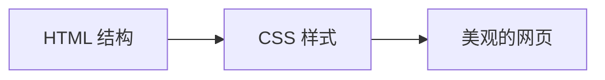
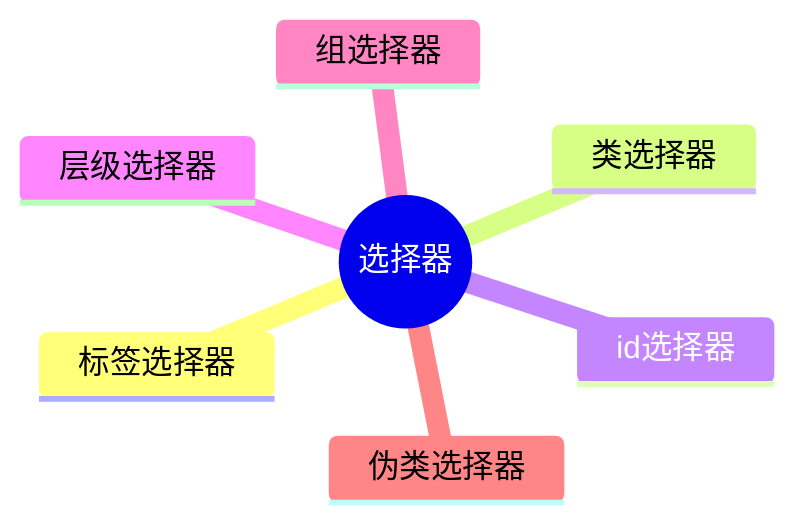
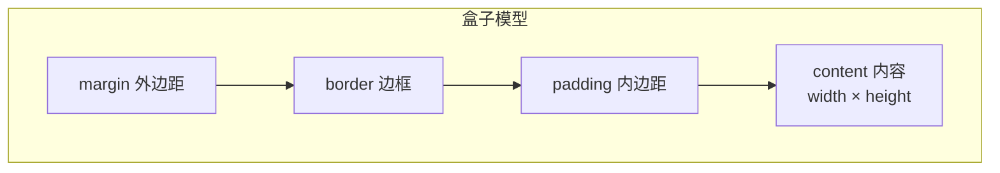

# 6.2 CSS 基础

<div align="center">

**第六章 · Web 前端开发基础 · 第 2 节**

*预计学习时间：1.5 小时 · 难度：⭐⭐*

</div>


---

## 📖 本节导读

- ✅ 理解 CSS 的作用与基本语法
- ✅ 掌握三种引入方式和常用选择器
- ✅ 学会布局属性与盒子模型

---

## 1. 什么是 CSS？

> 🟦 **知识卡片**
>
> **CSS**（Cascading Style Sheets，层叠样式表）用来**美化页面**——控制文字大小、颜色、布局和动画。



| 作用 | 示例 |
|------|------|
| 美化界面 | 文字大小、颜色、加粗 |
| 控制布局 | 浮动、定位、间距 |

### 基本语法

```css
选择器 {
    属性名1: 属性值1;
    属性名2: 属性值2;
}
```

```css
p {
    color: red;
    font-size: 16px;
}
```

---

## 2. 三种引入方式

| 方式 | 写法 | 优点 | 缺点 | 使用场景 |
|------|------|------|------|---------|
| **行内式** | `<div style="color:red">` | 方便直观 | 不可复用 | 几乎不用 |
| **内嵌式** | `<style>` 标签写在 `<head>` 里 | 单页复用方便 | 多页不便 | 学习阶段 |
| **外链式** | `<link rel="stylesheet" href="main.css">` | 样式与 HTML 分离 | 需维护独立文件 | **公司开发** |

```html
<!-- 行内式 -->
<div style="width:100px; height:100px; background:red">hello</div>

<!-- 内嵌式 -->
<head>
    <style>
        h3 { color: red; }
    </style>
</head>

<!-- 外链式（推荐） -->
<head>
    <link rel="stylesheet" href="css/main.css">
</head>
```

> 📸 **截图位**：三种方式渲染出的红色方块对比

---

## 3. CSS 选择器



### 3.1 标签选择器

以标签名开头，影响范围大，适合做通用设置：

```css
p { color: red; }
```

### 3.2 类选择器（最常用）

以 `.` 开头，可复用，一个标签可有多个类：

```css
.blue { color: blue; }
.big  { font-size: 20px; }
.box  { width: 100px; height: 100px; background: gold; }
```

```html
<div class="blue big box">这是个标题</div>
```

### 3.3 层级选择器（后代选择器）

根据嵌套关系选择后代标签，以空格分隔：

```css
div p { color: red; }
.con span { color: red; }
```

```html
<div>
    <p>hello</p>
</div>
<div class="con">
    <span>哈哈</span>
</div>
```

### 3.4 id 选择器

以 `#` 开头，id 在页面中**唯一**，不推荐作为样式选择器（留给 JS 用）：

```css
#myid1 { color: blue; }
```

### 3.5 组选择器

多个选择器共用样式，以 `,` 分隔：

```css
.box1, .box2, .box3 {
    width: 100px;
    height: 100px;
}
.box1 { background: red; }
.box2 { background: green; }
.box3 { background: blue; }
```

### 3.6 伪类选择器

用户交互时改变样式，以 `:` 分隔：

```css
div:hover {
    width: 200px;
    height: 200px;
    background: red;
}
```

> 📸 **截图位**：鼠标悬停 div 变色变大的效果

---

## 4. 常用样式属性

### 4.1 布局属性

| 属性 | 作用 | 示例 |
|------|------|------|
| `width` / `height` | 宽高 | `width: 200px` |
| `background` | 背景色或图片 | `background: url("logo.png") no-repeat` |
| `border` | 边框 | `border: 1px solid black` |
| `padding` | 内边距 | `padding: 10px` |
| `margin` | 外边距 | `margin: 20px auto` |
| `float` | 浮动排列 | `float: left` |

```css
.box {
    width: 200px;
    height: 100px;
    background: #f0f0f0;
    border: 1px solid #ccc;
    padding: 10px;
    margin: 20px;
    float: left;
}
```

### 4.2 文本属性

| 属性 | 作用 | 示例 |
|------|------|------|
| `color` | 文字颜色 | `color: #333` |
| `font-size` | 字号 | `font-size: 16px` |
| `font-weight` | 加粗 | `font-weight: bold` |
| `line-height` | 行高 | `line-height: 1.5` |
| `text-decoration` | 下划线 | `text-decoration: underline` |
| `text-align` | 水平对齐 | `text-align: center` |
| `text-indent` | 首行缩进 | `text-indent: 2em` |

> 🟦 **技巧**：`<span>` 标签可以给文本中的一小段设置样式。

---

## 5. 元素溢出与显示

### 5.1 overflow

子元素超出父元素时：

| 值 | 效果 |
|----|------|
| `visible` | 默认值，显示溢出部分 |
| `hidden` | 隐藏溢出部分 |
| `auto` | 溢出时出现滚动条 |

```css
.container {
    width: 200px;
    height: 100px;
    overflow: auto;
}
```

### 5.2 display

| 值 | 效果 |
|----|------|
| `none` | 隐藏且不占位置 |
| `inline` | 行内显示（不能设宽高） |
| `block` | 块级显示（独占一行） |

---

## 6. 盒子模型

> 🟦 **知识卡片**
>
> 把 HTML 元素看作一个矩形盒子，由 **内容、内边距、边框、外边距** 四部分组成。



**真实尺寸计算：**

```
盒子宽度 = width + padding左右 + border左右
盒子高度 = height + padding上下 + border上下
```

> ⚠️ **避坑**：设置 `padding` 和 `border` 会让盒子整体变大！`margin` 不影响盒子自身尺寸。

```css
.box {
    width: 200px;
    height: 100px;
    padding: 20px;
    border: 5px solid black;
    margin: 10px;
    /* 真实宽度 = 200 + 40 + 10 = 250px */
}
```

> 📸 **截图位**：浏览器开发者工具中查看盒子模型示意图

---

## 7. 动手练习

创建一个「个人名片」页面：

1. 用外链式引入 CSS
2. 类选择器设置标题样式（颜色、字号）
3. 用 `padding` 和 `border` 做一个带边框的卡片
4. 鼠标悬停时卡片变色（伪类选择器）

> 📸 **截图位**：完成的个人名片页面 + 悬停效果

---

## 8. 本节小结

| 类别 | 核心知识 |
|------|---------|
| 引入 | 外链式 `link`（公司开发标准） |
| 选择器 | 类选择器最常用，id 留给 JS |
| 布局 | width/height、float、margin/padding |
| 模型 | 内容 + padding + border + margin |

---

| ← 上一节 | [第六章目录](./README.md) | 下一节 → |
|---------|--------------------------|---------|
| [6.1 HTML 基础](./01-HTML基础.md) | | [6.3 JavaScript 基础](./03-JavaScript基础.md) |

*源码：[`web前端开发基础/CSS基础/`](https://github.com/Drgonmancer/Leo_code/tree/main/web前端开发基础/CSS基础)*
